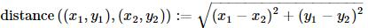

Boost.Hana 用户手册
------------------

# 起步

Hana 是一个头文件库,是用于计算类型和值的C++元编程套件.它提供的功能是[Boost.MPL](http://www.boost.org/doc/libs/release/libs/mpl/doc/index.html)和[Boost.Fusion](http://www.boost.org/doc/libs/release/libs/fusion/doc/html/index.html)库的超集.利用C++11/14技术和惯用法,与之前的库相比,Hana拥有更快的编译速度和运行时性能,同时也显著提高了编程体验.Hana很容易以ad-hoc方式扩展，它提供了与`Boost.Fusion`，`Boost.MPL`和`标准库`的开箱即用的交互操作.

# 先决条件和安装

Hana是一个没有外部依赖的头文件库(甚至不依赖Boost).因此,在您自己的项目中使用Hana非常容易.基本上，只需添加`include/`目录到你的编译器的头文件搜索路径即可.以下方式可以干净地安装Hana.首先，您可以安装Boost 1.61.0或更高版本，因为从该版本开始，Hana包含在Boost中.如果你不想安装所有的Boost，也可以只安装Hana.为此，您可以从官方[GitHub存储库](https://github.com/boostorg/hana)下载代码，并通过从项目根目录执行以下命令来手动安装库(需要[CMake](http://www.cmake.org/)).

``` bat
> mkdir build && cd build
> cmake ..
> cmake --build . --target install
```

这样,将在您的平台上安装Hana到缺省的安装目录(Unix为`/usr/local`,Windows为`C:\\Program Files`).如果想要安装到指定位置,可以这样做:

``` bat
> cmake .. -DCMAKE_INSTALL_PREFIX=/custom/install/prefix 
```

**注意**
* 手动安装还将安装一个与[pkg-config](http://www.freedesktop.org/wiki/Software/pkg-config/)一起使用的`hana.pc`文件.
* 如果您已经安装了Boost，请不要再安装Hana，因为新安装将覆盖Boost附带的安装.

如果在项目中使用CMake，可以使用Hana提供的[FindHana.cmake](https://github.com/boostorg/hana/blob/master/cmake/FindHana.cmake)模块将Hana设置为外部CMake项目.该模块还允许将Hana本地安装到该项目，而无需按照上述说明在系统上安装Hana.最后，如果你想对Hana做出贡献，[README](https://github.com/boostorg/hana/blob/master/README.md#hacking-on-hana)文档中有相关设置你的开发环境的描述.

## 编译器要求

Hana仅依赖于C++14编译器和标准库,除此之外再无其它要求了.以下为当前支持Hana的C++14编译器/工具链列表:

| 编译器/工具链   |               状态            |
-----------------|-------------------------------
| Clang >= 3.5.0 | 完整支持;每次向GitHub推送前测试 |
| Xcode >= 6.3   | 完整支持;每次向GitHub推送前测试 |
| GCC   >= 6.0.0 | 完整支持;每次向GitHub推送前测试 |

更具体地说，Hana需要一个支持以下C++14特性的编译器/标准库（非穷举）:

* 泛型 `lambda`
* 通用 `constexpr`
* 自动推导的返回类型
* 所有支持C++14的`<type_traits>`头文件中的类型特性

# 技术支持

如果您有什么问题,请查看[FAQ](#Faq)及[wiki](https://github.com/boostorg/hana/wiki).或者查找[问题列表](https://github.com/boostorg/hana/issues)也是个不错的主意.如果这些没有解决您的问题,您可以随时与我们在[Gitter](https://gitter.im/boostorg/hana)聊天,或者提交一个新的issue.[StackOverflow](http://stackoverflow.com/)的
[boost-hana](http://stackoverflow.com/questions/tagged/boost-hana)标签处是提出问题的首选.如果您发现了bug,请提交issue.

# 简介

自Boost.MPL首发以来,它通过提供大量的模板接口为C++程序员进行元编程提供了便利.这个突破极大地促进了C++模板元编程的主流化,如今模板元编程已经深植于各种项目中了.近期以来,C++11和C++14对语言带来了许多重大变化,其中一些使元编程更加容易,其它一些也大大拓宽了库的设计空间.因此,一些问题自然而来:是否仍然希望有元编程的抽象?如果是,有哪些?在考察了不同选择,如MPL11之后,最终答案是Hana库.对Hana的关键洞察是,类型和值的计算是一体两面的.通过统一这两个概念,元编程变得更为容易,新的令人兴奋的可能出现在我们面前了.

## C++计算分类(四个象限)

但是要真正了解Hana是什么，有必要理解C++中的不同类型的计算. 先不管可能的更细粒度的区分,我们将把注意力集中在四种不同类型的计算上. 首先，是运行时计算，这是我们通常在C++中使用的计算方式.在运行时世界中，我们有运行时容器，运行时函数和运行时算法：

```C++
auto f=[](int i)->std::string {
    return std::to_string(i*i);
};

std::vector<int> ints{1,2,3,4};
std::vector<std::string> strings;
std::transform(ints.begin(),ints.end(),std::back_inserter(strings),f);

assert((string==std::vector<std::string>{"1","4","9","16"}));
```
这个象限中的计算,通常以C++标准库为工具,C++标准库提供运行时可重用的算法和容器.自C++11以来,第二种计算成为可能:`constexpr`计算.这种计算中,我们用`constexpr`容器,`constexpr`函数及`constexpr`算法:

```C++
constexpr int factorial(int n){
    return n==0?1:n*factorial(n-1);
}

template<typename T,std::size_t N,typename F>
constexpr std::array<std::result_of_t<F(T),N> transform(std::array<T,N> arr,F f){
    // ...
}

constexpr std::array<int,4> ints{{1,2,3,4}};
constexpr std::array<int,4> facts=transform(ints,factorial);

static_assert(facts==std::array<int,4>{{1,2,6,24}},"");
```

**注意**

* 若使以上代码可执行,需要确保`std::array`的`operator==`操作符标记为`constexpr`,在C++14下,这不是问题.

基本上,`constexpr`计算与运行时计算的不同之处在于它足够简单,可以被编译器解析执行.一般来说,任何不对编译器的求值程序过于不友好的函数(像抛出异常或者
分配内存等),都可以标记为`constexpr`,而无需作出修改.`constexpr`计算与运行时计算类似,除了`constexpr`计算更受限制,并需要获得编译时执行的能力.不幸的是,没有常用于`constexpr`计算的工具集,即没有广泛采用的用于`constexpr`编程的标准库.也许,对`constexpr`编程感兴趣的人可以去了解一下[Sprout](https://github.com/bolero-MURAKAMI/Sprout)库.

第三种计算是异构计算. 异构计算不同于普通的计算方式，因为异构计算不使用存储同类对象（所有对象具有相同类型）的容器,而是使用异构容器.异构容器可以保存具有不同类型的对象. 此外，在这个计算象限中的函数是异构函数，这是一种讨论模板函数的复杂方式.类似地，我们由异构算法操作异构容器和函数：

```C++
auto to_string=[](auto t){
    std::stringstream ss;
    ss<<t;
    return ss.str();
};

fusion::vector<int,std::string,float> seq{1,"abc",3.4f};
fusion::vector<std::string,std::string,std::string> strings=fusion::transform(seq,to_string);

assert(strings==funsion::make_vector("1"s,"abc"s,"3.4"s));
```

如果你觉得操作异构容器很奇怪的话,不妨把它相像成操作`std::tuple`.在C++03的世界中,用于进行此计算的库是[Boost.Fusion](http://www.boost.org/doc/libs/release/libs/fusion/doc/html/index.html),它提供了几个操作异构数据的结构和算法的集合.我们将考察的第四个计算象限的计算是类型计算.在这个象限中,我们有类型容器,类型函数(通常称为元函数)和类型算法.在这里,任何类型操作:容器存储类型和元函数接受类型作为参数并返回类型结果.

```C++
template<typename T>
struct add_const_pointer{
    using type=T const*;
};

using types=mpl::vector<int,char,float,void>;
using pointers=mpl::transform<types,add_const_pointer<mpl::_1>>::type;

static_assert(mpl::equal<pointers,
    mpl::vecotr<int const*,char const*,float const*,void const*>::value,"");
```

类型计算的领域已经被相当广泛地探索了，并且C++03中类型计算的事实解决方案是一个名为[Boost.MPL](http://www.boost.org/doc/libs/release/libs/mpl/doc/index.html)的库，它提供类型容器和算法.对于低级类型转换，C++11中也可以使用<type_traits>标准头提供的元函数。

## Hana库是干什么的?

以上所有计算都作地很好了,那么,Hana库又是干什么的?现在我们已经知道了C++的各种计算类型,回答这个问题可以会很简单了.**Hana的目的是合并第三和第四象限的计算**,具体来说,Hana经过长期构建证明,异构计算比类型计算更强大.我们可以通过等效的异构计算来表达任何类型计算.这种构造在两个步骤中完成.首先,Hana是一个功能齐全的异构算法和容器库,有点像现代化的Boost.Fusion.其次,Hana提供了一种将任何类型计算转换为其等效的异构计算的方法.这允许异构计算的全部机制被重用于类型计算,而没有任何代码重复.当然,这种统一的最大优点是用户能看到的.

# 快速入门

本节的目的是从非常高的层次快速介绍Hana库的主要概念; 不用担心看不明白一股脑仍给你的东西. 但是，本教程要求读者已经至少熟悉基本元编程和C++14标准.首先,需要包含以下库:

```C++
#include <boost/hana.hpp>
namespace hana=boost::hana;
```

除非另行说明,本文档假定示例和代码片断都在之前添加了以上代码.还要注意更详细的头文件包含将在[头文件的组织](http://boostorg.github.io/hana/index.html#tutorial-header_organization)节详述.为了快速起步,现在我们再包含一些头文件,并定义一些动物类型:

```C++
#include <cassert>
#include <iostream>
#include <string>

struct Fish{std::string name;};
struct Cat {std::string name;};
struct Dog {std::string name;};
```

如果你正在阅读这个文档,你可能已经知道`std::tuple`和`std::make_tuple`.Hana也提供了自己的`tuple`和`make_tuple`:

```C++
auto animals=hana::make_tuple(Fish{"Nemo"},Cat{"Garfield"},Dog{"Snoopy"});
```

创建一个元组,除了可以存储不同类型的区别外,它就像是一个数组.像这样能够存储不同类型元素的容器称为异构容器.C++标准库只提供了操作`std::tuple`的少数支持.而Hana对自己的`tuple`的操作支持要多一些:

```C++
using namespace hana::literals;

//Access tuple elements with operator[] instead of std::get.
Cat grafield=animals[1_c];

//Perform high level algorithms on tuples (this is like std::transform)
auto names=hana::transform(animals,[](auto a){
    return a.name;
});

assert(hana::reverse(names)==hana::make_tuple("Snoopy","Garfield","Nemo"));
```

**注意**

* `1_c`是一个用[C++14用户自定义字面量](http://en.wikipedia.org/wiki/C%2B%2B11#User-defined_literals)创建的[编译时数值]().此自定义字面量位于`boost::hana::literals`名字空间,故此using了该名字空间.

注意我们是如何将[C++14泛型lambda]传递到`transform`的;必须要这样做是因为lambda首先用`Fish`来调用的,接着用`Cat`,最后用`Dog`来调用,它们都是类型不同的.Hana提供了C++标准提供的大多数算法,除了它们工作在元组和异构容器上而不是在`std::tuple`等之上的之外.除了使用异构值之外,Hana还使用自然语法执行类型计算,所有这些都在编译期完成,没有任何开销:

```C++
auto animal_types=hana::make_tuple(hana::type_c<Fish*>,hana::type_c<Cat&>,hana::type_c<Dog>);

auto no_pointers=hana::remove_if(animal_types,[](auto a){
    return hana::traits::is_pointer(a);
});

static_assert(no_pointers==hana::make_tuple(hana::type_c<Cat&>,hana::type_c<Dog>),"");
```

**注意**

* `type_c<...>`不是一个类型!它是一个[C++14变量模板](http://en.wikipedia.org/wiki/C%2B%2B14#Variable_templates)生成的Hana类型对象.更多详情参见[类型计算]().

除了用于异构和编译时序列外,Hana还提供一些特性使您的元编程恶梦成为过去.举例来说,你可以简单使用一行代码来检查结构的成员是否存在,而不再依赖于笨重的SFINAE:

```C++
auto has_name=hana::is_vaild([](auto&& x)->decltype((void)x.name){});

static_assert(has_name(garfield),"");
static_assert(!has_name(1),"");
```

想编写一个序列化库?不要着急,我们给你准备.反射机制可以很容易地添加到用户定义的类型中.这允许遍历用户定义类型的成员,使用编程接口查询成员等等,而且没有运行时开销:

```C++
// 1. Give introspection capabilities to 'Person'
struct Person{
    BOOST_HANA_DEFINE_STRUCT(Person,
        (std::string,name),
        (int,age)
    );
};

// 2. Write a generic serializer (bear with std::ostream for the example)
auto serialize=[](std::ostream& os,auto const& object){
    hana::for_each(hana::members(objec),[&](auto member){
        os<<member<<std::endl;
    });
};

// 3. Use it
Person john{"John",30};
serialize(std::cout,john);

// output:
// John
// 30
```

酷,但是我已经听到你的抱怨了,编译器给出不可理解的错误消息.我们是故意搞砸的,这表明构建Hana的家伙是一般人而不是专业的元编程程序员.让我们先看看错误情况:

``` C++
auto serialize = [](std::ostream& os, auto const& object) {
  hana::for_each(os, [&](auto member) {
    //           ^^ oopsie daisy!
    os << member << std::endl;
  });
};
```

详情:

``` C++
error: static_assert failed "hana::for_each(xs, f) requires 'xs' to be Foldable"
        static_assert(Foldable<S>::value,
        ^             ~~~~~~~~~~~~~~~~~~
note: in instantiation of function template specialization
      'boost::hana::for_each_t::operator()<
        std::__1::basic_ostream<char> &, (lambda at [snip])>' requested here
  hana::for_each(os, [&](auto member) {
  ^
note: in instantiation of function template specialization
    'main()::(anonymous class)::operator()<Person>' requested here
serialize(std::cout, john);
```

不是那么坏,对吧? 小例子非常容易展示但没有什么实际意义,让我们来一个真实世界的例子.

## 一个真实世界的例子

本节,我们的目标是实现一种能够处理`boost::any'的`switch`语句.给定一个`boost::any`,目标是分发any的动态类型到关联的函数:

``` C++
boost::any a='x';
std::string r=switch_(a)(
    case_<int>([](auto i){return "int: "s+std::to_string(i);}),
    case_<char>([](auto c){return "char: "s+std::string{c};}),
    default_([]{return "unknown"s;})
);

assert(r=="char: x"s);
```

**注意**

* 此文档中,我们将经常在字符串字面量上使用`s`后缀来创建`std::string`(而没有语法上的开销),这是个[C++14用户自定义字面量](http://en.wikipedia.org/wiki/C%2B%2B11#User-defined_literals)的标准定义.


因为any中保存有一个`char`,因此第二个函数被调用.如果any保存的是`int`,第一个函数将被调用.当any保存的动态类型不匹配任何一个case时,`default_`函数会被调用.最后,`switch`返回值为与any动态类型关联的函数的返回值.返回值的类型被推导为所有关联函数的返回类型的公共类型:

``` C++
boost::any a='x';
auto r=switch_(a)(
    case_<int>([](auto)->int{return 1;}),
    case_<char>([](auto)->long{return 2l;}),
    default_([]()->long long{return 3ll;})
);

//r is inferred to be a long long
static_assert(std::is_same<decltype(r),long long>{},"");
assert(r==2ll);
```

现在,我们看看如何用Hana来实现这个实用程序.第一步是将每个类型关联到一个函数.为此,我们将每个`case_`表示为`hana::pair`,`hana::pair`的第一个元素是类型,第二个元素是函数.另外,我们(arbitrarily)决定将`default_`表示为一个映射一个虚拟的类型到一个函数的`hana::pair`.

``` C++
template<typename T>
auto case_=[](auto f){
    return hana::make_pair(hana::type_c<T>,f);
}

struct default_t;
auto default_=case_<default_t>;
```

为支持上述接口，`switch_`必须返回一个case分支的函数,另外,`switch_(a)`还需要接受任意数量的的case(它们都是`haha::pair`),并能以正确的逻辑执行某个case的分派函数.可以通过返回C++14泛型lambda来实现:

``` C++
template<typename Any>
auto switch_(Any& a){
    return [&a](auto... case_){
        // ...
    };
}
```

参数包不是太灵活,我们把它转为`tuple`好利用操作:

``` C++
template<typename Any>
auto switch_(Any& a){
    return [&a](auto... cases_){
        auto cases=haha::make_tuple(cases_...);
        // ...
    };
}
```

注意在定义`cases`时是怎样使用`auto`关键字的;这通常更容易让编译器推断出tuple的类型，并使用make_tuple而不是手动处理类型.下一步要做的是区分出`default case`与其它case.为此,我们使用Hana的`find_if`算法,它在原理上类似于`std::find_if`:

``` C++
template<typename Any>
auto switch_(Any& a){
    return [&a](auto... cases_){
        auto cases=hana::make_tuple(cases_...);

        auto default_=hana::find_if(cases,[](auto const& c){
            return hana::first(c)==hana::type_c<default_t>;
        });
    };

    // ...
}
```

`find_if`接受一个元组和一个谓词,返回元组中满足谓词条件的第一个元素.返回结果是一个`hana::optional`,它类似于`std::optional`,除了可选值为empty或不是编译时已知的.如果元组的元素不满足谓词条件,`find_if`不返回任何值(空值).否则,返回`just(x)`(非空值),其中`x`是满足谓词的第一个元素.与STL算法中使用的谓词不同,此处使用的谓词必须是泛型的,因为元组中的元素是异构的.此外,该谓词必须返回Hana调用的IntegeralConstant,这意味着谓词的结果必须是编译时已知的.更多细节请参见[交叉相位算法]().在谓词内部,我们只需将cases的第一个元素的类型与`type_c<default_t>`比较.如果还记得我们使用`hana::pair`来对case进行编码的话,这里的意思即为我们在所有提供的case中找到default case.但是,如果没有提供default case时会怎样呢?当然是编译失败!

``` C++
template<typename Any>
auto switch_(Any& a){
    return [&a](auto... cases_){
        auto cases=hana::make_tuple(cases_...);

        auto default_=hana::find_if(cases,[](auto const& c){
            return haha::first(c)==hana::type_c<default_t>;
        });
        static_assert(default_!=hana::nothing,"switch is missing a default_ case");

        // ...
    };
}
```

注意我们是怎样用`static_assert`来处理`nothing`结果的.担心`default_`是非constexpr对象吗?不用.Hana能确保非编译期已知的信息传递到运行时.这显示能保证`default_`必须存在.下一步该处理非default的case了,我们这里用`filter`算法,它可以使序列仅保留满足谓词的元素:

``` C++
template<typename Any>
auto switch_(Any& a){
    return [&a](auto... cases_){
        auto cases=hana::make_tuple(cases_...);

        auto default_=hana::find_if(cases,[](auto const& c){
            return haha::first(c)==hana::type_c<default_t>;
        });
        static_assert(default_!=hana::nothing,"switch is missing a default_ case");

        auto rest=hana::filter(cases,[](auto const& c){
            return hana::first(c)!=hana::type_c<default_t>;
        });

        // ...
    };
```

接下来就该查找哪一个case匹配`any`的动态类型了,找到后要调用与此case关联的函数.简单处理的方法是使用递归,传入参数包.当然,也可以复杂一点,用hana算法来实现.有时最好的办法就是用最基础的技术从头开始编写.故此,我们将用`unpack`函数来实现,这个函数需要一个元组,元组中的元素就是这些case(不含default_):

``` C++
template<typename Any>
auto switch_(Any& a){
    return [&a](auto... cases_){
        auto cases=hana::make_tuple(cases_...);

        auto default_=hana::find_if(cases,[](auto const& c){
            return haha::first(c)==hana::type_c<default_t>;
        });
        static_assert(default_!=hana::nothing,"switch is missing a default_ case");

        auto rest=hana::filter(cases,[](auto const& c){
            return hana::first(c)!=hana::type_c<default_t>;
        });

        return hana::unpack(rest,[&](auto&... rests){
            return process(a,a.type(),hana::second(*default_),rests...);
        });
    };
```

`unpack`接受一个元组和一个函数,并以元组的内容作为参数调用函数.解包的结果是调用该函数的结果.此例,函数是一个泛型lambda,lambda调用了`process`函数.在这里使用`unpack`的原因是将rest元组转换为一个参数包更容易递归(相对于tuple来说).在继续处理`process`函数之前,先对参数`second(*default_)`作以解释.如前所述,`default_`是一个可选值.像`std::optional`一样,这个可选值重载了`dereference`运算符(和箭头运算符)以允许访问`optional`内部的值.如果`optional`为空(nothing),则引发编译错误.因为我们知道`default_`不为空(上面代码中有检查),我们只须简将与default相关联的函数传递给`process`函数.接下来进行最后一步的处理,实现`process`函数:

``` C++
template<typename Any,typename Default>
auto process(Any&,std::type_index const&,Default& default_){
    return default_();
}

template<typename Any,typename Default,typename Case,typename... Rest>
auto process(Any& a,std::type_index const& t,Default default_,Case& case_,Rest&... rest){
    using T=typename decltype(+hana::first(case_))::type;
    return t==typeid(T)?hana::second(case_)(*boost::unsafe_any_cast<T>(&a)):
        process(a,t,default_,rest...);
}
```

这个函数有两个重载版本:一个重载用于至少有一个case,一个重载用于仅有`default_` case.与我们期望的一样,仅有`default_` case的重载简单调用default函数并返回该结果.另一个重载才更有趣.首先,我们检索与与该case相关联的类型并将其保存到`T`变量.这里`decltype(...)::type`看起来挺复杂的,其实很简单.详情参见[类型计算]().然后,我们比较`any`的动态类型是否匹配这个case,如果匹配就调用关联函数,将`any`转换为正确的类型,否则,用其余的case再次递归.是不是很简单?以下是完整的代码:

``` C++
#include <boost/hana.hpp>
#include <boost/any.hpp>
#include <cassert>
#include <string>
#include <typeindex>
#include <typeinfo>
#include <utility>
namespace hana = boost::hana;

//! [cases]
template <typename T>
auto case_ = [](auto f) {
  return hana::make_pair(hana::type_c<T>, f);
};
struct default_t;
auto default_ = case_<default_t>;
//! [cases]

//! [process]
template <typename Any, typename Default>
auto process(Any&, std::type_index const&, Default& default_) {
  return default_();
}
template <typename Any, typename Default, typename Case, typename ...Rest>
auto process(Any& a, std::type_index const& t, Default& default_,
             Case& case_, Rest& ...rest)
{
  using T = typename decltype(+hana::first(case_))::type;
  return t == typeid(T) ? hana::second(case_)(*boost::unsafe_any_cast<T>(&a))
                        : process(a, t, default_, rest...);
}
//! [process]

//! [switch_]
template <typename Any>
auto switch_(Any& a) {
  return [&a](auto ...cases_) {
    auto cases = hana::make_tuple(cases_...);
    auto default_ = hana::find_if(cases, [](auto const& c) {
      return hana::first(c) == hana::type_c<default_t>;
    });
    static_assert(default_ != hana::nothing,
      "switch is missing a default_ case");
    auto rest = hana::filter(cases, [](auto const& c) {
      return hana::first(c) != hana::type_c<default_t>;
    });
    return hana::unpack(rest, [&](auto& ...rest) {
      return process(a, a.type(), hana::second(*default_), rest...);
    });
  };
}
//! [switch_]
```

以上就是我们的快速入门了.这个例子只介绍了几个有用的算法(`find_if`,`filter`,`unpack`)和异构容器(`tuple`,`optional`),放心,还有更多!本教程的后续部分将以友好的方式逐步介绍与Hana有关的概念.如果你想立即着手编写代码,可以用以下备忘表作为快速参考.这个备忘表囊括了最常用的算法和容器,还提供了简短的说明.

# 备忘表

**备注**

* 大多数算法同时处理类型和值(参见[类型计算]())
* 算法通常返回一个新容器作为它们的返回结果;不会更改原容器(参见[算法]())
* 所有的算法都是`constexpr`函数对象

| 容器           | 说明                                                     |
-----------------|----------------------------------------------------------
| tuple          | 固定长度的基于索引的泛型异构序列,可将它视为异构对象中的`std::vector`|
| optional       | 表示可选值,即可以为空的值.它有点像`std::optional`,除了空值也是编译时已知的外|
| map            | 无序关联数组映射(唯一)编译期实体到任意对象.好比异构对象的`std::unordered_map`|
| set            | 无序容器,包含必须是编译期实体的唯一键.好比异构对象的`std::unordered_set`|
| range          | 表示编译期的数值范围,好比更好的`std::integer_sequence`|
| pair           | 持有两种异构对象的容器.好比`std::pair`,但压缩空类型的存储|
| string         | 编译期字符串|
| type           | 表示一个C++类型的容器.是类型与值相统一的根本所在.比MPL式的计算更有趣[类型计算]()|
| integral_constant| 表示编译期数值.非常类似于`std::integral_constant`,不同之处在于`hana::integral_constant`还定义了一些操作和语法糖|
| lazy           | 封装一个懒惰值或计算.|
| basic_tuple    | 简装版`hana::tuple`.不符合标准,但更有编译时效率|

| 函数                     | 说明                                                          |
--------------------------|----------------------------------------------------------------
| adjust(sequence,value,f)| 将函数应用到序列的每个元素上,将值与元素比较,返回调整后的序列|
| adjust_if(sequence,predicate,f)| 将函数应用到序列的每个元素上,调整满足谓词的每个元素,返回调整后的序号|
| {all,any,none}(sequence) | 返回是否 所有/任意/无 序列的元素都是真值|
| {all,any,none}(sequence) | 返回是否 所有/任意/无 序列的元素满足谓词|
| append(sequence,value)   | 附加元素到序列|
| at(sequence,index)       | 返回序列第n个元素,index必须是一个IntegralConstant|
| back(sequence)           | 返回非空序列的最后一个元素|
| concat(sequence1,sequence2)| 合并两个序列|
| contains(sequence,value) | 序列中是否包含给定的值|
| count(sequence,value)    | 序列中给定值的数量|
| count_if(sequence,predicate)| 序列中给定符合谓词条件的元素的数量|
| drop_front(sequence[,n]) | 从序列中删除前`n`个元素,若`length(sequence)<=n`,则删除整个序列.`n`必须是`IntegralConstant`,未提供`n`时,``默认为`1`|
| drop_front_exactly(sequence[,n])|从序列中删除前`n`个元素,`n`必须是`IntegralConstant`而且序列中至少要有`n`个元素,未提供`n`时,``默认为`1`|
| drop_back(sequence[,n])  | 从序列结尾删除`n`个元素,若`length(sequence)<=n`,则删除整个序列.`n`必须是`IntegralConstant`,未提供`n`时,``默认为`1`|
| drop_while(sequence,predicate) | 从序列删除满足谓词的元素.谓词必须返回一个`IntegralConstant`|
| fill(sequence,value) | 用`value`重置序列中的所有元素|
| filter(sequence,predicate) | 移除序列中所有不满足谓词的元素,谓词必须返回一个`IntegralConstant`|
| find(sequence,value) | 查找序列中第一个与`value`相等的元素,并返回`just`或`nothing`,参见`hana::optional`|
| find_if(sequence,predicate) | 查找序列中第一个与满足谓词的元素,并返回`just`或`nothing`,参见`hana::optional`|
| flatten(sequence) | 连接序列,类似于`std::tuple_cat`|
| fold_left(sequence[,state],f) | 从左侧累积序列的元素，可选地使用提供的初始状态|
| fold_right(sequence[,state],f) | 从右侧累积序列的元素，可选地使用提供的初始状态|
| fold(sequence[,state],f) | 相当于`fold_left`,与`Boost.MPL`和`Boost.Fusion`保持一致|
| for_each(sequence,f) | 在序列的每个元素上调用`f`函数.返回`void`|
| front(sequence) | 返回非空序列的第一个元素|
| group(sequence[,predicate])| 将所有满足（或全部不满足）谓词的序列的相邻元素组。 谓词默认为相等，在这种情况下，元素必须是`Comparable`(可比性)的|
| insert(sequence,index,element) | 在指定索引处插入元素,`index`必须是`IntegralConstant`|
| insert_range(sequence,index,elements) | 在指定索引处插入多个元素,`index`必须是`IntegralConstant`|
| is_empty(sequence)| 序列是否为空,返回值作为`IntegralConstant`|
| length(sequence) | 序列的长度,返回值作为`IntegralConstant`|
| lexicographical_compare(sequence1,sequence2[,predicate])| 执行两个序列的词典比较，可选地使用自定义谓词，默认情况下使用`hana::less`|
| maximum(sequence[,predicate])| 返回序列的最大元素，可选地根据谓词。 如果没有提供谓词，那么元素必须是`Orderable`(可排序)的|
| minimum(sequence[,predicate])|返回序列的最小元素，可选地根据谓词。 如果没有提供谓词，那么元素必须是`Orderable`(可排序)的|
| partition(sequence,predicate) | 将序列分成满足和不满足谓词的元素对 |
| prepend(sequence,value) | 将元素预置到序列|
| remove(sequence,value) | 移除所有与`value`相等的元素|
| remove_at(sequence,index) | 移除给定索引处的元素,`index`必须是`IntegralConstant`|
| remove_if(sequence,predicate)| 移除所有满足谓词的元素,谓词必须返回`IntegralConstant`|
| remove_range(sequence,from,to) | 移除半开区间[from,to)的元素,这些索引必须都是`IntegralConstant`|
| replace(sequence,oldval,newval) | 将序列中所有元素与oldval相等的值替换为newval|
| replace_if(sequence,predicate,newval)|用newval替换序列中满足某些谓词的元素.|
| reverse(sequence)|逆序排列|
| reverse_fold(sequence[,state],f)|相当于`fold_right`.为与Boost.MPL和Boost.Fusion保持一致.|
| size(sequence) |相当于`length`,为与C++标准库保持一致.|
| slice(sequence,indices)|返回包含原始序列的给定索引处的元素的新序列.|
| slice_c<from,to>(sequence)|返回包含原始序列的半开区间`[from，to)`中包含的索引处的元素的新序列.|
| sort(sequence[,predicate]) |可选地根据谓词对序列的元素进行（稳定）排序. 如果没有提供谓词，那么元素必须是可排序的.|
| take_back(sequence,number) |取序列的最后`n`个元素，如果`length（sequence）<= n`，则取整个序列。 `n`必须是`IntegralConstant`.|
| take_front(sequence,number) |取序列的前`n`个元素，如果`length（sequence）<= n`，则取整个序列. `n`必须是`IntegralConstant`.|
| take_while(sequence,predicate) |当一些谓词满足时，获取序列的元素，并返回.|
| transform(sequence,f) |对序列的每个元素应用函数并返回结果.|
| unique(sequence[,predicate]) |从序列中删除所有连续的重复项.谓词默认为相等，在这种情况下，元素必须是Comparable(可比较的).|
| unpack(sequence,f) |用序列的内容调用`f`,等价于`f(x1,...,xN)`|
| zip(s1,...,sN) | 将`N`个序列压缩成元组序列.所有序列必须具有相同的长度.|
| zip_shortest(s1,...,sN) | 将N个序列压缩成元组序列. 返回的序列具有最短输入序列的长度. |
| zip_with(f,s1,...,sN) | 用N元函数压缩N个序列.所有序列必须具有相同的长度.|
| zip_shortest_with(f,s1,...,sN) |用N元函数压缩N个序列.返回的序列具有最短输入序列的长度.|

# 断言

在本教程的其余部分，您将看到使用不同类型的断言（如`BOOST_HANA_RUNTIME_CHECK`和`BOOST_HANA_CONSTANT_CHECK`）的代码段。 像任何合理的断言宏，它们基本上检查它们给出的条件是否满足。 然而，在异构编程的上下文中，一些信息在编译时是已知的，而其他信息仅在运行时可知。 在上下文中使用的断言的确切类型告诉您所声明的条件是否可以在编译时可知，或者是否必须在运行时计算，这是非常宝贵的信息。 下面是教程中使用的不同类型的断言，以及它们的特殊的简述。 有关更多详细信息，您应该检查[对断言的引用]().

| 断言 | 说明|
------|------
|BOOST_HANA_RUNTIME_CHECK|在直到运行时才可知的条件上断言.这种断言提供了最弱的保证形式.|
|BOOST_HANA_CONSTEXPR_CHECK|如果在常量表达式中允许lambda,则在`constexpr`的条件上断言.换句话说,它不是一个`static_assert`的唯一原因是语言限制了lambda不能出现在常量表达式中,这个限制可能会在c++17中解除.|
|static_assert|在`constexpr`条件上断言.强度上大于`BOOST_HANA_CONSTEXPR_CHECK`,因为它要求条件是一个`constexpr`表达式,因此它保证了表达式中使用的算法是`constexpr`友好的.|
|BOOST_HANA_CONSTANT_CHECK|在一个布尔型`IntegralConstant`条件上断言.这种断言提供了最强的保证形式.因为`IntegralConstant`可以转换为`constexpr`值,即使它本身不是`constexpr`.|

# 编译期数值

本节介绍`IntegralConstant`的重要概念和Hana的元编程范式背后的哲学.让我们从一个奇怪的问题开始. 什么是`integral_constant`?

``` C++
template<class T, T v>
struct integral_constant{
    static constexpr T value=v;
    typedef T value_type;
    typedef integral_constant type;
    constexpr operator value_type() const noexcept{return value;}
    constexpr value_type operator()() const noexcept{return value;}
};
```

**注意**
* 如果你觉得这些很新奇，你可以需要看看`std::integral_constant`[文档](http://en.cppreference.com/w/cpp/types/integral_constant)

一个有效的回答是,`integral_constant`表示数值的类型编码,或者更一般地表示为任何整型对象.比如,我们可以使用模板别名很容易地在该表示中的数值上定义后继函数：

``` C++
template<typename N>
using succ=integral_constant<int,N::value+1>;

using one=integral_constant<int,1>;
using two=succ<one>;
using three=succ<two>;
// ...
```

通常将这种使用`integral_constant`的方式用于模板元编程的类型实体.我们还会看到另一种`integral_constant`使用方式是作为一个运行时对象,代表一个整型的`constexpr`值:

``` C++
auto one=integral_constant<int,1>{};
```

这里,虽然`one`没有标记为`constexpr`,它所拥有的抽象值(一个`constexpr`的 1)在编译期仍然可用,因为该值被编码到`one`类型中,事实上，即使`one`不是`constexpr`,我们也可以用`decltype`检索它表示的编译期值:

``` C++
auto one=integral_constant<int,1>{};
constexpr int one_constexpr=decltype(one)::value;
```

但是为什么我们会想把`integral_constant`当作对象而不是类型实体呢?为了看是为什么,考虑我们现在如果实现之前同样的后继函数:

``` C++
template<typename N>
auto succ(N){
    return integral_constant<int,N::value+1>{};
}

auto one=integral_constant<int,1>{};
auto two=succ(one);
auto three=succ(two);
```

您注意到了什么新东西吗? 区别在于，不是在类型级别使用模板别名实现`succ`，我们现在使用模板函数在值级别实现它. 此外，我们现在可以使用与普通C++相同的语法执行编译时算术.这种将编译期实体看作对象而不是类型的方式是Hana的表达力的关键。

##编译期计算##

MPL定义了多个[算术运算符](http://www.boost.org/doc/libs/release/libs/mpl/doc/refmanual/arithmetic-operations.html)以支持使用`integral_constant`做编译期计算.一个典型的例子是`plus`运算符,其大致实现如下：

``` C++
template<typename X,typename Y>
struct plus{
    using type=integral_constant<decltype(X::value+Y::value),X::value+Y::value>;
};

using three=plus<integral_constant<int,1>,integral_constant<int,2>>::type;
```

通过将`integral_constant`作为对象而不是类型来看待，从元函数到函数的转换非常简单：

``` C++
template<typename V,V v,typename U,U u>
constexpr auto operator+(integral_constant<V,v>,integral_constant<U,u>){
    return integral_constant<decltype(v+u>),v+u>{};
}

auto three=integral_constant<int,1>{}+integral_constant<int,2>{};
```

强调这个操作符不返回正常整数的事实是非常重要. 相反，它返回一个值初始化的对象，其类型包含加法的结果。 该对象中包含的唯一有用的信息实际上是在它的类型，我们正在创建一个对象，因为它允许我们使用这个漂亮的值级语法。 事实证明，我们可以通过使用[C++14变量模板](http://en.wikipedia.org/wiki/C%2B%2B14#Variable_templates)来简化`integral_constant`建，从而使这种语法更好：

``` C++
template<int i>
constexpr integral_constant<int,i> int_c{};

auto three=int_c<1>+int_c<2>;
```

现在我们谈论的是在初始类型层面方法中表现出的增强体验，不是吗？ 但还有更多; 我们还可以使用C ++ 14用户定义的文字使这个过程更简单：

``` C++
template<char... digits>
constexpr auto operator"" _c(){
    //parse the digits and return an integral_constant
}

auto three=1_c+3_c;
```

Hana提供了自己的`integral_constants`,它定义了算术运算符,就像我们上面显示的一样, Hana还提供了变量模板，可以轻松创建不同类型的`integral_constants`：`int_c，long_c，bool_c`等.这允许你省略后面的`{}`大括号，否则需要值来初始化这些对象。 当然，也提供`_c`后缀; 它是`hana :: literals`命名空间的一部分，您必须在使用它之前将其导入到命名空间中：

``` C++
using namesapce hana::literals;

auto three=1_c+3_c;
```

这样,你可以做编译期计算,而不必尴尬的与类型级别的特性斗争,你的同事现在将能够了解发生了什么.

##示例：距离公式

为了说明它是多么的好用,让我们实现一个函数在编译期计算一个2-D欧氏距离.作为提醒,2-D平面中的两个点的欧几里得距离由下式给出



先看看用类型计算的样子(使用MPL):

``` C++
template<typename P1,typename P2>
struct distance{
    using xs=typename mpl::minus<typename P1::x,typename P2::x>::type;
    using ys=typename mpl::minus<typename p1::y,typename P2::y>::type;

    using type=typename sqrt<
        typename mpl::plus<
            typename mpl::multiplies<xs,xs>::type,
            typename mpl::multiplies<ys,ys>::type
        >::type
    >::type;
};

static_assert(mpl::equal_to<
    distance<point<mpl::int_<3>,mpl::int_<5>>,point<<mpl::int_<7>,mpl::int_<2>>>::type,
    mpl::int_<5>
>::value);
```

嗯...现在,让我们用上面提到的值级方法来实现它：

``` C++
template<typename P1,typename P2>
constexpr auto distance(P1 p1,P2 p2){
    auto xs=p1.x-p2.x;
    auto ys=p1.y-p2.y;
    return sqrt(xs*xs+ys*ys);
}

BOOST_HANA_CONSTANT_CHECK(distance(point(3_c,5_c),point(7_c,2_c))==5_c);
```

这个版本看起来简洁多了.然而,这还没完。注意到`distance`函数看起来和你为计算动态值的欧几里德距离所写的一样吗？ 事实上，因为我们在动态值和编译期计算使用了相同的语法,为其编写的通用函数将能同时工作于编译期和运行期！

``` C++
auto p1=point(3,5); // dynamic values now
auto p2=point(7,2); //
BOOST_HANA_RUNTIME_CHECK(distance(p1,p2)==5); //same function works!
```
*不用改变任何代码*,我们可以在运行时使`distance`函数正确地工作。

##编译期分发##

现在我们有了编译期计算，下一步需要解决编译期分发问题，元编程时，如果一些条件为真则编译一段代码，否则编译另一段代码是很有用的。就好像是[static_if](http://www.open-std.org/jtc1/sc22/wg21/docs/papers/2015/n4461.html)一样.还没搞清楚为什么需要编译期分发?先考察下面的代码(改编自[N4461](http://www.open-std.org/jtc1/sc22/wg21/docs/papers/2015/n4461.html)):

``` C++
template<typename T,typename... Args>
std::enable_if_t<std::is_constructible<T,Args...>::value,std::unique_ptr<T>>
make_unique(Args&&... args){
    return std::unique_ptr<T>(new T(std::forward<Args>(args)...));
}

template<typename T,typename... Args>
std::enable_if_t<!std::is_constructible<T,Args...>::value,std::unique_ptr<T>>
make_unique(Args&&... args){
    return std::unique_ptr<T>(new T{std::forward<Args>(args)...});
}
```

以上代码使用构造函数正规的语法形式创建`std::unique_ptr`.为此,它利用`SFINAE`实现两个不同的重载.现在,每个看到这些代码的人都不仅会问,为什么不能更简单一点:

``` C++
template <typename T, typename ...Args>
std::unique_ptr<T> make_unique(Args&&... args) {
  if (std::is_constructible<T, Args...>::value)
    return std::unique_ptr<T>(new T(std::forward<Args>(args)...));
  else
    return std::unique_ptr<T>(new T{std::forward<Args>(args)...});
}
```

原因是编译器需要编译`if`语句的两个分支，而不考虑条件（即使它在编译时是已知的）.但是当`T`不能从`Args...`构造时，第二个分支将无法编译，这将导致硬编译错误。 我们真正需要的是找一种方法告诉编译器，当条件为真时，`不要编译`第二个分支第一个分支。

为了模拟这一点，Hana提供了一个`if_`函数，它像一个普通的`if`语句一样工作，除了它需要一个可以是IntegralConstant的条件，并返回由条件选择的两个值之一（可能有不同的类型）之外. 如果条件为真，则返回第一个值，否则返回第二个值。 一个有点空洞的例子如下：

``` C++
auto one_two_three=hana::if_(hana::true_c,123,"hello");
auto hello=hana::if_(hana::false_c,123,"hello");
```

**注意**

* `hana::true_c`和`hana::false_c`仅为编译期布尔`IntegralConstant`值.分别表示编译期真值和假值.

