Boost.Hana 用户手册
------------------

# 起步

`Hana` 是一个头文件库，是用于计算类型和值的`C++元编程`套件。它提供的功能是[Boost.MPL](http://www.boost.org/doc/libs/release/libs/mpl/doc/index.html)和[Boost.Fusion](http://www.boost.org/doc/libs/release/libs/fusion/doc/html/index.html)库的超集。利用`C++11/14`技术和惯用法，与之前的库相比，`Hana`拥有更快的编译速度和运行时性能，同时也显著增强了编程体验。`Hana`很容易以**ad-hoc**方式扩展，它提供了与`Boost.Fusion`，`Boost.MPL`和`标准库`的开箱即用的交互操作。

# 先决条件和安装

`Hana`是一个没有外部依赖的头文件库(甚至不依赖`Boost`)。因此，在您自己的项目中使用`Hana`非常容易。基本上，只需添加`include/`目录到你的编译器的头文件搜索路径即可。以下方式可以干净地安装`Hana`。首先，您可以安装`Boost 1.61.0`或更高版本，因为从该版本开始，`Hana`包含在`Boost`中。如果你不想安装所有的`Boost`，也可以只安装`Hana`。为此，您可以从官方[GitHub存储库](https://github.com/boostorg/hana)下载代码，并通过从项目根目录执行以下命令来手动安装库(需要[CMake](http://www.cmake.org/))。

``` bat
> mkdir build && cd build
> cmake ..
> cmake --build . --target install
```

这样，将在您的平台上安装Hana到缺省的安装目录(Unix为`/usr/local`,Windows为`C:\\Program Files`)。如果想要安装到指定位置,可以这样做：

``` bat
> cmake .. -DCMAKE_INSTALL_PREFIX=/custom/install/prefix 
```

**注意**

* 手动安装还将安装一个与[pkg-config](http://www.freedesktop.org/wiki/Software/pkg-config/)一起使用的`hana.pc`文件。
* 如果您已经安装了`Boost`，请不要再安装`Hana`，因为新安装将覆盖`Boost`附带的安装。

如果在项目中使用`CMake`，可以使用`Hana`提供的[FindHana.cmake](https://github.com/boostorg/hana/blob/master/cmake/FindHana.cmake)模块将Hana设置为外部`CMake`项目.该模块还允许将`Hana`本地安装到该项目，而无需按照上述说明在系统上安装`Hana`。最后，如果你想对`Hana`做出贡献，[README](https://github.com/boostorg/hana/blob/master/README.md#hacking-on-hana)文档中有相关设置你的开发环境的描述。

## 编译器要求

`Hana`仅依赖于`C++14`编译器和标准库，除此之外再无其它要求了。以下为当前支持`Hana`的`C++14`编译器/工具链列表：

| 编译器/工具链   |               状态            |
-----------------|-------------------------------
| Clang >= 3.5.0 | 完整支持;每次向GitHub推送前测试 |
| Xcode >= 6.3   | 完整支持;每次向GitHub推送前测试 |
| GCC   >= 6.0.0 | 完整支持;每次向GitHub推送前测试 |

更具体地说，`Hana`需要一个支持以下`C++14`特性的编译器/标准库（非穷举）：

* 泛型 `lambda`
* 通用 `constexpr`
* 变量模板
* 自动推导的返回类型
* 所有支持`C++14`的`<type_traits>`头文件中的类型特性

查看[wiki](https://github.com/boostorg/hana/wiki)以获取更多平台相关信息。

# 技术支持

如果您有什么问题，请查看[FAQ](#Faq)及[wiki](https://github.com/boostorg/hana/wiki)。或者查找[问题列表](https://github.com/boostorg/hana/issues)也是个不错的主意。如果这些没有解决您的问题，您可以随时与我们在[Gitter](https://gitter.im/boostorg/hana)聊天,或者提交一个新的`issue`。[StackOverflow](http://stackoverflow.com/)的
[boost-hana](http://stackoverflow.com/questions/tagged/boost-hana)标签处是提出问题的首选。如果您发现了**bug**，请提交`issue`。

# 简介

自`Boost.MPL`首发以来，它通过发布大量的模板接口为`C++程序员`进行元编程提供了便利，这个突破极大地促进了`C++模板元编程`的主流化，如今模板元编程已经深植于各种项目之中了。近期以来，`C++11`和`C++14`对语言带来了许多重大变化，其中一些使元编程更加容易，其它一些也大大拓宽了库的设计空间。由此,一些问题自然而来：是否仍然希望有元编程的抽象？如果是，有哪些？在考察了不同选择，如`MPL11`之后，最终答案是`Hana`库。对`Hana`的关键洞察是，类型和值的计算是一体两面的。通过统一这两个概念，元编程变得更为容易，新的令人兴奋的可能出现在我们面前了。

## `C++`计算分类(四个象限)

但是要真正了解`Hana`是什么，有必要理解`C++`中的不同类型的计算。 先不管可能的更细粒度的区分,我们将把注意力集中在四种不同类型的计算上。首先，是`运行时计算`，这是我们通常在`C++`中使用的计算方式。在运行时世界中，我们有运行时容器，运行时函数和运行时算法：

```C++
auto f=[](int i)->std::string {
    return std::to_string(i * i);
};

std::vector<int> ints{1,2,3,4};
std::vector<std::string> strings;
std::transform(ints.begin(),ints.end(),std::back_inserter(strings),f);

assert((string==std::vector<std::string>{"1","4","9","16"}));
```

这个象限中的计算，通常以`C++标准库`为工具，`C++标准库`提供运行时可重用的算法和容器。自`C++11`以来，第二种计算成为可能:`constexpr计算`。这种计算中，我们用`constexpr`容器，`constexpr`函数及`constexpr`算法：

```C++
constexpr int factorial(int n){
    return n==0 ? 1 : n * factorial(n-1);
}

template<typename T,std::size_t N,typename F>
constexpr std::array<std::result_of_t<F(T)>,N> transform(std::array<T,N> arr,F f){
    // ...
}

constexpr std::array<int,4> ints{{1,2,3,4}};
constexpr std::array<int,4> facts=transform(ints,factorial);

static_assert(facts==std::array<int,4>{{1,2,6,24}},"");
```

**注意**

* 若使以上代码可执行，需要确保`std::array`的`operator==`操作符标记为`constexpr`，在`C++14`下，这不是问题。

基本上，`constexpr计算`与`运行时计算`的不同之处在于它足够简单，可以被编译器解析执行。一般来说，任何不对编译器的求值程序过于不友好的函数(像抛出异常或者分配内存等)，都可以标记为`constexpr`，而无需作出修改。`constexpr计算`与`运行时计算`类似，除了`constexpr计算`更受限制，并需要获得编译时执行的能力之外。不幸的是，没有常用于`constexpr计算`的工具集，即没有广泛采用的用于`constexpr`编程的标准库。也许，对`constexpr`编程感兴趣的人可以去了解一下[Sprout](https://github.com/bolero-MURAKAMI/Sprout)库。

第三种计算是`异构计算`。`异构计算`不同于普通的计算方式，因为`异构计算`不使用存储同类对象（所有对象具有相同类型）的容器，而是使用异构容器。异构容器可以保存类型不同的对象。 此外，在这个计算象限中的函数是异构函数，这是一种讨论模板函数的复杂方式。类似地，我们由异构算法操作异构容器和函数：

```C++
auto to_string=[](auto t){
    std::stringstream ss;
    ss<<t;
    return ss.str();
};

fusion::vector<int,std::string,float> seq{1,"abc",3.4f};
fusion::vector<std::string,std::string,std::string> strings=fusion::transform(seq,to_string);

assert(strings==funsion::make_vector("1"s,"abc"s,"3.4"s));
```

如果你觉得操作异构容器很奇怪的话，不妨把它相像成操作`std::tuple`。在`C++03`的世界中，用于进行此计算的库是[Boost.Fusion](http://www.boost.org/doc/libs/release/libs/fusion/doc/html/index.html)，它提供了一些操作异构数据的结构和算法的集合。我们将考察的第四个计算象限的计算是`类型计算`。在这个象限中，我们有类型容器，类型函数(通常称为元函数)和类型算法。在这里，针对任意类型进行操作：容器存储的是类型、元函数接受类型作为参数返回的结果也是类型。

```C++
template<typename T>
struct add_const_pointer{
    using type=T const*;
};

using types=mpl::vector<int,char,float,void>;
using pointers=mpl::transform<types,add_const_pointer<mpl::_1>>::type;

static_assert(mpl::equal<pointers,
    mpl::vecotr<int const*,char const*,float const*,void const*>>::value,"");
```

`类型计算`的领域已经被相当广泛地探索了，并且`C++03`中`类型计算`的事实解决方案是一个名为[Boost.MPL](http://www.boost.org/doc/libs/release/libs/mpl/doc/index.html)的库，它提供类型容器和算法。对于低级类型转换，`C++11`中也可以使用<type_traits>标准头提供的元函数。

## `Hana`库是干什么的?

以上所有计算都做地很好了，那么，`Hana`库又是干什么的?现在我们已经知道了C++的各种计算类型，回答这个问题可以会很简单了。**Hana的目的是合并第三和第四象限的计算**，具体来说，`Hana`经过长期构建证明，`异构计算`比`类型计算`更强大。我们可以通过等效的`异构计算`来表达任何`类型计算`。这种构造在两个步骤中完成。首先，`Hana`是一个功能齐全的异构算法和容器库，有点像现代化的`Boost.Fusion`。其次，`Hana`提供了一种将任何`类型计算`转换为其等效的`异构计算`的方法。这允许`异构计算`的全部机制被重用于`类型计算`，而没有任何代码重复。当然，这种统一的最大优点是用户可见的。

# 快速入门

本节的目的是从非常高的层次快速介绍`Hana`库的主要概念; 不用担心看不明白一股脑仍给你的东西。但是，本教程要求读者已经至少熟悉基本元编程和`C++14`标准。首先，需要包含以下库：

```C++
#include <boost/hana.hpp>
namespace hana=boost::hana;
```

除非另行说明，本文档假定示例和代码片断都在之前添加了以上代码。还要注意更详细的头文件包含将在[头文件的组织结构](#头文件的组织结构)节详述。为了快速起见，现在我们再包含一些头文件，并定义一些动物类型：

```C++
#include <cassert>
#include <iostream>
#include <string>

struct Fish{std::string name;};
struct Cat {std::string name;};
struct Dog {std::string name;};
```

如果你正在阅读这个文档，你可能已经知道`std::tuple`和`std::make_tuple`。`Hana`也提供了自己的`tuple`和`make_tuple`:

```C++
auto animals=hana::make_tuple(Fish{"Nemo"},Cat{"Garfield"},Dog{"Snoopy"});
```

创建一个元组，除了有可以存储不同类型这个区别外，它就像是一个数组。像这样能够存储不同类型元素的容器称为异构容器。C++标准库只对操作`std::tuple`提供了少量的支持。而`Hana`对自己的`tuple`的操作支持要多一些：

```C++
using namespace hana::literals;

//Access tuple elements with operator[] instead of std::get.
Cat grafield=animals[1_c];

//Perform high level algorithms on tuples (this is like std::transform)
auto names=hana::transform(animals,[](auto a){
    return a.name;
});

assert(hana::reverse(names)==hana::make_tuple("Snoopy","Garfield","Nemo"));
```

**注意**

* `1_c`是一个用[C++14用户自定义字面量](http://en.wikipedia.org/wiki/C%2B%2B11#User-defined_literals)创建的[编译时数值](#编译时数值).此自定义字面量位于`boost::hana::literals`名字空间，故此`using`了该名字空间。

注意我们是如何将[C++14泛型lambda](http://en.wikipedia.org/wiki/C%2B%2B14#Generic_lambdas)传递到`transform`的;必须要这样做是因为`lambda`首先用`Fish`来调用的，接着用`Cat`，最后用`Dog`来调用，它们都是类型不同的。`Hana`提供了`C++`标准提供的大多数算法，除了它们工作在元组和异构容器上而不是在`std::tuple`等之上的之外。除了使用异构值之外，`Hana`还使用自然语法执行类型计算，所有这些都在编译期完成，没有任何运行时开销:

```C++
auto animal_types=hana::make_tuple(hana::type_c<Fish*>,hana::type_c<Cat&>,hana::type_c<Dog>);

auto no_pointers=hana::remove_if(animal_types,[](auto a){
    return hana::traits::is_pointer(a);
});

static_assert(no_pointers==hana::make_tuple(hana::type_c<Cat&>,hana::type_c<Dog>),"");
```

**注意**

* `type_c<...>`不是一个类型！它是一个[C++14变量模板](http://en.wikipedia.org/wiki/C%2B%2B14#Variable_templates)生成的`Hana`类型对象。更多详情参见[类型计算](#类型计算)。

除了用于异构和编译时序列外，`Hana`还提供一些特性使您的元编程恶梦成为过去。举例来说，你可以简单使用一行代码来检查结构的成员是否存在，而不再依赖于笨拙的`SFINAE`：

```C++
auto has_name=hana::is_vaild([](auto&& x)->decltype((void)x.name){});

static_assert(has_name(garfield),"");
static_assert(!has_name(1),"");
```

想编写一个序列化库？不要着急，我们给你准备。反射机制可以很容易地添加到用户定义的类型中。这允许遍历用户定义类型的成员，使用编程接口查询成员等等，而且没有运行时开销：

```C++
// 1. Give introspection capabilities to 'Person'
struct Person{
    BOOST_HANA_DEFINE_STRUCT(Person,
        (std::string,name),
        (int,age)
    );
};

// 2. Write a generic serializer (bear with std::ostream for the example)
auto serialize=[](std::ostream& os,auto const& object){
    hana::for_each(hana::members(objec),[&](auto member){
        os<<member<<std::endl;
    });
};

// 3. Use it
Person john{"John",30};
serialize(std::cout,john);

// output:
// John
// 30
```

酷，但是我已经听到你的抱怨了，编译器给出不可理解的错误消息。我们是故意搞砸的，这表明构建`Hana`的家伙是一般人而不是专业的元编程程序员。让我们先看看错误情况：

``` C++
auto serialize = [](std::ostream& os, auto const& object) {
  hana::for_each(os, [&](auto member) {
    //           ^^ oopsie daisy!
    os << member << std::endl;
  });
};
```

详情：

``` C++
error: static_assert failed "hana::for_each(xs, f) requires 'xs' to be Foldable"
        static_assert(Foldable<S>::value,
        ^             ~~~~~~~~~~~~~~~~~~
note: in instantiation of function template specialization
      'boost::hana::for_each_t::operator()<
        std::__1::basic_ostream<char> &, (lambda at [snip])>' requested here
  hana::for_each(os, [&](auto member) {
  ^
note: in instantiation of function template specialization
    'main()::(anonymous class)::operator()<Person>' requested here
serialize(std::cout, john);
```

不是那么坏，对吧？小例子非常容易展示但没有什么实际意义，让我们来一个真实世界的例子。

## 一个真实世界的例子

本节，我们的目标是实现一种能够处理`boost::any`的`switch`语句。给定一个`boost::any`，目标是分发`any`的动态类型到关联的函数：

``` C++
boost::any a='x';
std::string r=switch_(a)(
    case_<int>([](auto i){return "int: "s+std::to_string(i);}),
    case_<char>([](auto c){return "char: "s+std::string{c};}),
    default_([]{return "unknown"s;})
);

assert(r=="char: x"s);
```

**注意**

* 此文档中，我们将经常在字符串字面量上使用`s`后缀来创建`std::string`(而没有语法上的开销)，这是个[C++14用户自定义字面量](http://en.wikipedia.org/wiki/C%2B%2B11#User-defined_literals)的标准定义。


因为`any`中保存有一个`char`，因此第二个函数被调用。如果`any`保存的是`int`，第一个函数将被调用。当`any`保存的动态类型不匹配任何一个`case`时，`default_`函数会被调用。最后，`switch`返回值为与`any`动态类型关联的函数的返回值。返回值的类型被推导为所有关联函数的返回类型的公共类型：

``` C++
boost::any a='x';
auto r=switch_(a)(
    case_<int>([](auto)->int{return 1;}),
    case_<char>([](auto)->long{return 2l;}),
    default_([]()->long long{return 3ll;})
);

//r is inferred to be a long long
static_assert(std::is_same<decltype(r),long long>{},"");
assert(r==2ll);
```

现在，我们看看如何用`Hana`来实现这个实用程序。第一步是将每个类型关联到一个函数。为此，我们将每个`case_`表示为`hana::pair`，`hana::pair`的第一个元素是类型，第二个元素是函数。另外，我们(arbitrarily)决定将`default_`表示为一个映射一个虚拟的类型到一个函数的`hana::pair`。

``` C++
template<typename T>
auto case_=[](auto f){
    return hana::make_pair(hana::type_c<T>,f);
}

struct default_t;
auto default_=case_<default_t>;
```

为支持上述接口，`switch_`必须返回一个`case`分支的函数，另外，`switch_(a)`还需要接受任意数量的`case`(它们都是`haha::pair`)，并能以正确的逻辑执行某个`case`的分派函数。可以通过返回`C++14`泛型`lambda`来实现：

``` C++
template<typename Any>
auto switch_(Any& a){
    return [&a](auto... case_){
        // ...
    };
}
```

参数包不是太灵活，我们把它转为`tuple`好便于操作：

``` C++
template<typename Any>
auto switch_(Any& a){
    return [&a](auto... cases_){
        auto cases=haha::make_tuple(cases_...);
        // ...
    };
}
```

注意在定义`cases`时是怎样使用`auto`关键字的；这通常更容易让编译器推断出`tuple`的类型，并使用`make_tuple`而不是手动处理类型。下一步要做的是区分出`default case`与其它`case`。为此，我们使用`Hana`的`find_if`算法，它在原理上类似于`std::find_if`：

``` C++
template<typename Any>
auto switch_(Any& a){
    return [&a](auto... cases_){
        auto cases=hana::make_tuple(cases_...);

        auto default_=hana::find_if(cases,[](auto const& c){
            return hana::first(c)==hana::type_c<default_t>;
        });
    };

    // ...
}
```

`find_if`接受一个元组和一个谓词，返回元组中满足谓词条件的第一个元素。返回结果是一个`hana::optional`，它类似于`std::optional`，除了可选值为`empty`或不是编译时已知的。如果元组的元素不满足谓词条件，`find_if`不返回任何值(空值)。否则，返回`just(x)`(非空值)，其中`x`是满足谓词的第一个元素。与`STL`算法中使用的谓词不同，此处使用的谓词必须是泛型的，因为元组中的元素是异构的。此外，该谓词必须返回`Hana`可调用的`IntegeralConstant`，这意味着谓词的结果必须是编译时已知的。更多细节请参见[正交算法](#正交算法)。在谓词内部，我们只需将`cases`的第一个元素的类型与`type_c<default_t>`比较。如果还记得我们使用`hana::pair`来对`case`进行编码的话，这里的意思即为我们在所有提供的`case`中找到`default case`。但是，如果没有提供`default case`时会怎样呢？当然是编译失败！

``` C++
template<typename Any>
auto switch_(Any& a){
    return [&a](auto... cases_){
        auto cases=hana::make_tuple(cases_...);

        auto default_=hana::find_if(cases,[](auto const& c){
            return haha::first(c)==hana::type_c<default_t>;
        });
        static_assert(default_!=hana::nothing,"switch is missing a default_ case");

        // ...
    };
}
```

注意我们是怎样用`static_assert`来处理`nothing`结果的。担心`default_`是非`constexpr`对象吗？不用。`Hana`能确保非编译期已知的信息传递到运行时。这显然能保证`default_`必须存在。下一步该处理非`default`的`case`了，我们这里用`filter`算法，它可以使序列仅保留满足谓词的元素：

``` C++
template<typename Any>
auto switch_(Any& a){
    return [&a](auto... cases_){
        auto cases=hana::make_tuple(cases_...);

        auto default_=hana::find_if(cases,[](auto const& c){
            return haha::first(c)==hana::type_c<default_t>;
        });
        static_assert(default_!=hana::nothing,"switch is missing a default_ case");

        auto rest=hana::filter(cases,[](auto const& c){
            return hana::first(c)!=hana::type_c<default_t>;
        });

        // ...
    };
```

接下来就该查找哪一个`case`匹配`any`的动态类型了，找到后要调用与此`case`关联的函数。简单处理的方法是使用递归，传入参数包。当然，也可以复杂一点，用`hana`算法来实现。有时最好的办法就是用最基础的技术从头开始编写。故此，我们将用`unpack`函数来实现，这个函数需要一个元组，元组中的元素就是这些`case`(不含`default_`)：

``` C++
template<typename Any>
auto switch_(Any& a){
    return [&a](auto... cases_){
        auto cases=hana::make_tuple(cases_...);

        auto default_=hana::find_if(cases,[](auto const& c){
            return haha::first(c)==hana::type_c<default_t>;
        });
        static_assert(default_!=hana::nothing,"switch is missing a default_ case");

        auto rest=hana::filter(cases,[](auto const& c){
            return hana::first(c)!=hana::type_c<default_t>;
        });

        return hana::unpack(rest,[&](auto&... rests){
            return process(a,a.type(),hana::second(*default_),rests...);
        });
    };
```

`unpack`接受一个元组和一个函数，并以元组的内容作为参数调用函数。解包的结果是调用该函数的结果。此例，函数是一个泛型`lambda`，`lambda`调用了`process`函数。在这里使用`unpack`的原因是将`rest`元组转换为一个参数包更容易递归(相对于`tuple`来说)。在继续处理`process`函数之前，先对参数`second(*default_)`作以解释。如前所述,`default_`是一个可选值。像`std::optional`一样，这个可选值重载了`dereference`运算符(和箭头运算符)以允许访问`optional`内部的值。如果`optional`为空(nothing)，则引发编译错误。因为我们知道`default_`不为空(上面代码中有检查)，我们只须简单地将与`default`相关联的函数传递给`process`函数。接下来进行最后一步的处理，实现`process`函数：

``` C++
template<typename Any,typename Default>
auto process(Any&,std::type_index const&,Default& default_){
    return default_();
}

template<typename Any,typename Default,typename Case,typename... Rest>
auto process(Any& a,std::type_index const& t,Default default_,Case& case_,Rest&... rest){
    using T=typename decltype(+hana::first(case_))::type;
    return t==typeid(T)?hana::second(case_)(*boost::unsafe_any_cast<T>(&a)):
        process(a,t,default_,rest...);
}
```

这个函数有两个重载版本：一个重载用于至少有一个`case`，一个重载用于仅有`default_` `case`。与我们期望的一样，仅有`default_` `case`的重载简单调用`default`函数并返回该结果。另一个重载才更有趣。首先，我们检索与与该`case`相关联的类型并将其保存到`T`变量。这里`decltype(...)::type`看起来挺复杂的，其实很简单。详情参见[类型计算](#类型计算)。然后，我们比较`any`的动态类型是否匹配这个`case`，如果匹配就调用关联函数，将`any`转换为正确的类型，否则，用其余的`case`再次递归。是不是很简单？以下是完整的代码：

``` C++
#include <boost/hana.hpp>
#include <boost/any.hpp>
#include <cassert>
#include <string>
#include <typeindex>
#include <typeinfo>
#include <utility>
namespace hana = boost::hana;

//! [cases]
template <typename T>
auto case_ = [](auto f) {
  return hana::make_pair(hana::type_c<T>, f);
};
struct default_t;
auto default_ = case_<default_t>;
//! [cases]

//! [process]
template <typename Any, typename Default>
auto process(Any&, std::type_index const&, Default& default_) {
  return default_();
}
template <typename Any, typename Default, typename Case, typename ...Rest>
auto process(Any& a, std::type_index const& t, Default& default_,
             Case& case_, Rest& ...rest)
{
  using T = typename decltype(+hana::first(case_))::type;
  return t == typeid(T) ? hana::second(case_)(*boost::unsafe_any_cast<T>(&a))
                        : process(a, t, default_, rest...);
}
//! [process]

//! [switch_]
template <typename Any>
auto switch_(Any& a) {
  return [&a](auto ...cases_) {
    auto cases = hana::make_tuple(cases_...);
    auto default_ = hana::find_if(cases, [](auto const& c) {
      return hana::first(c) == hana::type_c<default_t>;
    });
    static_assert(default_ != hana::nothing,
      "switch is missing a default_ case");
    auto rest = hana::filter(cases, [](auto const& c) {
      return hana::first(c) != hana::type_c<default_t>;
    });
    return hana::unpack(rest, [&](auto& ...rest) {
      return process(a, a.type(), hana::second(*default_), rest...);
    });
  };
}
//! [switch_]
```

以上就是我们的快速入门了。这个例子只介绍了几个有用的算法(`find_if`，`filter`，`unpack`)和异构容器(`tuple`,`optional`)，放心，还有更多！本教程的后续部分将以友好的方式逐步介绍与`Hana`有关的概念。如果你想立即着手编写代码，可以用以下备忘表作为快速参考。这个备忘表囊括了最常用的算法和容器，还提供了简短的说明。

# 备忘表

**备注**

* 大多数算法同时处理类型和值(参见[类型计算](#类型计算))
* 算法通常返回一个新容器作为它们的返回结果；不会更改原容器(参见[算法](#算法))
* 所有的算法都是`constexpr`函数对象

| 容器           | 说明                                                     |
-----------------|----------------------------------------------------------
| tuple          | 固定长度的基于索引的泛型异构序列，可将它视为异构对象中的`std::vector`|
| optional       | 表示可选值，即可以为空的值。它有点像`std::optional`，除了空值也是编译时已知的外|
| map            | 无序关联数组映射(唯一)编译期实体到任意对象。好比异构对象的`std::unordered_map`|
| set            | 无序容器，包含必须是编译期实体的唯一键。好比异构对象的`std::unordered_set`|
| range          | 表示编译期的数值范围，好比更好的`std::integer_sequence`|
| pair           | 持有两种异构对象的容器。好比`std::pair`，但压缩空类型的存储|
| string         | 编译期字符串|
| type           | 表示一个C++类型的容器。是类型与值相统一的根本所在。比MPL式的计算更有趣，参见[类型计算](#类型计算)|
| integral_constant| 表示编译期数值。非常类似于`std::integral_constant`，不同之处在于`hana::integral_constant`还定义了一些操作和语法糖|
| lazy           | 封装一个惰性值或计算|
| basic_tuple    | 简装版`hana::tuple`。不符合标准，但更有编译时效率|

| 函数                     | 说明                                                          |
--------------------------|----------------------------------------------------------------
| adjust(sequence,value,f)| 将函数应用到序列的每个元素上，将值与元素比较，返回调整后的序列|
| adjust_if(sequence,predicate,f)| 将函数应用到序列的每个元素上，调整满足谓词的每个元素，返回调整后的序号|
| {all,any,none}(sequence) | 返回是否 所有/任意/无 序列的元素都是真值|
| {all,any,none}(sequence) | 返回是否 所有/任意/无 序列的元素满足谓词|
| append(sequence,value)   | 附加元素到序列|
| at(sequence,index)       | 返回序列第`n`个元素，`index`必须是一个`IntegralConstant`|
| back(sequence)           | 返回非空序列的最后一个元素|
| concat(sequence1,sequence2)| 合并两个序列|
| contains(sequence,value) | 序列中是否包含给定的值|
| count(sequence,value)    | 序列中给定值的数量|
| count_if(sequence,predicate)| 序列中给定符合谓词条件的元素的数量|
| drop_front(sequence[,n]) | 从序列中删除前`n`个元素，若`length(sequence)<=n`，则删除整个序列。`n`必须是`IntegralConstant`，未提供`n`时，默认为`1`|
| drop_front_exactly(sequence[,n])|从序列中删除前`n`个元素，`n`必须是`IntegralConstant`而且序列中至少要有`n`个元素，未提供`n`时，默认为`1`|
| drop_back(sequence[,n])  | 从序列结尾删除`n`个元素，若`length(sequence)<=n`,则删除整个序列。`n`必须是`IntegralConstant`，未提供`n`时，默认为`1`|
| drop_while(sequence,predicate) | 从序列删除满足谓词的元素。谓词必须返回一个`IntegralConstant`|
| fill(sequence,value) | 用`value`重置序列中的所有元素|
| filter(sequence,predicate) | 移除序列中所有不满足谓词的元素，谓词必须返回一个`IntegralConstant`|
| find(sequence,value) | 查找序列中第一个与`value`相等的元素，并返回`just`或`nothing`，参见`hana::optional`|
| find_if(sequence,predicate) | 查找序列中第一个与满足谓词的元素，并返回`just`或`nothing`，参见`hana::optional`|
| flatten(sequence) | 连接序列,类似于`std::tuple_cat`|
| fold_left(sequence[,state],f) | 从左侧累积序列的元素，可选地使用提供的初始状态|
| fold_right(sequence[,state],f) | 从右侧累积序列的元素，可选地使用提供的初始状态|
| fold(sequence[,state],f) | 相当于`fold_left`，与`Boost.MPL`和`Boost.Fusion`保持一致|
| for_each(sequence,f) | 在序列的每个元素上调用`f`函数。返回`void`|
| front(sequence) | 返回非空序列的第一个元素|
| group(sequence[,predicate])| 将所有满足（或全部不满足）谓词的序列的相邻元素组。 谓词默认为相等，在这种情况下，元素必须是`Comparable`(可比性)的|
| insert(sequence,index,element) | 在指定索引处插入元素，`index`必须是`IntegralConstant`|
| insert_range(sequence,index,elements) | 在指定索引处插入多个元素，`index`必须是`IntegralConstant`|
| is_empty(sequence)| 序列是否为空,返回值作为`IntegralConstant`|
| length(sequence) | 序列的长度,返回值作为`IntegralConstant`|
| lexicographical_compare(sequence1,sequence2[,predicate])| 执行两个序列的词典比较，可选地使用自定义谓词，默认情况下使用`hana::less`|
| maximum(sequence[,predicate])| 返回序列的最大元素，可选地根据谓词。 如果没有提供谓词，那么元素必须是`Orderable`(可排序)的|
| minimum(sequence[,predicate])|返回序列的最小元素，可选地根据谓词。 如果没有提供谓词，那么元素必须是`Orderable`(可排序)的|
| partition(sequence,predicate) | 将序列分成满足和不满足谓词的元素对 |
| prepend(sequence,value) | 将元素预置到序列|
| remove(sequence,value) | 移除所有与`value`相等的元素|
| remove_at(sequence,index) | 移除给定索引处的元素，`index`必须是`IntegralConstant`|
| remove_if(sequence,predicate)| 移除所有满足谓词的元素，谓词必须返回`IntegralConstant`|
| remove_range(sequence,from,to) | 移除半开区间[from,to)的元素，这些索引必须都是`IntegralConstant`|
| replace(sequence,oldval,newval) | 将序列中所有元素与`oldval`相等的值替换为`newval`|
| replace_if(sequence,predicate,newval)|用`newval`替换序列中满足某些谓词的元素。|
| reverse(sequence)|逆序排列|
| reverse_fold(sequence[,state],f)|相当于`fold_right`。为与`Boost.MPL`和`Boost.Fusion`保持一致。|
| size(sequence) |相当于`length`,为与`C++标准库`保持一致。|
| slice(sequence,indices)|返回包含原始序列的给定索引处的元素的新序列。|
| slice_c<from,to>(sequence)|返回包含原始序列的半开区间`[from，to)`中包含的索引处的元素的新序列。|
| sort(sequence[,predicate]) |可选地根据谓词对序列的元素进行（稳定）排序。 如果没有提供谓词，那么元素必须是可排序的。|
| take_back(sequence,number) |取序列的最后`n`个元素，如果`length（sequence）<= n`，则取整个序列。 `n`必须是`IntegralConstant`。|
| take_front(sequence,number) |取序列的前`n`个元素，如果`length（sequence）<= n`，则取整个序列。 `n`必须是`IntegralConstant`。|
| take_while(sequence,predicate) |当一些谓词满足时，获取序列的元素，并返回。|
| transform(sequence,f) |对序列的每个元素应用函数并返回结果。|
| unique(sequence[,predicate]) |从序列中删除所有连续的重复项.谓词默认为相等，在这种情况下，元素必须是`Comparable`(可比较的).|
| unpack(sequence,f) |用序列的内容调用`f`,等价于`f(x1,...,xN)`|
| zip(s1,...,sN) | 将`N`个序列压缩成元组序列。所有序列必须具有相同的长度。|
| zip_shortest(s1,...,sN) | 将`N`个序列压缩成元组序列。 返回的序列具有最短输入序列的长度。 |
| zip_with(f,s1,...,sN) | 用N元函数压缩`N`个序列。所有序列必须具有相同的长度。|
| zip_shortest_with(f,s1,...,sN) |用`N`元函数压缩`N`个序列。返回的序列具有最短输入序列的长度。|

# 断言

在本教程的其余部分，您将看到使用不同类型的断言（如`BOOST_HANA_RUNTIME_CHECK`和`BOOST_HANA_CONSTANT_CHECK`）的代码段。 像任何合理的断言宏，它们基本上检查它们给出的条件是否满足。 然而，在异构编程的上下文中，一些信息在编译时是已知的，而其他信息仅在运行时可知。 在上下文中使用的断言的确切类型告诉您所声明的条件是否可以在编译时可知，或者是否必须在运行时计算，这是非常宝贵的信息。 下面是教程中使用的不同类型的断言，以及它们的特殊的简述。 有关更多详细信息，参见[对断言的引用](#对断言的引用)。

| 断言 | 说明|
------|------
|BOOST_HANA_RUNTIME_CHECK|在直到运行时才可知的条件上断言。这种断言提供了最弱的保证形式。|
|BOOST_HANA_CONSTEXPR_CHECK|如果在常量表达式中允许`lambda`，则在`constexpr`的条件上断言。换句话说，它不是一个`static_assert`的唯一原因是语言限制了`lambda`不能出现在常量表达式中，这个限制可能会在`c++17`中解除。|
|static_assert|在`constexpr`条件上断言。强度上大于`BOOST_HANA_CONSTEXPR_CHECK`，因为它要求条件是一个`constexpr`表达式,因此它保证了表达式中使用的算法是`constexpr`友好的。|
|BOOST_HANA_CONSTANT_CHECK|在一个布尔型`IntegralConstant`条件上断言。这种断言提供了最强的保证形式。因为`IntegralConstant`可以转换为`constexpr`值，即使它本身不是`constexpr`。|

# 编译时数值

本节介绍`IntegralConstant`的重要概念和`Hana`的元编程范式背后的哲学。让我们从一个奇怪的问题开始。什么是`integral_constant`?

``` C++
template<class T, T v>
struct integral_constant{
    static constexpr T value = v;
    typedef T value_type;
    typedef integral_constant type;
    constexpr operator value_type() const noexcept { return value; }
    constexpr value_type operator()() const noexcept { return value; }
};
```

**注意**

* 如果你觉得这些很新奇，你可能需要看看`std::integral_constant`[文档](http://en.cppreference.com/w/cpp/types/integral_constant)

一个有效的回答是，`integral_constant`表示数值的类型编码,或者更一般地表示为任何整型对象。比如，我们可以使用模板别名很容易地在该表示中的数值上定义后继函数：

``` C++
template<typename N>
using succ=integral_constant<int, N::value + 1>;

using one=integral_constant<int,1>;
using two=succ<one>;
using three=succ<two>;
// ...
```

通常将这种使用`integral_constant`的方式用于模板元编程的类型实体。我们还会看到另一种`integral_constant`使用方式是作为一个运行时对象，代表一个整型的`constexpr`值：

``` C++
auto one=integral_constant<int,1>{};
```

这里，虽然`one`没有标记为`constexpr`，它所拥有的抽象值(一个`constexpr`的 1)在编译期仍然可用，因为该值被编码到`one`类型中，事实上，即使`one`不是`constexpr`，我们也可以用`decltype`检索它表示的编译期值：

``` C++
auto one=integral_constant<int,1>{};
constexpr int one_constexpr=decltype(one)::value;
```

但是为什么我们会想把`integral_constant`当作对象而不是类型实体呢？为了看是为什么，考虑我们现在如果实现之前同样的后继函数：

``` C++
template<typename N>
auto succ(N){
    return integral_constant<int,N::value+1>{};
}

auto one=integral_constant<int,1>{};
auto two=succ(one);
auto three=succ(two);
```

您注意到了什么新东西吗? 区别在于，不是在类型级别使用模板别名实现`succ`，我们现在使用模板函数在值级别实现它。 此外，我们现在可以使用与普通`C++`相同的语法执行编译时算术。这种将编译期实体看作对象而不是类型的方式是`Hana`的表达力的关键。

## 编译期计算 ##

`MPL`定义了多个[算术运算符](http://www.boost.org/doc/libs/release/libs/mpl/doc/refmanual/arithmetic-operations.html)以支持使用`integral_constant`做编译期计算。一个典型的例子是`plus`运算符，其大致实现如下：

``` C++
template<typename X,typename Y>
struct plus{
    using type=integral_constant<decltype(X::value+Y::value),X::value+Y::value>;
};

using three=plus<integral_constant<int,1>,integral_constant<int,2>>::type;
```

通过将`integral_constant`作为对象而不是类型来看待，从元函数到函数的转换非常简单：

``` C++
template<typename V,V v,typename U,U u>
constexpr auto operator+(integral_constant<V,v>,integral_constant<U,u>){
    return integral_constant<decltype(v+u>),v+u>{};
}

auto three=integral_constant<int,1>{}+integral_constant<int,2>{};
```

强调这个操作符不返回正常整数的事实是非常重要。相反，它返回一个值初始化的对象，其类型包含加法的结果。 该对象中包含的唯一有用的信息实际上是在它的类型中，我们正在创建一个对象，因为它允许我们使用这个超赞的值级语法。 事实证明，我们可以通过使用[C++14变量模板](http://en.wikipedia.org/wiki/C%2B%2B14#Variable_templates)来简化`integral_constant`的创建，从而使这种语法更好：

``` C++
template<int i>
constexpr integral_constant<int,i> int_c{};

auto three=int_c<1>+int_c<2>;
```

现在我们谈论的是在初始类型层面方法中表现出的增强体验，不是吗？ 但还有更多; 我们还可以使用`C++14`用户定义的字面量使这个过程更简单：

``` C++
template<char... digits>
constexpr auto operator"" _c(){
    //parse the digits and return an integral_constant
}

auto three=1_c + 3_c;
```

`Hana`提供了自己的`integral_constants`，它定义了算术运算符，就像我们上面显示的一样， `Hana`还提供了变量模板，可以轻松创建不同类型的`integral_constants`：`int_c，long_c，bool_c`等。这允许你省略后面的`{}`大括号，否则需要值来初始化这些对象。 当然，也提供`_c`后缀; 它是`hana::literals`命名空间的一部分，您必须在使用它之前将其导入到命名空间中：

``` C++
using namesapce hana::literals;

auto three=1_c + 3_c;
```

这样，你可以在做编译期计算时不必尴尬地与类型级别的特性做斗争，你的同事现在将能够了解发生了什么。

## 示例：距离公式

为了说明它是多么的好用，让我们实现一个函数在编译期计算一个`2-D欧氏距离`。作为提醒，`2-D`平面中的两个点的欧几里得距离由下式给出


先看看用类型计算的样子(使用`MPL`)：

``` C++
template<typename P1,typename P2>
struct distance{
    using xs=typename mpl::minus<typename P1::x,typename P2::x>::type;
    using ys=typename mpl::minus<typename p1::y,typename P2::y>::type;

    using type=typename sqrt<
        typename mpl::plus<
            typename mpl::multiplies<xs,xs>::type,
            typename mpl::multiplies<ys,ys>::type
        >::type
    >::type;
};

static_assert(mpl::equal_to<
    distance<point<mpl::int_<3>,mpl::int_<5>>,point<<mpl::int_<7>,mpl::int_<2>>>::type,
    mpl::int_<5>
>::value);
```

嗯...现在，让我们用上面提到的值级方法来实现它：

``` C++
template<typename P1,typename P2>
constexpr auto distance(P1 p1,P2 p2){
    auto xs=p1.x-p2.x;
    auto ys=p1.y-p2.y;
    return sqrt(xs*xs+ys*ys);
}

BOOST_HANA_CONSTANT_CHECK(distance(point(3_c,5_c),point(7_c,2_c))==5_c);
```

这个版本看起来简洁多了。然而，这还没完。注意到`distance`函数看起来和你为计算动态值的欧几里德距离所写的一样吗？ 事实上，因为我们在动态值和编译期计算使用了相同的语法，为其编写的通用函数将能同时工作于编译期和运行期！

``` C++
auto p1=point(3,5); // dynamic values now
auto p2=point(7,2); //
BOOST_HANA_RUNTIME_CHECK(distance(p1,p2)==5); //same function works!
```

**不用改变任何代码**,我们可以在运行时使`distance`函数正确地工作。

## 编译期分发 ##

现在我们有了编译期计算，下一步需要解决编译期分发问题，元编程时，如果一些条件为真则编译一段代码，否则编译另一段代码是很有用的。就好像是[static_if](http://www.open-std.org/jtc1/sc22/wg21/docs/papers/2015/n4461.html)一样。还没搞清楚为什么需要编译期分发？先考察下面的代码(改编自[N4461](http://www.open-std.org/jtc1/sc22/wg21/docs/papers/2015/n4461.html))：

``` C++
template<typename T,typename... Args>
std::enable_if_t<std::is_constructible<T,Args...>::value,std::unique_ptr<T>>
make_unique(Args&&... args){
    return std::unique_ptr<T>(new T(std::forward<Args>(args)...));
}

template<typename T,typename... Args>
std::enable_if_t<!std::is_constructible<T,Args...>::value,std::unique_ptr<T>>
make_unique(Args&&... args){
    return std::unique_ptr<T>(new T{std::forward<Args>(args)...});
}
```

以上代码使用构造函数正规的语法形式创建`std::unique_ptr`。为此，它利用`SFINAE`实现两个不同的重载。现在，每个看到这些代码的人都不仅会问，为什么不能更简单一点：

``` C++
template <typename T, typename ...Args>
std::unique_ptr<T> make_unique(Args&&... args) {
  if (std::is_constructible<T, Args...>::value)
    return std::unique_ptr<T>(new T(std::forward<Args>(args)...));
  else
    return std::unique_ptr<T>(new T{std::forward<Args>(args)...});
}
```

原因是编译器需要编译`if`语句的两个分支，而不考虑条件（即使它在编译时是已知的）。但是当`T`不能从`Args...`构造时，第二个分支将无法编译，这将导致硬编译错误。 我们真正需要的是找一种方法告诉编译器，当条件为真时，`不要编译`第二个分支第一个分支。

为了模拟这一点，Hana提供了一个`if_`函数，它像一个普通的`if`语句一样工作，除了它需要一个可以是`IntegralConstant`的条件，并返回由条件选择的两个值之一（可能有不同的类型）之外。如果条件为真，则返回第一个值，否则返回第二个值。 一个有点空洞的例子如下：

``` C++
auto one_two_three=hana::if_(hana::true_c,123,"hello");
auto hello=hana::if_(hana::false_c,123,"hello");
```

**注意**

* `hana::true_c`和`hana::false_c`为编译期`IntegralConstant`布尔值.分别表示编译期真值和假值.

`one_two_three`等于`123`,`hello`等于`"hello"`.从另一个角度看,`if_`很像`?:`运算符,除了`:`分割符两边可以有不同类型外:

``` C++
//这两条语句都失败了,因为分支有不兼容的类型.
auto one_two_three=hana::true_c ? 123 : "hello";
auto hello=hana::false_c ? 123 : "hello";
```

好吧，这样的代码看起来非常简洁，但是编译器不支持这个偷懒的办法。那么，如何实现类似`if`的分支呢?我们决定在分支中使用泛型`lambda`,借助`hana::if_`来执行我们想要的分支.以下重写`make_unique`:

``` C++
template<typename T,typename... Args>
std::unique_ptr<T> make_unique(Args&&... args){
    return hana::if_(std::is_constructible<T,Args...>{},
        [](auto&&... x){return std::unique_ptr<T>(new T(std::forward<Args>(x)...));},
        [](auto&&... x){return std::unique_ptr<T>(new T{std::forward<Args>(x)...});}
    )(std::forward<Args>(args)...);
}
```

如果条件为真,`hana::if_`执行第一个泛型`lambda`分支,为假则执行第二个分支.`hana::if_`仅简单返回某分支,我们传入了`(std::forward<Args>(args)...)`参数以便返回的`lambda`立即执行,这里，预期的泛型`lambda`将参数`x...`用`args...`实参执行并返回结果.

这样做（立即传参数）的原因是因为每个分支的主体只能在所有`x...`类型已知时才被实例化.事实上,由于分支是泛型`lambda`,在它被调用之前,参数的类型是未知的,编译器必须在检查lambda函数体内类型之前等待`x...`的类型变为已知.因为当条件不满足（`hana::if_`忽略了它）时，错误的`lambda`从不被调用，所以失败的`lambda`的函数体从不被类型检查，因此不会发生编译错误。

**注意**

* `if_`的分支是`lambda`,因此，它们从不同的途径构造了`make_unique`函数.在这些分支中出现的变量必须被`lambdas`捕获或作为参数传递给它们，因此它们受到捕获或传递的方式（通过值，引用等）的影响。

由于这种将分支表达为`lambda`类型然后调用它们的模式是非常常见的，`Hana`提供了一个`eval_if`函数，其目的是使编译时分支更容易。 `eval_if`来自于一个事实，在`lambda`中，可以接收输入数据作为参数或从上下文中捕获它。 然而，为了模拟语言级`if`语句，隐含地从封闭范围捕获变量通常更自然. 因此，我们更喜欢这样写:

``` C++
template <typename T, typename ...Args>
std::unique_ptr<T> make_unique(Args&&... args) {
  return hana::if_(std::is_constructible<T, Args...>{},
    [&] { return std::unique_ptr<T>(new T(std::forward<Args>(args)...)); },
    [&] { return std::unique_ptr<T>(new T{std::forward<Args>(args)...}); }
  );
}
```

这里，我们捕获了来自闭包范围的`args ...`变量，这就不需要我们引入新的`x ...`变量并将它们作为参数传递给分支。 然而，还两个问题. 首先，这样做将不会实现正确的结果，因为`hana::if_`将最终返回一个`lambda`，而不是返回调用该`lambda`的结果. 要解决这个问题，我们可以使用`hana::eval_if`而不是`hana::if_`：

``` C++
template <typename T, typename ...Args>
std::unique_ptr<T> make_unique(Args&&... args) {
  return hana::eval_if(std::is_constructible<T, Args...>{},
    [&] { return std::unique_ptr<T>(new T(std::forward<Args>(args)...)); },
    [&] { return std::unique_ptr<T>(new T{std::forward<Args>(args)...}); }
  );
}
```

这里，我们使用`[&]`通过引用捕获闭包的`args ...`，我们不需要接收任何参数. 此外,`hana::eval_if`假定其参数是可以被调用的分支，它将负责调用由条件选择的分支. 然而，这仍然会导致编译失败，因为`lambda`的主体不再有任何依赖，因而将对两个分支进行语义分析，即使只有一个将被使用. 这个问题的解决方案是使`lambda`的主体人为地依赖于某些东西，以防止编译器在`lambda`被实际使用之前执行语义分析. 为了使这一点成为可能，`hana::eval_if`将使用标识函数（一个函数无改变地返回其参数）调用所选的分支，如果分支接受这样的参数：

``` C++
template <typename T, typename ...Args>
std::unique_ptr<T> make_unique(Args&&... args) {
  return hana::eval_if(std::is_constructible<T, Args...>{},
    [&](auto _) { return std::unique_ptr<T>(new T(std::forward<Args>(_(args))...)); },
    [&](auto _) { return std::unique_ptr<T>(new T{std::forward<Args>(_(args))...}); }
  );
}
```

这里，分支的主体采用约定的称为`_`的附加参数.这个参数将由`hana::eval_if`提供给所选择的分支. 然后，我们使用`_`作为我们想要在每个分支的主体内依赖的变量的函数.使用`_`会发生什么呢?`_`是一个直接原样返回其参数的函数.但是，编译器在`lambda`实际被调用之前不可能知道它，因此它不能知道`_(args)`的类型.这样一来,会阻止编译器执行语义分析，并且不会发生编译错误.另外，由于`_(x)`保证等于`x`，我们知道我们实际上没有通过使用这个技巧改变分支的语义.

虽然使用这个技巧可能看起来很麻烦，但当处理分支中的许多变量时，它可能非常有用。此外，不需要用`_`来包装所有变量; 只有那些包装类型检查必须延迟的表达式中涉及的变量才需要使用它.在`Hana`中还有一些需要了解的编译时分支，参见`hana::eval_if`,`hana::if_`和`hana::lazy`来深入了解它们.

##为什么停到这里了?##

为什么我们应该限制算术运算和分支?当您开始将IntegralConstants视为对象时，使用更多通常有用的函数来增加其接口更为明智。 例如，`Hana`的`IntegralConstants`定义了一个`times`成员函数，可用于调用函数一定次数，这对于循环展开尤其有用：

``` C++
__attribute__((noinline)) void f() { }
int main() {
  hana::int_c<10>.times(f);
}
```

以上代码在编译会展开为调用`10`次`f`.相当于如下操作:

``` C++
f();f();...f();//10 times
```

**注意**

* 通常[要小心](https://youtu.be/qkzaZumt_uk?t=4478)手动展开循环或手动执行其他此类优化.在大多数情况下,你的编译器在优化时可能比你更好.

`IntegralConstant`的另一个很好的用途是定义更好的运算符来索引异构序列.`std::tuple`必须使用`std::get`访问,`hana::tuple`可以使用用于标准库容器的熟悉的`operator []`来访问：

``` C++
auto values=hana::make_tuple(1,'x',3.4f);
char x=values[1_c];
```

这是怎样让工作变得简单的呢. 基本上,`hana::tuple`定义一个使用一个整数常量的运算符`[]`而不是一个通常常的整数,类似于:

``` C++
template<typename N>
constexpr decltype(auto) operator[](N const&){
    return std::get<N::value>(*this);
}
```

本节,`IntegralConstant`部分结束了,本节介绍 了`Hana`的新的元编程方法.如果你喜欢你所看到的.本教程的其余部分应该会感到更加熟悉.

# 类型计算

在这一点上,如果你有兴趣像`MPL`一样进行类型计算,你可能会想知道`Hana`如何帮助你.不用担心,`Hana`提供了一种通过将类型表示为值来执行具有大量表达性的类型计算的方法,就像我们将编译时数字表示为值一样. 这是一种全新的接近元编程的方法,如果你想熟练使用Hana,你应该尝试将你的旧`MPL`习惯放在一边.

但是,请注意,现代`C++`的功能,如[自动推导返回类型](http://en.wikipedia.org/wiki/C%2B%2B14#Function_return_type_deduction),在许多情况下不需要类型计算. 因此,在考虑做一个类型计算之前,你应该问自己是否有一个更简单的方法来实现你想要实现的.在大多数情况下,答案是肯定的. 然而,当答案是否定的时候,`Hana`将为你提供核力量设施来做需要做的事情.

## 类型作为对象

`Hana`中类型计算的关键点基本上与编译时计算的方法相同.基本想法是将编译时实体表示为对象,将它们包装到某种容器中. 对于`IntegralConstant`,编译时实体是整型的常量表达式,我们使用的包装器是`integral_constant`. 在本节中，编译时实体将是类型,我们将使用的包装器称为`type`,就像我们对`IntegralConstant`做的一样,让我们开始定义一个可以用来表示类型的虚拟模板：

``` C++
template<typename T>
struct basic_type{
    //empty (for now)
};

basic_type<int> Int{};
basic_type<char> Char{};
```

**注意**

* 在这里我们使用`basic_type`名字，是因为我们仅构建一个`hana`提供版本的最简版本。

虽然这看起来完全没用，但实际上足以开始编写看起来像函数的元函数了。 让我们考虑以下`std::add_pointer`和`std::is_pointer`的替代实现：

``` C++
template<typename T>
constexpr basic_type<T*> add_pointer(basic_type<T> const&)
{ return {}; }

template<typename T>
constexpr auto is_pointer(basic_type<T> const&)
{ return hana::bool_c<false>; }

template<typename T>
constexpr auto is_pointer(basic_type<T*> const&)
{ return hana::bool_c<true>; }
```

我们刚刚编写了看起来像函数的元函数，就像我们在上一节中将编译时算术元函数编写为异构`C++`操作符一样. 以下是我们如何使用它们：

``` C++
basic_type<int> t{};
auto p=add_pointer(t);
BOOST_HANA_CONSTANT_CHECK(is_pointer(p));
```

注意到我们现在如何使用正常的函数调用语法来执行类型级别的计算了吗? 这类似于使用编译时数值如何使用正常的`C++`操作符来执行编译时计算. 像我们对`integral_constant`所做的一样,我们还可以进一步使用`C++14`变量模板为创建类型提供语法糖：

``` c++
template<typename T>
constexpr basic_type<T> type_c{};

auto t=type_c<int>;
auto p=add_pointer(t);
BOOST_HANA_CONSTANT_CHECK(is_pointer(p));
```

**注意**

* 这不是`hana::type_c`变量模板完整实现，因为有些细微不同之处;仅用于解释的目的.把它仍到一边,参考`hana::type`的实现，以确切知道您可以从`hana::type_c<...>`中获得什么.

## 优势

这样做有什么好处呢？因为`type_c<...>`是一个对象,我们可以将它存储到像`tuple`这样的异构容器中,我们可以移动它,也可以将它传递(或者返回)到函数中,而且我们可以用在任何需要对象的地方:

``` C++
auto types=hana::make_tuple(hana::type_c<int*>,hana::type_c<char&>,hana::type_c<void>);
auto char_ref=types[1_c];

BOOST_HANA_CONSTANT_CHECK(char_ref==hana::type_c<char&>);
```

**注意**

* 当需要多个类型时,编写`make_tuple(type_c<T>...)`可能会觉得比较繁嗦,为此,`Hana`提供了变量模板`tuple_t<T...>`,它是`make_tuple(type_c<T>...)`的语法糖.

另外,请注意,由于上面的元组实际上只是一个正常的异构序列,就像`ints`的元组上一样,我们可以对该序列应用异构算法.此外,由于我们只是操作对象,我们现在可以使用完整的语言支持,而不仅仅是在类型级别提供的小子集.例如,考虑删除不是引用的所有类型或来自类型序列的指针的任务.如果用`MPL`,我们必须使用占位符表达式来表达谓词,看起来较为笨拙:

```C++
using types = mpl::vector<int, char&, void*>;
using ts = mpl::copy_if<types, mpl::or_<std::is_pointer<mpl::_1>,
                                        std::is_reference<mpl::_1>>>::type;
//                             ^^^^^^^^^^^^^^^^^^^^^^^^^^^^^^^^^^^^
//                             placeholder expression
static_assert(mpl::equal<ts, mpl::vector<char&, void*>>::value, "");
```

现在,由于我们在操作对象,我们可以使用完整的语言支持,并使用一个通用的`lambda`,这样的代码有更好的可读性：

```C++
auto types = hana::tuple_t<int*, char&, void>;
auto ts = hana::filter(types, [](auto t) {
  return is_pointer(t) || is_reference(t);
});
BOOST_HANA_CONSTANT_CHECK(ts == hana::tuple_t<int*, char&>);
```

由于`Hana`对所有异构容器进行统一处理,这种将类型表示为值的方法也具有以下优点：异构计算和类型计算现在只需要单个库即可. 事实上，虽然我们通常需要两个不同的库来执行几乎相同的任务，但我们现在想要一个单独的库来完成它们.再次,考虑使用谓词过滤序列的任务.如果使用`MPL`和`Fusion`，我们必须这样做：

```C++
// types (MPL)
using types = mpl::vector<int*, char&, void>;
using ts = mpl::copy_if<types, mpl::or_<std::is_pointer<mpl::_1>,
                                        std::is_reference<mpl::_1>>>::type;
// values (Fusion)
auto values = fusion::make_vector(1, 'c', nullptr, 3.5);
auto vs = fusion::filter_if<std::is_integral<mpl::_1>>(values);
```

但用`Hana`,只要一个库就行了.注意看我们怎么使用相似的算法和容器的，并且只调整谓词，以便它可以对值进行操作：

```C++
// types
auto types = hana::tuple_t<int*, char&, void>;
auto ts = hana::filter(types, [](auto t) {
  return is_pointer(t) || is_reference(t);
});

// values
auto values = hana::make_tuple(1, 'c', nullptr, 3.5);
auto vs = hana::filter(values, [](auto const& t) {
  return is_integral(hana::typeid_(t));
});
```

但这不是全部。 实际上，具有用于类型和值计算的统一语法允许我们在异构容器的接口中实现更大的一致性。 例如，考虑创建将类型与值相关联，然后访问它的元素的异构映射的简单任务。 使用`Fusion`,您那未经训练的眼睛不会一看到就能理解的：

```C++
auto map = fusion::make_map<char, int, long, float, double, void>(
  "char", "int", "long", "float", "double", "void"
);
std::string Int = fusion::at_key<int>(map);
BOOST_HANA_RUNTIME_CHECK(Int == "int");
```

但是，对于类型和值统一语法，同样的事情变得更加清楚：

```C++
auto map = hana::make_map(
  hana::make_pair(hana::type_c<char>,   "char"),
  hana::make_pair(hana::type_c<int>,    "int"),
  hana::make_pair(hana::type_c<long>,   "long"),
  hana::make_pair(hana::type_c<float>,  "float"),
  hana::make_pair(hana::type_c<double>, "double")
);
std::string Int = map[hana::type_c<int>];
BOOST_HANA_RUNTIME_CHECK(Int == "int");
```

虽然以`Hana`的方式需要更多的代码行，但它更可读，更接近我们期望的初始化方式。

## 使用此方式工作

到目前为止，我们可以将类型表示为值，并使用通常的`C++`语法对这些对象执行类型级计算。 这很好，但它不是非常有用，因为我们没有办法从对象表示推导出正常的`C++`类型。 例如，我们如何声明一个从类型计算的结果获取的变量类型？

```C++
auto t = add_pointer(hana::type_c<int>); // could be a complex type computation
using T = the-type-represented-by-t;
T var = ...;
```

现在，没有简单的方法去做以上工作。 为了更容易实现，我们丰富了上面定义的`basic_type`容器的接口。 而不是一个空的结构，我们现在定义为：

```C++
template <typename T>
struct basic_type {
  using type = T;
};
```

**注意**

* 这相当于使`basic_type`是`MPL`意义上的元函数。

这样，我们可以使用`decltype`来容易地访问由`type_c<...>`对象表示的实际`C++`类型：

```C++
auto t = add_pointer(hana::type_c<int>);
using T = decltype(t)::type; // fetches basic_type<T>::type
T var = ...;
```

一般来说，使用`Hana`进行类型元编程需要三步：

1. 使用`hana::type_c<...>`将对象表示为对象
2. 使用值语法执行类型转换
3. 使用`decltype(...)::type`解用类型

现在，你一定认为这是令人难以置信的繁琐。 在现实中，它有以下几个原因。 首先，这种包装和解包只需要在一些非常薄的边界发生。

```C++
auto t = hana::type_c<T>;
auto result = huge_type_computation(t);
using Result = decltype(result)::type;
```

此外，由于您在计算中获得处理对象（无需包装/解包）的优势，因此包装和解包的成本将摊销在整个计算上。 因此，对于复杂类型的计算，根据在该计算内的值的工作的表达性增益，该三步骤过程的句法噪声很快变得可忽略。 另外，使用值而不是类型意味着我们可以避免在整个地方键入`typename`和`template`，这在经典元编程中占了很多句法噪声。

另一点是，并不总是需要三个完整的步骤。 事实上，有时候只需要一个类型的计算并查询结果，而不必将结果作为一个普通的`C++`类型：

```C++
auto t = hana::type_c<T>;
auto result = type_computation(t);
BOOST_HANA_CONSTANT_CHECK(is_pointer(result)); // third step skipped
```

在这种情况下，我们可以跳过第三步，因为我们不需要访问由`result`表示的实际类型。 在其他情况下，可以避免第一步，就像使用`tuple_t`，它没有比任何其他纯类型级别方法更多的语法噪声：

```C++
auto types = hana::tuple_t<int*, char&, void>; // first step skipped
auto pointers = hana::transform(types, [](auto t) {
  return add_pointer(t);
});
```

对此持怀疑态度的读者，让我们考虑一个找到类型序列中最小类型的任务。 这是一个很短的类型计算的一个很好的例子，这是我们期望新的范式受到最大的影响的地方。 正如你将看到的，即使对于小计算，事情仍然可管理。 首先，让我们用`MPL`实现它：

```C++
template <typename ...T>
struct smallest
  : mpl::deref<
    typename mpl::min_element<
      mpl::vector<T...>,
      mpl::less<mpl::sizeof_<mpl::_1>, mpl::sizeof_<mpl::_2>>
    >::type
  >
{ };
template <typename ...T>
using smallest_t = typename smallest<T...>::type;
static_assert(std::is_same<
  smallest_t<char, long, long double>,
  char
>::value, "");
```

结果是很有可读性的（对于任何熟悉`MPL`的人）。 现在让我们使用`Hana`实现相同的事情：

```C++
template <typename ...T>
auto smallest = hana::minimum(hana::make_tuple(hana::type_c<T>...), [](auto t, auto u) {
  return hana::sizeof_(t) < hana::sizeof_(u);
});
template <typename ...T>
using smallest_t = typename decltype(smallest<T...>)::type;
static_assert(std::is_same<
  smallest_t<char, long, long double>, char
>::value, "");
```

正如你所看到的，3步过程的句法噪声几乎完全被其余的计算所掩盖了。

## 一般提升步骤

我们以函数形式引入的第一个类型计算如下：

```C++
template <typename T>
constexpr auto add_pointer(hana::basic_type<T> const&) {
  return hana::type<T*>;
}
```

我们需要将它写成如下样子，虽然看起来复杂了一些：

```C++
template <typename T>
constexpr auto add_pointer(hana::basic_type<T> const&) {
  return hana::type_c<typename std::add_pointer<T>::type>;
}
```

然而，这个实现强调的事实，我们真的模拟一个现有的元函数，并简单地表示为一个函数。 换句话说，我们通过创建我们自己的`add_pointer`函数来提取一个元函数（`std::add_pointer`）到值的世界。 事实证明，这个提升过程是一个通用的过程。 事实上，给定任何元函数，我们可以写几乎相同的事情：

```C++
template <typename T>
constexpr auto add_const(hana::basic_type<T> const&)
{ return hana::type_c<typename std::add_const<T>::type>; }
template <typename T>
constexpr auto add_volatile(hana::basic_type<T> const&)
{ return hana::type_c<typename std::add_volatile<T>::type>; }
template <typename T>
constexpr auto add_lvalue_reference(hana::basic_type<T> const&)
{ return hana::type_c<typename std::add_lvalue_reference<T>::type>; }
// etc...
```

这种机械变换很容易被抽象成可以处理任何[MPL元函数](http://www.boost.org/doc/libs/release/libs/mpl/doc/refmanual/metafunction.html)的通用提升器，如下所示：

```C++
template <template <typename> class F, typename T>
constexpr auto metafunction(hana::basic_type<T> const&)
{ return hana::type_c<typename F<T>::type>; }
auto t = hana::type_c<int>;
BOOST_HANA_CONSTANT_CHECK(metafunction<std::add_pointer>(t) == hana::type_c<int*>);
```

更一般地，我们将允许具有任何数量的参数的元函数，这带来了以下稍微呆板的实现：

```C++
template <template <typename ...> class F, typename ...T>
constexpr auto metafunction(hana::basic_type<T> const& ...)
{ return hana::type_c<typename F<T...>::type>; }
BOOST_HANA_CONSTANT_CHECK(
  metafunction<std::common_type>(hana::type_c<int>, hana::type_c<long>) == hana::type_c<long>
);
```

`Hana`提供了一个类似的通用元函数升级器`hana::metafunction`。 一个小小的改进是`hana::metafunction<F>`是一个函数对象，而不是一个重载的函数，所以可以把它传递给更高阶的算法。 它也是一个稍微更强大的`Metafunction`概念的模型，但是现在可以安全地忽略它。 我们在本节中探讨的过程不仅适用于元函数; 它也适用于模板。 事实上，我们可以定义：

```C++
template <template <typename ...> class F, typename ...T>
constexpr auto template_(hana::basic_type<T> const& ...)
{ return hana::type_c<F<T...>>; }
BOOST_HANA_CONSTANT_CHECK(
  template_<std::vector>(hana::type_c<int>) == hana::type_c<std::vector<int>>
);
```

`Hana`为名为`hana::template_`的模板提供了一个通用的提升器，它还为名为`hana::metafunction_class`的`MPL`元函数类提供了一个通用的提升器。 这为我们提供了一种将“传统”类型计算统一表示为函数的方法，以便使用经典类型元编程库编写的任何代码几乎可以与`Hana`一起使用。 例如，假设你有一大块基于`MPL`的代码，你想与`Hana`接口。 这样做的过程不会比用`Hana`提供的提升器包装你的元函数更难：

```C++
template <typename T>
struct legacy {
  using type = ...; // something you really don't want to mess with
};
auto types = hana::make_tuple(...);
auto use = hana::transform(types, hana::metafunction<legacy>);
```

但是，请注意，并非所有类型级别的计算都可以使用`Hana`提供的工具提升。 例如，不能提升`std::extent`，因为它需要非类型模板参数。 因为没有办法在`C++`中统一处理非类型模板参数，所以必须使用特定于该类型级别计算的手写函数对象：

```C++
auto extent = [](auto t, auto n) {
  return std::extent<typename decltype(t)::type, hana::value(n)>{};
};
BOOST_HANA_CONSTANT_CHECK(extent(hana::type_c<char>, hana::int_c<1>) == hana::size_c<0>);
BOOST_HANA_CONSTANT_CHECK(extent(hana::type_c<char[1][2]>, hana::int_c<1>) == hana::size_c<2>);
```

**注意**

* 当从头文件`<type_traits>`中使用`type traits`时，不要忘记包含桥接文件：`std::integral_constrant`(`<boost/hana/ext/std/integral_constant.hpp>`)

然而，在实践中，这不应该是一个问题，因为绝大多数类型级计算可以很容易地提升。 最后，由于`<type_traits>`头提供的`metafunctions`频繁使用，`Hana`为其中每一个提供一个提升的版本。 那些解除的`traits`在`hana::traits`命名空间，他们在`<boost/hana/traits.hpp>`头文件中：

```C++
BOOST_HANA_CONSTANT_CHECK(hana::traits::add_pointer(hana::type_c<int>) == hana::type_c<int*>);
BOOST_HANA_CONSTANT_CHECK(hana::traits::common_type(hana::type_c<int>, hana::type_c<long>) == hana::type_c<long>);
BOOST_HANA_CONSTANT_CHECK(hana::traits::is_integral(hana::type_c<int>));
auto types = hana::tuple_t<int, char, long>;
BOOST_HANA_CONSTANT_CHECK(hana::all_of(types, hana::traits::is_integral));
```

到这里类型计算部分就结束了。 虽然这种用于类型编程的新范例可能很难在第一次就投入使用，但随着使用它越来越有意义。 你也会来欣赏它如何模糊类型和值之间的界限，开辟新的令人兴奋的可能性和简化许多任务。

# 内省

我们将在这里讨论静态内省，静态内省是程序在编译时检查对象类型的能力。 换句话说，它是一个在编译时与类型交互的编程接口。 例如，你曾经想检查一些未知类型是否有一个名为`foo`的成员？ 或者在某些时候你需要迭代结构的成员？

```C++
struct Person {
  std::string name;
  int age;
};
Person john{"John", 30};
for (auto& member : john)
  std::cout << member.name << ": " << member.value << std::endl;
// name: John
// age: 30
```

如果你在你的生活中写了一些模板，你遇到的第一个问题是检查一个成员的机会很高。 此外，任何人试图实现对象序列化，甚至只是格式化输出就会产生第二个问题。在大多数动态语言如`Python`，`Ruby`或`JavaScript`中，这些问题都是能完全解决的，程序员每天都使用内省来简化很多任务。 然而，作为一个`C++`程序员，我们没有语言支持这些东西，这使得完成这几个任务比他们应该更困难。 虽然语言支持可能需要正确处理这个问题，`Hana`使一些常见的内省模式更容易获得。

## 表达式有效性检查

给定一个未知类型的对象，有时需要检查这个对象是否有一个具有某个名字的成员（或成员函数）。 这可以用于执行复杂的重载风格。 例如，考虑对支持它的对象调用`toString`方法的问题，但为不支持它的对象提供另一个默认实现：

```C++
template <typename T>
std::string optionalToString(T const& obj) {
  if (obj.toString() is a valid expression)
    return obj.toString();
  else
    return "toString not defined";
}
```

**注意**

* 虽然这种技术的大多数用例将通过在未来修订标准中的[concepts lite](http://www.open-std.org/jtc1/sc22/wg21/docs/papers/2013/n3580.pdf)概念来解决，但是仍然存在这样的情况，其中快速、脏检查比创建完全概括的概念更方便。

我们如何以通用方式实现对`obj.toString()`的有效性的检查(因此它可以在其他函数中重用)? 通常，我们会坚持写一些基于`SFINAE`的检查：

```C++
template <typename T, typename = void>
struct has_toString
  : std::false_type
{ };
template <typename T>
struct has_toString<T, decltype((void)std::declval<T>().toString())>
  : std::true_type
{ };
```

代码能很好地工作，但目的不是很清楚，大多数没有深刻的模板元编程知识的人会认为这是黑魔法。 然后，我们可以实现`optionalToString`：

```C++
template <typename T>
std::string optionalToString(T const& obj) {
  if (has_toString<T>::value)
    return obj.toString();
  else
    return "toString not defined";
}
```

**注意**

* 当然，这个实现不会真正工作，因为`if`语句的两个分支都将被编译。 如果`obj`没有`toString`方法，`if`分支的编译将失败。 我们将在稍后解决这个问题。

代替上面的`SFINAE`技巧，`Hana`提供了一个`is_valid`函数，可以与[C++14通用lambdas](http://en.wikipedia.org/wiki/C%2B%2B14#Generic_lambdas)组合获得一个更干净的实现同样的事情：

```C++
auto has_toString = hana::is_valid([](auto&& obj) -> decltype(obj.toString()) { });
```

这里我们有一个函数对象`has_toString`返回给定的表达式是否对我们传递给它的参数有效。 结果作为`IntegralConstant`返回，因此`constexpr-ness`在这里不是一个问题，因为函数的结果表示为一个类型。 现在，除了更少的冗长（这是一个单行！），意图是更清晰。 其他好处是，`has_toString`可以传递到更高阶的算法，它也可以在函数范围定义，因此没有必要污染具有实现细节的命名空间范围。 下面是我们将如何编写的`optionalToString`：

```C++
template <typename T>
std::string optionalToString(T const& obj) {
  if (has_toString(obj))
    return obj.toString();
  else
    return "toString not defined";
}
```

更干净，对吧？ 然而，正如我们前面所说的，这个实现不会真正工作，因为`if`的两个分支总是必须被编译，不管`obj`是否有`toString`方法。 有几个可能的选项，但最古典的是使用`std::enable_if`：

```C++
template <typename T>
auto optionalToString(T const& obj)
  -> std::enable_if_t<decltype(has_toString(obj))::value, std::string>
{ return obj.toString(); }
template <typename T>
auto optionalToString(T const& obj)
  -> std::enable_if_t<decltype(!has_toString(obj))::value, std::string>
{ return "toString not defined"; }
```

**注意**

* 我们使用这样一个事实，`has_toString`返回一个`IntegralConstant`来写`decltype(...)::value`，这是一个常量表达式。 出于某种原因，`has_toString（obj）`不被认为是一个常量表达式，即使我认为它应该是一个，因为我们从未读过`obj`（参见[高级constexpr](#高级constexpr)）。

虽然这个实现是完全有效的，但它仍然相当繁琐，因为它需要编写两个不同的函数，并通过使用`std::enable_if`显式地绕过了`SFINAE`的圈子。 然而，你可能还记得编译时分支那一节，`Hana`提供了一个`if_`函数，可以用来模拟`static_if`的功能。 这里我们用`hana::if_`来编写`optionalToString`：

```C++
template <typename T>
std::string optionalToString(T const& obj) {
  return hana::if_(has_toString(obj),
    [](auto& x) { return x.toString(); },
    [](auto& x) { return "toString not defined"; }
  )(obj);
}
```

现在，前面的示例仅涉及检查非静态成员函数的存在的特定情况。 然而，`is_valid`可以用于检测几乎任何种类的表达式的有效性。 为了完整起见，我们现在提供有效性检查的常见用例列表以及如何使用`is_valid`实现它们。

### 非静态数值

我们要看的第一个惯用法是检查非静态成员的存在。 我们可以使用与上一个示例类似的方式：

```C++
auto has_member = hana::is_valid([](auto&& x) -> decltype((void)x.member) { });
struct Foo { int member[4]; };
struct Bar { };
BOOST_HANA_CONSTANT_CHECK(has_member(Foo{}));
BOOST_HANA_CONSTANT_CHECK(!has_member(Bar{}));
```

注意我们为何将`x.member`的结果转换为`void`？ 这是为了确保我们的检测也适用于不能从函数返回的类型，如数组类型。 此外，重要的是使用引用作为我们的通用`lambda`的参数，否则将需要`x`是[复制构造](http://en.cppreference.com/w/cpp/concept/CopyConstructible)的，这不是我们试图检查的。 这种方法很简单，当对象可用时最方便。 然而，当检查器旨在不使用对象时，以下替代实现可以更好地适合：

```C++
auto has_member = hana::is_valid([](auto t) -> decltype(
  (void)hana::traits::declval(t).member
) { });
struct Foo { int member[4]; };
struct Bar { };
BOOST_HANA_CONSTANT_CHECK(has_member(hana::type_c<Foo>));
BOOST_HANA_CONSTANT_CHECK(!has_member(hana::type_c<Bar>));
```

这个有效性检查器不同于我们之前看到的，因为通用的`lambda`不再期望一个通常的对象了; 它现在期待一个类型（它是一个对象，但仍然代表一个类型）。 然后，我们使用来自`<boost/hana/traits.hpp>`头的`hana::traits::declval`提升的元函数来创建由`t`表示的类型的右值，然后我们可以使用它来检查非静态成员。 最后，不是将实际对象传递给`has_member`（像`Foo{}`或`Bar{}`），我们现在传递一个`type_c<...>`。 这个实现是没有对象在周围时的理想选择。

### 静态数值

检查静态成员是很容易的，并且`Hana`提供完整性支持：

```C++
auto has_member = hana::is_valid([](auto t) -> decltype(
  (void)decltype(t)::type::member
) { });
struct Foo { static int member[4]; };
struct Bar { };
BOOST_HANA_CONSTANT_CHECK(has_member(hana::type_c<Foo>));
BOOST_HANA_CONSTANT_CHECK(!has_member(hana::type_c<Bar>));
```

再次，我们期望一个类型被传递给检查器。 在通用`lambda`中，我们使用`decltype'(t)::type`来获取由`t`对象表示的实际`C++`类型，如[类型计算](#类型计算)节中所述。 然后，我们获取该类型中的静态成员并将其转换为`void`，这与非静态成员的原因相同。

### 嵌套类型名

检查嵌套类型名称并不难，但会稍微复杂一点：

```C++
auto has_member = hana::is_valid([](auto t) -> hana::type<
  typename decltype(t)::type::member
//^^^^^^^^ needed because of the dependent context
> { });
struct Foo { struct member; /* not defined! */ };
struct Bar { };
BOOST_HANA_CONSTANT_CHECK(has_member(hana::type_c<Foo>));
BOOST_HANA_CONSTANT_CHECK(!has_member(hana::type_c<Bar>));
```

可能想知道为什么我们使用 `->hana::type<typename-expression>`而不是简单的 `->typename-expression`。 同样，原因是我们要支持不能从函数返回的类型，如数组类型或不完全类型。

### 嵌套模板

检查嵌套模板名称类似于检查嵌套类型名称，除了在通用`lambda`中使用`template_<...>`变量模板而不是`type<...>`:

```C++
auto has_member = hana::is_valid([](auto t) -> decltype(hana::template_<
  decltype(t)::type::template member
  //                 ^^^^^^^^ needed because of the dependent context
>) { });
struct Foo { template <typename ...> struct member; };
struct Bar { };
BOOST_HANA_CONSTANT_CHECK(has_member(hana::type_c<Foo>));
BOOST_HANA_CONSTANT_CHECK(!has_member(hana::type_c<Bar>));
```

## SFINAE 控制

只有表达式形式良好时才做某事是`C++`中非常常见的模式。 实际上，`optionalToString`函数只是以下模式的一个实例，这是非常一般的：

```C++
template <typename T>
auto f(T x) {
  if (some expression involving x is well-formed)
    return something involving x;
  else
    return something else;
}
```

为了封装这个模式，`Hana`提供了`sfinae`函数，它允许执行一个表达式，但是只有当它是良好的形式：

```C++
auto maybe_add = hana::sfinae([](auto x, auto y) -> decltype(x + y) {
  return x + y;
});
maybe_add(1, 2); // hana::just(3)
std::vector<int> v;
maybe_add(v, "foobar"); // hana::nothing
```

这里，我们创建一个`maybe_add`函数，它只是一个用`Hana`的`sfinae`函数包装的通用`lambda`。 `maybe_add`是一个函数，它接受两个输入，返回`juse`包装的普通`lambda`的结果，如果调用是良好的，`just(...)`什么都不属于一个类型的容器，称为`hana::optional`，这本质上是一个编译时`std::optional`。 总而言之，`maybe_add`等同于以下函数返回一个`std::optional`，除了检查是在编译时完成的：

```C++
auto maybe_add = [](auto x, auto y) {
  if (x + y is well formed)
    return std::optional<decltype(x + y)>{x + y};
  else
    return std::optional<???>{};
};
```

事实证明，我们可以利用`sfinae`和`optional`来实现`optionalToString`函数，如下所示：

```C++
template <typename T>
std::string optionalToString(T const& obj) {
  auto maybe_toString = hana::sfinae([](auto&& x) -> decltype(x.toString()) {
    return x.toString();
  });
  return maybe_toString(obj).value_or("toString not defined");
}
```

首先，我们使用`sfinae`函数将`toString`包装。 因此，`maybe_toString`是一个函数，如果形式良好，则返回`(x.toString())`，否则不返回。 其次，我们使用`.value_or()`函数从容器中提取可选值。 如果可选值为空，`.value_or()`返回给定的默认值; 否则，它返回的值在`just(here x.toString())`。 这种将`SFINAE`看作可能失败的计算的特殊情况的方式是非常干净和强大的，特别是因为`sfinae'd`函数可以通过`hana::optional` Monad组合，这留给参考文档。

## 内省用户定义类型

你曾经想要遍历用户定义类型的成员吗？ 本节的目的是向您展示如何使用`Hana`轻松地做到这一点。 为了允许使用用户定义的类型，`Hana`定义了`Struct`概念。 一旦用户定义的类型是该概念的模型，可以遍历该类型的对象的成员并查询其他有用的信息。 要将用户定义的类型转换为`Struct`，可以使用几个选项。 首先，您可以使用`BOOST_HANA_DEFINE_STRUCT`宏定义用户定义类型的成员：

```C++
struct Person {
  BOOST_HANA_DEFINE_STRUCT(Person,
    (std::string, name),
    (int, age)
  );
};
```

此宏使用给定的类型定义两个成员(名称和年龄)。 然后，它在`Person::hana`嵌套结构中定义了一些样板，这是使`Person`成为`Struct`概念的模型所必需的。 没有定义构造函数（因此保留`POD`属性），成员的定义顺序与它们在这里出现的顺序相同，宏可以与模板结构一起使用，也可以在任何范围使用。 另请注意，您可以在使用宏之前或之后向`Person`类型中添加更多成员。 但是，只有在使用宏定义的成员在自动检查`Person`类型时才会被选中。 足够简单？ 现在，可以通过编程方式访问`Person`：

```C++
Person john{"John", 30};
hana::for_each(john, [](auto pair) {
  std::cout << hana::to<char const*>(hana::first(pair)) << ": "
            << hana::second(pair) << std::endl;
});
// name: John
// age: 30
```

对结构体的迭代完成，好像结构体是一对对的序列，其中一对中的第一个元素是与成员相关的键，第二个元素是成员本身。 当通过`BOOST_HANA_DEFINE_STRUCT`宏定义一个`Struct`时，与任何成员关联的键是一个编译时`hana::string`，表示该成员的名称。 这就是为什么与`for_each`一起使用的函数使用单个参数对，然后使用第一和第二个函数来访问对的子部分。 另外，注意如何使用`<char const *>`函数对成员的名称？ 这将编译时字符串转换为`constexpr char const *`，所以它可以`couted`。 因为总是使用第一和第二来获取对的子部分可能是恼人的，我们还可以使用`fuse`函数来包装我们的`lambda`，并使它成为一个二进制`lambda`：

```C++
hana::for_each(john, hana::fuse([](auto name, auto member) {
  std::cout << hana::to<char const*>(name) << ": " << member << std::endl;
}));
```

现在，它看起来更简洁。 正如我们刚才提到的，结构体被看作是一种用于迭代目的的一对序列。 实际上，一个`Struct`甚至可以像关联数据结构一样被搜索，其键是成员的名字，其值是成员本身：

```C++
std::string name = hana::at_key(john, "name"_s);
BOOST_HANA_RUNTIME_CHECK(name == "John");
int age = hana::at_key(john, "age"_s);
BOOST_HANA_RUNTIME_CHECK(age == 30);
```

**注意**

* `_s`用户定义的文本创建一个编译时`hana::string`。 它位于`boost::hana::literals`命名空间中。 请注意，它不是标准的一部分，但它是由`Clang`和`GCC`支持。 如果要保持100％的标准，可以使用`BOOST_HANA_STRING`宏。

`Struct`和`hana::map`之间的主要区别在于可以修改映射（可以添加和删除键），而`Struct`是不可变的。 但是，您可以轻松地将一个`Struct`转换为与`<map_tag>`关联的`hana::map`，然后您可以以更灵活的方式操作它。

```C++
auto map = hana::insert(hana::to<hana::map_tag>(john), hana::make_pair("last name"_s, "Doe"s));
std::string name = map["name"_s];
BOOST_HANA_RUNTIME_CHECK(name == "John");
std::string last_name = map["last name"_s];
BOOST_HANA_RUNTIME_CHECK(last_name == "Doe");
int age = map["age"_s];
BOOST_HANA_RUNTIME_CHECK(age == 30);
```

使用`BOOST_HANA_DEFINE_STRUCT`宏来修改结构很方便，但有时候不能修改需要修改的类型。 在这些情况下，`BOOST_HANA_ADAPT_STRUCT`宏可用于以自组织方式调整结构：

```C++
namespace not_my_namespace {
  struct Person {
    std::string name;
    int age;
  };
}
BOOST_HANA_ADAPT_STRUCT(not_my_namespace::Person, name, age);
```

**注意**

* 必须在全局范围使用`BOOST_HANA_ADAPT_STRUCT`宏。

该效果与`BOOST_HANA_DEFINE_STRUCT`宏完全相同，除非您不需要修改要修改的类型，这有时是有用的。 最后，还可以使用`BOOST_HANA_ADAPT_ADT`宏定义自定义访问器：

``` C++
namespace also_not_my_namespace {
  struct Person {
    std::string get_name();
    int get_age();
  };
}
BOOST_HANA_ADAPT_ADT(also_not_my_namespace::Person,
  (name, [](auto const& p) { return p.get_name(); }),
  (age, [](auto const& p) { return p.get_age(); })
);
```

这样，用于访问`Struct`的成员的名称将是指定的名称，并且在检索该成员时，将在`Struct`上调用相关的函数。 在我们继续使用这些内省功能的一个具体例子之前，还应该提到的是，结构可以适应而不使用宏。 这个用于定义`Structs`的高级接口可以用于例如指定不是编译时字符串的键。 高级接口在`Struct`概念的文档中有描述。

## 示例：生成JSON

现在让我们继续使用我们刚刚提供的用于以`JSON`格式打印自定义对象的内省功能的具体示例。 我们的最终目标是拥有像这样的东西：

```C++
struct Car {
  BOOST_HANA_DEFINE_STRUCT(Car,
    (std::string, brand),
    (std::string, model)
  );
};
struct Person {
  BOOST_HANA_DEFINE_STRUCT(Person,
    (std::string, name),
    (std::string, last_name),
    (int, age)
  );
};
Car bmw{"BMW", "Z3"}, audi{"Audi", "A4"};
Person john{"John", "Doe", 30};
auto tuple = hana::make_tuple(john, audi, bmw);
std::cout << to_json(tuple) << std::endl;
```

格式化JSON输出，应该看起来像:

```JSON
    1 [
    2   {
    3     "name": "John",
    4     "last_name": "Doe",
    5     "age": 30
    6   },
    7   {
    8     "brand": "Audi",
    9     "model": "A4"
   10   },
   11   {
   12     "brand": "BMW",
   13     "model": "Z3"
   14   }
   15 ]
```

首先，让我们定义一些效率函数，使字符串操作更容易：

```C++
template <typename Xs>
std::string join(Xs&& xs, std::string sep) {
  return hana::fold(hana::intersperse(std::forward<Xs>(xs), sep), "", hana::_ + hana::_);
}
std::string quote(std::string s) { return "\"" + s + "\""; }
template <typename T>
auto to_json(T const& x) -> decltype(std::to_string(x)) {
  return std::to_string(x);
}
std::string to_json(char c) { return quote({c}); }
std::string to_json(std::string s) { return quote(s); }
```

`quote`和`to_json`重载是很自然的。 然而，`join`函数可能需要一点解释。 基本上，散布函数采用序列和分隔符，并且在原始序列的每对元素之间返回具有分隔符的新序列。 换句话说，我们采用形式`[x1，...，xn]`的序列，并将其转换为形式`[x1，sep，x2，sep，...，sep，xn]`的序列。 最后，我们使用`_ + _`函数对象折叠结果序列，这等价于`std::plus<>{}`。 因为我们的序列包含`std::strings`（我们假设它可行），这将具有将序列的所有字符串连接成一个大字符串的效果。 现在，让我们定义如何输出一个序列：

```C++
template <typename Xs>
  std::enable_if_t<hana::Sequence<Xs>::value,
std::string> to_json(Xs const& xs) {
  auto json = hana::transform(xs, [](auto const& x) {
    return to_json(x);
  });
  return "[" + join(std::move(json), ", ") + "]";
}
```

首先，我们使用`transform`算法将我们的对象序列转换为`JSON`格式的`std::string`序列。 然后，我们用逗号连接该序列，并用`[]`将其括起来表示`JSON`符号中的序列。 足够简单吧？ 现在让我们来看看如何输出用户定义的类型：

```C++
template <typename T>
  std::enable_if_t<hana::Struct<T>::value,
std::string> to_json(T const& x) {
  auto json = hana::transform(hana::keys(x), [&](auto name) {
    auto const& member = hana::at_key(x, name);
    return quote(hana::to<char const*>(name)) + " : " + to_json(member);
  });
  return "{" + join(std::move(json), ", ") + "}";
}
```

这里，我们使用`keys`方法来检索包含用户定义类型的成员的名称的元组。 然后，我们将该序列转换为“name”序列：成员字符串，然后我们`join`并用`{}`括起来，这用于表示`JSON`符号中的对象。 就是这样收工！

# 容器的一般性操作

本节解释了关于`Hana`容器的几个重要概念：如何创建它们，元素的生命周期和其他问题。

## 创建容器

虽然在`C++`中创建对象的通常方式是使用它的构造函数，但异构编程使事情更复杂。 实际上，在大多数情况下，人们对（或甚至不知道）要创建的异构容器的实际类型不感兴趣。 另一方面，虽然可以明确地写出该类型，但是这样做是多余的或繁琐的。 因此，`Hana`使用从`std::make_tuple`借用的不同方法来创建新容器。 很像一个可以用`std::make_tuple`创建一个`std::tuple`，一个`hana::tuple`可以用`hana::make_tuple`创建。 然而，更一般地，`Hana`中的容器可以用`make`函数创建：

```C++
auto xs = hana::make<hana::tuple_tag>(1, 2.2, 'a', "bcde"s);
```

事实上，`make_tuple`只是`make<tuple_tag>`的一个快捷方式，所以当你离开`Hana`的命名空间时，你不必键入`boost::hana::make<boost::hana::tuple_tag>`。 简单地说，`make<...>`是在围绕着使用的，以创建不同类型的对象，从而概括了一系列`std::make_xxx`函数。 例如，可以使用`make<range_tag>`创建一个`hana::range`的编译时整数：

```C++
constexpr auto r = hana::make<hana::range_tag>(hana::int_c<3>, hana::int_c<10>);
static_assert(r == hana::make_range(hana::int_c<3>, hana::int_c<10>), "");
```

* 带有尾部`_tag`的这些类型是表示异类容器族（`hana::tuple`，`hana::map`等）的虚拟类型。 标签记录在[`Hana`核心](#Hana核心)部分。

为方便起见，每当`Hana`的组件提供`make<xxx_tag>`函数时，它还提供`make_xxx`快捷方式以少打一些字符。 此外，在该示例中可以提出的一个有趣的地方是`r`是`constexpr`的事实。 通常，每当一个容器只用常量表达式初始化（这是`r`的情况），该容器可以被标记为`constexpr`。

到目前为止，我们只创建了带有`make_xxx`系列函数的容器。 然而，一些容器确实提供构造函数作为其接口的一部分。 例如，可以创建一个`hana::tuple`，就像创建一个`std::tuple`：

```C++
hana::tuple<int, double, char, std::string> xs{1, 2.2, 'a', "bcde"s};
```

当构造函数（或任何真实成员函数）是公共接口的一部分时，它们将在每个容器的基本声明上文档化。 然而，在一般情况下，不应当理所当然的认为可以构建为上面构造的元组的容器。 例如，尝试创建一个`hana::range`的方式将无法工作：

```C++
hana::range<???> xs{hana::int_c<3>, hana::int_c<10>};
```

事实上，我们甚至不能在这种情况下指定我们想要创建的对象的类型，因为`hana::range`的精确类型是由实现来定义的，下一节有所提及。

## 容器类型

本节的目的是澄清从`Hana`的容器的类型可以预期什么。 事实上，到目前为止，我们总是让编译器通过使用`make_xxx`系列函数和`auto`来推导出容器的实际类型。 但一般来说，我们怎样描述一个容器的类型呢？

```C++
auto xs = hana::make_tuple(1, '2', "345");
auto ints = hana::make_range(hana::int_c<0>, hana::int_c<100>);
// what can we say about the types of `xs` and `ints`?
```

答案是看它依赖什么。 一些容器具有明确定义的类型，而其他容器没有指定。 在本示例中，由`make_tuple`返回的对象的类型是明确定义的，而由`make_range`返回的类型是由实现定义的：

```C++
hana::tuple<int, char, char const*> xs = hana::make_tuple(1, '2', "345");
auto ints = hana::make_range(hana::int_c<0>, hana::int_c<100>);
// can't specify the type of ints, however
```

它们将在每个容器的基本声明上文档化; 当容器具有实现定义的表示时，在容器的描述中包括可以从该表示中精确地解释可以期望什么的注释。 保留未指定容器的表示有几个原因; 他们在[rationales](#Fair warning: functional programming ahead)中解释。 当容器的表示是实现定义的时，必须小心不要对它做任何假设，除非这些假设在容器的文档中被明确允许。

### 容器类型重载

虽然有必要，保留一些未指定的容器类型使得一些事情很难实现，像异构容器上的重载函数：

```C++
template <typename T>
void f(std::vector<T> xs) {
  // ...
}
template <typename ...???>
void f(unspecified-range-type<???> r) {
  // ...
}
```

`is_a`实用程序提供了这个原因（和其他方面）。 `is_a`允许使用其标签检查类型是否是精确类型的容器，而不考虑容器的实际类型。 例如，上面的例子可以重写为

```C++
template <typename T>
void f(std::vector<T> xs) {
  // ...
}
template <typename R, typename = std::enable_if_t<hana::is_a<hana::range_tag, R>()>>
void f(R r) {
  // ...
}
```

这样，只有当`R`是一个标签为`range_tag`的类型时，`f`的第二个重载才会匹配，而不管该范围的确切表示。 当然，`is_a`可以用于任何类型的容器：`tuple`，`map`，`set`等等。

## 容器元素

`Hana`容器拥有自己的元素。 创建容器时，它会创建用于初始化它的元素的副本，并将它们存储在容器中。 当然，可以通过使用移动语义来避免不必要的副本。 由于拥有语义，容器内的对象的生命周期与容器的生命周期相同。

```C++
std::string hello = "Hello";
std::vector<char> world = {'W', 'o', 'r', 'l', 'd'};
// hello is copied, world is moved-in
auto xs = hana::make_tuple(hello, std::move(world));
// s is a reference to the copy of hello inside xs.
// It becomes a dangling reference as soon as xs is destroyed.
std::string& s = xs[0_c];
```

与标准库中的容器非常相似，`Hana`中的容器期望它们的元素是对象。 因此，引用可能不会存储在其中。 当引用必须存储在容器中时，应该使用`std::reference_wrapper`：

```C++
std::vector<int> ints = { /* huge vector of ints */ };
std::vector<std::string> strings = { /* huge vector of strings */ };
auto map = hana::make_map(
  hana::make_pair(hana::type_c<int>, std::ref(ints)),
  hana::make_pair(hana::type_c<std::string>, std::ref(strings))
);
auto& v = map[hana::type_c<int>].get();
BOOST_HANA_RUNTIME_CHECK(&v == &ints);
```

# 算法的一般性操作

很像前面的部分介绍了异构容器的一般但重要的概念，本节介绍异构算法的一般概念。

## 传值语义

`Hana`中的算法总是返回一个包含结果的新容器。 这允许通过简单地使用第一个的结果作为第二个的输入以便于很轻易地链接算法。 例如，要对元组的每个元素应用函数，然后反转结果，只需要连接`revers`e和`transform`算法：

```C++
auto to_str = [](auto const& x) {
  std::stringstream ss;
  ss << x;
  return ss.str();
};
auto xs = hana::make_tuple(1, 2.2, 'a', "bcde");
BOOST_HANA_RUNTIME_CHECK(
  hana::reverse(hana::transform(xs, to_str)) == hana::make_tuple("bcde", "a", "2.2", "1")
);
```

这不同于标准库的算法，它们要求必须向基础序列提供迭代器。 由[rationales](#Fair warning: functional programming ahead)所述的原因，起先考虑了基于迭代器的设计，但很快被驳回。有利于可组合和有效的抽象更适合异构编程的特定上下文。

也可以认为从算法返回拥有其元素的完整序列将导致大量不期望的副本。 例如，当使用`reverse`和`transform`时，可以认为在调用`transform`之后产生一个中间副本：

```C++
hana::reverse(
  hana::transform(xs, to_str) // <-- copy into reverse(...) here?
);
```

为了确保这不会发生，`Hana`使用完美转发和移动语义，所以它可以提供几乎最佳的运行时性能。 因此，不是创建一个副本，在`reverse`和`transform`之间发生移动：

```C++
hana::reverse(
  hana::transform(xs, to_str) // <-- nope, move from the temporary instead!
);
```

最终，目标是使用`Hana`编写的代码应该相当于最佳的手写代码，除非这些代码写起来很容易。 性能注意事项在各自的章节中进行深入解释。

## (非)惰性

`Hana`的算法是非惰性的。 当一个算法被调用时，它完成它的工作，并返回一个包含结果的新序列。 例如，在大序列上调用排列算法是一个不明智的想法，因为`Hana`实际上将计算所有的排列：

```C++
auto perms = hana::permutations(hana::make_tuple(1, 2, 3, 4, 5, 6, 7, 8, 9, 10));
// perms has 3 628 800 elements, and your compiler just crashed
```

作为比较，`Boost.Fusion`中的算法返回视图，它通过引用保存原始序列，并且在访问序列的元素时根据需要应用算法。 这会导致微妙的生命周期问题，例如有一个视图指向的是被破坏的序列。 `Hana`的设计假设大多数时候，我们想访问序列中的所有或几乎所有的元素，因此对惰性来说性能上不是很有利。

## 生成什么？

`Hana`中的算法对于它们被扩展到运行时的代码是有点特别的。 这个小节的目标不是要准确地解释代码生成什么，这取决于编译器。 基本上，`Hana`算法就像一个等价的经典算法的展开版本。 实际上，由于处理的序列的边界在编译时是已知的，所以我们可以在该序列上展开循环是有意义的。 例如，让我们考虑`for_each`算法：

```C++
auto xs = hana::make_tuple(0, 1, 2, 3);
hana::for_each(xs, f);
```

如果xs是一个运行时序列而不是一个元组，它的长度只会在运行时被知道，上面的代码必须实现为一个循环：

```C++
for (int i = 0; i < xs.size(); ++i) {
  f(xs[i]);
}
```

然而，在我们的例子中，序列的长度在编译时是已知的，因此我们不必在每次迭代时检查索引。 因此，我们可以写：

```C++
f(xs[0_c]);
f(xs[1_c]);
f(xs[2_c]);
f(xs[3_c]);
```

这里的主要区别是在每个步骤都不进行绑定检查和索引增量，因为没有索引; 循环被有效地展开。 在一些情况下，出于性能原因，这可能是期望的。 在其他情况下，这可能会对性能造成不利影响，因为它会导致代码膨胀。 和往常一样，性能是一个棘手的问题，是否你真的想要循环展开还是逐步处理。 作为经验法则，处理容器的所有（或子集）元素的算法被展开。 事实上，如果你考虑它，这个展开是异构序列的唯一途径，因为序列的不同元素可能有不同的类型。 正如你可能已经注意到的，我们不使用正常的索引到元组，而是编译时索引，它不能由正常的for循环生成。 换句话说，以下是没有意义的：

```C++
for (??? i = 0_c; i < xs.size(); ++i) {
  f(xs[i]);
}
```

## 副作用和纯度

默认情况下，`Hana`假定函数是纯的。 纯函数是根本没有副作用的函数。 换句话说，它是一个对程序的影响仅由其返回值决定的函数。 特别地，这样的函数可以不访问比函数的单次调用更长的任何状态。 这些函数具有非常好的属性，如对它们进行数学推理的能力，重新排序或甚至消除调用等等。 除非另有规定，与`Hana`一起使用的所有函数（即在高阶算法中使用的函数）应该是纯的。 特别地，传递给高阶算法的函数不能保证被称为任何特定次数。 此外，执行顺序通常没有指定，因此不应该被认为是理所当然的。 如果这种缺乏对函数调用的保证看起来很疯狂，请考虑以下`any_of`算法的使用：

```C++
auto r = hana::any_of(hana::make_tuple("hello"s, 1.2, 3), [](auto x) {
  return std::is_integral<decltype(x)>{};
});
BOOST_HANA_CONSTANT_CHECK(r);
```

**注意**

* 为使这些代码可工作，必须包含在<boost/hana/ext/std/integral_constant.hpp>中的`std::integr_constant`的外部适配器。

  根据前面的展开部分，这个算法应该扩展到如下：

  ```C++
  auto xs = hana::make_tuple("hello"s, 1.2, 3);
  auto pred = [](auto x) { return std::is_integral<decltype(x)>{}; };
  auto r = hana::bool_c<
    pred(xs[0_c]) ? true :
    pred(xs[1_c]) ? true :
    pred(xs[2_c]) ? true :
    false
  >;
  BOOST_HANA_CONSTANT_CHECK(r);
  ```

当然，上面的代码不能按原样工作，因为我们在需要是一个常量表达式的东西中调用`pred`，但是`pred`是一个`lambda`（并且`lambdas`不能在常量表达式中调用）。 然而，这些对象是否具有整数类型在编译时是清楚地知道的，因此我们希望计算答案只涉及编译时计算。 事实上，这正是`Hana`做的，上述算法被扩展成类似：

```C++
auto xs = hana::make_tuple("hello"s, 1.2, 3);
auto pred = [](auto x) { return std::is_integral<decltype(x)>{}; };
auto r = hana::bool_c<
  decltype(pred(xs[0_c]))::value ? true :
  decltype(pred(xs[1_c]))::value ? true :
  decltype(pred(xs[2_c]))::value ? true :
  false
>;
BOOST_HANA_CONSTANT_CHECK(r);
```

**注意**

* 正如你将能够从下一节正交计算中推断出的，`any_of`的实现实际上必须比这更通用。 然而，这个[Lie-to-children](http://en.wikipedia.org/wiki/Lie-to-children)仅出于教育目的。

正如你所看到的，谓词永远不会被执行; 仅使用其对特定对象的结果类型。 关于评估的顺序，考虑变换算法，其被指定（对于元组）为：

  ```C++
   hana::transform(hana::make_tuple(x1, ..., xn), f) == hana::make_tuple(f(x1), ..., f(xn))
  ```

因为`make_tuple`是一个函数，并且因为函数的参数的求值顺序是未指定的，所以在元组的每个元素上调用`f`的顺序也是未指定的。 如果持有一个纯函数，一切工作正常，所得到的代码通常更容易理解。 然而，一些例外的算法，如`for_each`，预期不纯的函数，并且它们保证了求值的顺序。 的确，一个只使用纯函数的`for_each`算法几乎没有用。 当一个算法可以接受一个不纯的函数或保证某种顺序的评价，该算法的文档将明确提及它。 但是，默认情况下，不能保证是理所当然的。

## 正交算法

本节介绍正交计算和算法的概念。 事实上，我们已经在快速启动中使用了正交算法，例如使用滤波器，但是我们没有准确解释当时发生了什么。 但在我们介绍正交算法之前，让我们定义正交是什么意思。 这里所指的阶段是程序的编译和执行。 在大多数静态类型语言中的`C++`中，编译时和运行时有明显的区别; 这被称为相位差。 当我们谈到正交计算时，我们是指以某种方式在这些阶段上执行的计算; 即在编译时部分执行并在运行时部分执行。

就像我们在前面的例子中看到的，一些函数能够返回在编译时可以使用的东西，即使它们是在运行时值上调用的。 例如，让我们考虑应用于非`constexpr`容器的长度函数：

```C++
struct Fish { std::string name; };
struct Cat  { std::string name; };
struct Dog  { std::string name; };
auto animals = hana::make_tuple(Fish{"Nemo"}, Cat{"Garfield"}, Dog{"Snoopy"});
//   ^^^^^^^ not a compile-time value
BOOST_HANA_CONSTANT_CHECK(hana::length(animals) == hana::size_c<3>);
//                        ^^^^^^^^^^^^^^^^^
```

显然，元组不能被`constexpr`，因为它包含运行时`std::string`。 尽管它不是在常量表达式上调用，但是`length`返回可以在编译时使用的东西。 如果你想到的话，元组的大小在编译时是已知的，而不管它的内容，因此，这些信息只有在编译时可供我们使用才有意义。 如果这似乎令人惊讶，考虑`std::tuple`和`std::tuple_size`：

```C++
std::tuple<int, char, std::string> xs{1, '2', std::string{"345"}};
static_assert(std::tuple_size<decltype(xs)>::value == 3u, "");
```

由于元组的大小是以其类型编码的，所以无论元组是否为`constexpr`，它在编译时都是可用的。 在`Hana`中，这是通过返回一个`IntegralConstant`的长度来实现的。 由于`IntegralConstant`的值是在其类型中编码的，所以长度的结果包含在它返回的对象的类型中，因此长度在编译时是已知的。 因为长度从运行时值（容器）到编译时值（`IntegralConstant`），所以长度是一个正交算法的一个简单例子（无关紧要，因为它并不真正操作元组）。 另一个非常类似于`length`的算法是`is_empty`算法，它返回容器是否为空：

```C++
BOOST_HANA_CONSTANT_CHECK(!hana::is_empty(animals));
//                         ^^^^^^^^^^^^^^^^^^^^^^^ assertion done at compile-time
```

更一般地，任何采用其值在运行时已知的容器但查询在编译时可以知道的容器的任何算法应该能够返回`IntegralConstant`或另一个类似的编译时值。 让我们通过考虑`any_of`算法使事情稍微复杂一些，我们已经在上一节中遇到过：

```C++
bool any_garfield = hana::any_of(animals, [](auto animal) {
  return animal.name == "Garfield"s;
});
BOOST_HANA_RUNTIME_CHECK(any_garfield);
```

在这个例子中，在编译时不能知道结果，因为谓词返回一个`bool`，它是比较两个`std::string`的结果。 由于`std::string`不能在编译时进行比较，所以谓词必须在运行时操作，并且算法的整体结果只能在运行时才知道。 但是，让我们使用`any_of`替换下面的谓词：

```C++
auto any_cat = hana::any_of(animals, [](auto x) {
  return std::is_same<decltype(x), Cat>{};
});
BOOST_HANA_CONSTANT_CHECK(any_cat);
```

**注意**

* 为使这些代码工作，必须包含在`<boost/hana/ext/std/integral_constant.hpp>`中的`std::integr_constant`的外部适配器。

首先，由于谓词仅查询关于元组的每个元素的类型的信息，所以清楚的是，其结果可以在编译时知道。 由于元组中元素的数量在编译时也是已知的，所以算法的总体结果理论上可以在编译时知道。 更确切地说，发生的是谓词返回一个初始化`std::is_same<...>`的值，它继承自`std::integral_constant`。 `Hana`识别这些对象，并且以这样的方式编写算法，使得它保留谓词的结果的编译时间。 最后，`any_of`返回一个`IntegralConstant`保存算法的结果，我们使用编译器的类型扣除以一种聪明的方式，使它看起来容易。 因此，它相当于（但是你需要已经知道算法的结果！）：

```C++
hana::integral_constant<bool, true> any_cat = hana::any_of(animals, [](auto x) {
  return std::is_same<decltype(x), Cat>{};
});
BOOST_HANA_CONSTANT_CHECK(any_cat);
```

好的，所以一些算法能够返回编译时值，当他们的输入满足编译时的一些约束。然而，其他算法更具限制性，并且它们需要它们的输入以满足关于编译时间的一些约束，没有它们，它们根本不能操作。一个示例是`filter`，它接受一个序列和一个谓词，并返回一个只包含那些满足该谓词的元素的新序列。过滤器需要谓词返回一个`IntegralConstant`。虽然这个要求可能看起来很严格，但如果你考虑这个要求真的有意义。实际上，由于我们从异构序列中去除一些元素，所以得到的序列的类型取决于谓词的结果。因此，谓词的结果必须在编译时知道，编译器才能为返回的序列分配类型。例如，考虑当我们尝试过滤异构序列时发生的情况如下：

```C++
auto animals = hana::make_tuple(Fish{"Nemo"}, Cat{"Garfield"}, Dog{"Snoopy"});
auto no_garfield = hana::filter(animals, [](auto animal) {
  return animal.name != "Garfield"s;
});
```

显然，我们知道谓词只会在第二个元素上返回`false`，因此结果应该是`[Fish，Dog]`元组。 然而，编译器没有办法知道这一点，因为谓词的结果是运行时计算的结果，这发生在编译器完成其工作之后。 因此，编译器没有足够的信息来确定算法的返回类型。 但是，我们可以使用在编译时获得结果的任何谓词过滤相同的序列：

```C++
auto mammals = hana::filter(animals, [](auto animal) {
  return hana::type_c<decltype(animal)> != hana::type_c<Fish>;
});
```

由于谓词返回一个`IntegralConstant`，因此我们知道在编译时将保持异构序列的哪些元素。 因此，编译器能够找出算法的返回类型。 其他算法，如分区和排序工作类似; 特殊算法要求总是记录在案，只是在使用之前阅读算法的参考文档，以避免意外。

这是关于算法的部分的结束。 虽然这构成了算法中相位相互作用的相当完整的解释，参见[constexpr的高级部分](#高级constexpr)、Constant、IntegralConstant，可以获得更深入的理解。

**警告**

* `Hana`的算法是`constexpr`函数对象，而不是模板函数。 这允许将它们传递到更高阶的算法，这是非常有用的。 然而，由于那些函数对象被定义在头文件中的命名空间范围，这使得每个翻译单元看到不同的算法对象。 因此，不保证算法函数对象的地址在翻译单元之间是唯一的，如果依赖于这样的地址，这可能导致ODR违反。 所以，简而言之，不要依赖Hana提供的任何全局对象的地址的唯一性，这在一般情况下没有意义，因为这样的对象是`constexpr`。 有关详细信息，请参阅问题＃76。

# 性能注意事项

`C++`程序员喜欢性能，所以这里是一个专门的部分。 由于`Hana`在运行时和编译时计算之间处于前沿，我们不仅对运行时性能感兴趣，而且对编译时性能感兴趣。 由于这两个主题是相当不相交的，我们在下面分别对待。

**注意**

* 当我们推送到存储库时，本节中提供的基准会自动更新。 如果您发现不能承受此处声明的结果，请开一个GitHub `issue`; 它可能是一个性能回归。

**警告**

* 在写这篇文章的时候，并不是所有的`Hana`容器都经过了优化。 实施`Hana`是一个足够大的挑战，容器最初写成天真的，现在正在严格优化的过程。 特别是，关联容器（`hana::map`和`hana::set`）由于其朴素的实现而具有相当差的编译时行为，并且它们的运行时行为在某些情况下也似乎是有问题的。 改进这种情况是在TODO列表中。

## 编译期性能

`C++元编程`带来了它的可怕的东西的份额。 与它相关的最恼人和众所周知的问题之一是不可分的编译时间。 Hana声称比前任更有编译时效率; 这是一个大胆的声明，我们现在将尝试回复它。 当然，`Hana`没有创造奇迹; 元编程是`C++模板系统`的副产品，编译器并不意味着用作某些元语言的解释器。 然而，通过使用尖端和强烈的基准测试技术，`Hana`能够最小化编译器的压力。

**注意**

* 虽然`Hana`比前`C++11`元编程库具有更好的编译时间，但是现代库仅支持类型级计算（例如`Brigand`）可以以通用性为代价提供更好的编译时间。 事实上，无论我们如何努力减轻它，`Hana`的操纵运行时价值的能力都是以编译时的成本。 如果你想使用`Hana`进行密集型类型计算，你应该进行基准测试，看看它是否适合你。

在我们潜水之前，让我快速评论一下用于衡量Hana编译时性能的方法。先前的元编程库通过查看编译器必须执行的实例化的数量来测量它们的元算法和元序列的编译时复杂度。虽然容易理解，这种测量编译时复杂性的方法实际上不给我们有关编译时间的很多信息，这是我们有兴趣在一天结束时最小化。基本上，原因是模板元编程是这样一个扭曲的计算模型，很难找到一个标准的方法来衡量算法的性能。因此，我们不是呈现无意义的复杂性分析，而是对每个支持的编译器上的所有内容进行基准测试，并选择该编译器上最好的实现。还要注意，我们在这里提供的基准是相当精确的。事实上，即使我们不采取多个测量，并采取他们的意思或类似的减少不安，基准是非常稳定的，当他们被再生，这表明一个相当好的精度。现在，让我们潜水。

首先，`Hana`最小化其对预处理器的依赖。除了在许多情况下产生更干净的错误消息，这减少了头文件的整体解析和预处理时间。此外，因为`Hana`只支持最前沿的编译器，库中只有很少的解决方法，这导致更干净和更小的库。最后，`Hana`最小化对任何类型的外部依赖性的依赖。特别是，它只在几个特定情况下使用其他`Boost`库，并且它不依赖于标准库的最大部分。这样做有几个原因（除了包括时间）;他们被记录在理由。

以下是显示包含不同库所需时间的图表。该图表显示将每个库包含在每个库的（非外部）公共`API`中的时间。例如，对于`Hana`，这意味着`<boost/hana.hpp>`头，它排除外部适配器。对于其他库，如`Boost.Fusion`，这意味着包括`boost/fusion/`目录中的所有公共头，但不包括外部库（如`MPL`）的适配器。

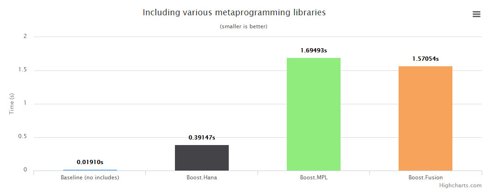

除了减少预处理时间，`Hana`还使用现代技术以尽可能高的编译时高效方式实现异构序列和算法。 在跳转到编译时性能的算法之前，我们将看看创建异构序列的编译时成本。 事实上，由于我们将展示用于序列的算法，因此我们必须意识到创建序列本身的成本，因为这将影响算法的基准。 下图显示了创建n个异构元素序列的编译时成本。

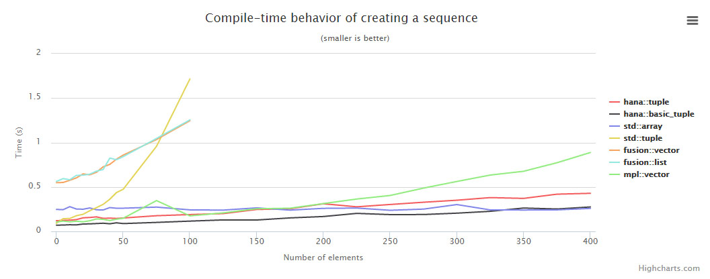

**注意**

* 您可以通过选择要放大的区域来放大图表。 此外，您可以通过在右侧的图例中单击来隐藏一系列点。

基准方法是始终以最有效的方式创建序列。对于`Hana`和`std::tuple`，这只是意味着使用适当的`make_tuple`函数。然而，对于`MPL`，这意味着创建一个大小为`20`的`mpl::vectorN`，然后使用`mpl::push_back`创建更大的向量。我们使用类似的技术融合序列。这样做的原因是`Fusion`和`MPL`序列具有固定的大小限制，并且已经发现这里使用的技术是产生更长序列的最快方式。

为了完整性，我们还提供了创建一个带有`n`个元素的`std::array`的编译时成本。但是，请注意，`std::array`只能包含单一类型的元素，因此我们在这里比较苹果和橘子。正如你所看到的，创建`std::array`的代价是恒定的，本质上是不存在的（非零开销是简单地包括`<array>`头文件）。因此，虽然`Hana`提供了比其他异构容器更好的编译时间，请坚持使用正常的均匀容器，如果这是您的应用程序所需要的;你的编译时间会快得多。

您还可以看到创建序列具有不可忽略的成本。实际上，这是做异构计算的最昂贵的部分，你会在下面的图表中看到。因此，当您查看下面的图表时，请记住仅仅创建序列的成本。还要注意，这里只介绍最重要的算法，但`Metabench`项目为几乎所有`Hana`算法的编译时性能提供了微观基准。此外，我们提供的基准比较几个不同的库。然而，由于`Hana`和`Fusion`可以使用值，而不仅仅是类型，比较他们的算法和类型的库像MPL不是真的公平。实际上，`Hana`和`Fusion`算法更强大，因为它们还允许执行运行时效应。但是，`Fusion`和`Hana`之间的比较是公平的，因为两个库都是一样强大的（严格来说）。最后，我们不能显示`std::tuple`的算法的基准，因为标准不提供等效算法。当然，我们可以使用Hana的外部适配器，但这不会是一个忠实的比较。

元编程中普遍存在的第一种算法是变换。它需要一个序列和一个函数，并返回一个包含将该函数应用于每个元素的结果的新序列。下面的图表给出了将变换应用到n个元素的序列的编译时性能。 x轴表示序列中元素的数量，y轴表示编译时间（以秒为单位）。还要注意，我们在每个库中使用变换等效;我们不使用`Hana`的转换通过`Boost.Fusion`适配器，例如，因为我们真的想要基准我们的实现。

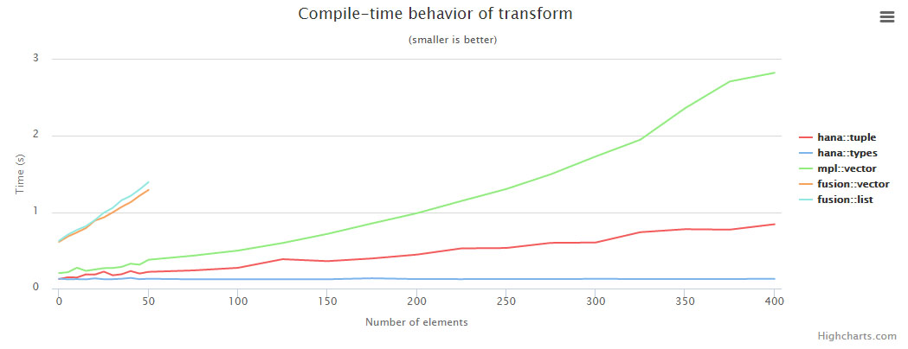

在这里，我们可以看到，`Hana`的元组表现比所有其他的选择。这主要是因为我们使用`C++11`可变参数包扩展来实现这种算法，这是非常有效的。

在我们继续前，重要的是要提到一些关于融合算法的基准测试方法。 `Fusion`中的一些算法是惰性的，这意味着它们实际上不执行任何操作，而只是将已修改的视图返回到原始数据。这是`fusion::transform`的情况，它简单地返回一个变换的视图，将这个函数应用到原始序列的每个元素，因为这些元素被访问。如果我们想对任何东西进行基准测试，我们需要强制对该视图进行评估，最终在实际代码中访问序列的元素时会发生这种情况。然而，对于具有多个层的复杂计算，惰性方法可能产生实质上不同的编译时间简档。当然，这种差异在微基准测试中表现不佳，因此请记住，这些基准测试仅仅是一部分的大局。为了使本节其余部分的完整性，我们将提到Fusion算法是否为惰性，以便您知道何时人为地强制对算法进行评估以用于基准化。

**注意**

* 我们正在考虑给`Hana`添加惰性的意见。 如果此功能对您很重要，请通过评论此问题告诉我们。

第二类重要的算法是折叠。 折叠可以用于实现许多其他算法，如`count_if`，`minimum`等。 因此，折叠算法的良好编译时性能确保这些派生算法的良好的编译时性能，这就是为什么我们只在这里展示折叠。 还要注意，所有非`monadic`折叠变体在编译时间方面有些等同，因此我们只呈现左折叠。 下图显示了将`fold_left`应用于`n`个元素的序列的编译时性能。 `x`轴表示序列中元素的数量，`y`轴表示编译时间（以秒为单位）。 用于折叠的函数是一个不起作用的虚拟函数。 在实际代码中，您可能会使用非平凡操作进行折叠，因此曲线会比这更糟糕。 然而，这些是微基准，因此它们只显示算法本身的性能。

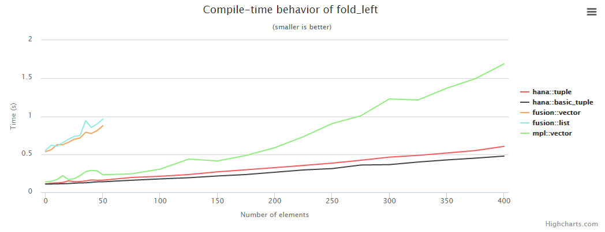

我们在这里提出的第三个也是最后一个算法是`find_if`算法。 该算法难以有效地实现，因为它需要在满足给定谓词的第一元素处停止。 出于同样的原因，现代技术并不真正帮助我们，所以这个算法构成了对`Hana`的实现质量的一个很好的测试，没有考虑到由`C++14`使用的免费午餐。

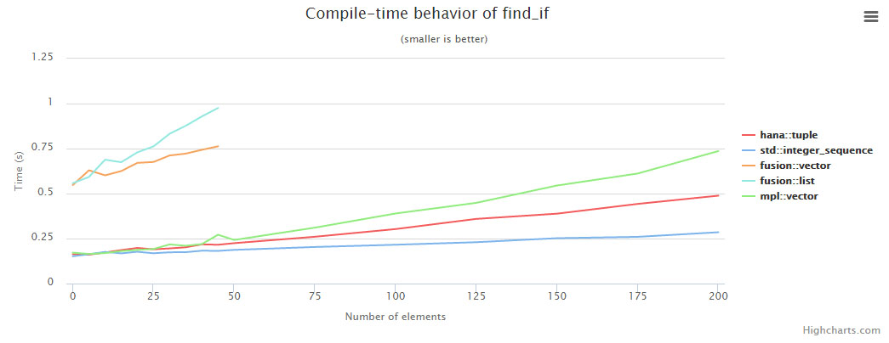

正如你所看到的，`Hana`的性能优于`Fusion`，以及`MPL`，但是`Hana`的`find_if`也可以与值一起使用，与`MPL`不同。 最后是关于编译时性能的部分。 如果你想看到一个我们没有在这里提出的算法的性能，`Metabench`项目提供了大多数`Hana`算法的编译时基准。

## 运行期性能

`Hana`被设计成在运行时非常有效。但在我们深入细节之前，让我们澄清一件事。 `Hana`是一个元编程库，允许操纵类型和值，它并不总是有意义，甚至谈论运行时性能。实际上，对于`IntegralConstants`的类型级计算和计算，运行时性能根本不是一个问题，因为计算的结果包含在一个类型中，该类型是纯编译时实体。换句话说，这些计算仅涉及编译时工作，并且甚至不生成代码以在运行时执行这些计算。讨论运行时性能的唯一情况是在异构容器和算法中操作运行时值，因为这是编译器必须生成一些运行时代码的唯一情况。因此，只有这种计算，我们将在本节的剩余部分进行研究。

就像我们对编译时基准测试一样，用于测量`Hana`运行时性能的方法是数据驱动而不是分析。换句话说，不是通过对作为输入大小的函数的基本操作的数量进行计数来尝试确定算法的复杂性，而是简单地对最有趣的情况进行测量并且观察它的行为。有这样做的几个原因。首先，我们不希望`Hana`的算法在大型输入上被调用，因为那些算法用于在编译时长度必须已知的异构序列。例如，如果您试图在`100k`个元素的序列上调用`find_if`算法，那么您的编译器会在尝试生成此算法的代码时死机。因此，不能在非常大的输入上调用算法，并且分析方法然后失去很大的吸引力。其次，处理器已经发展成为非常复杂的野兽，你能够挤出的实际性能实际上受控于比你的算法所执行的步骤数量少得多。例如，坏的高速缓存行为或分支误预测可以将理论上有效的算法变成慢速的，特别是对于小输入。由于`Hana`导致大量展开发生，这些因素必须更仔细地考虑，任何分析方法可能只会让我们认为我们是高效的。相反，我们想要硬数据，和漂亮的图表来显示它！

**注意**

* 就像编译时的性能一样，我们迫使对一些通常是懒惰的融合算法进行评估。 同样，取决于计算的复杂性，惰性算法可能导致产生实质上不同的代码或者使用不同的设计，或多或少。 当您查看这些运行时基准时，记住这一点。 如果性能对于您的应用程序是绝对关键的，您应该在从Fusion切换到Hana之前和之后进行配置。 让我们知道`Hana`是否更糟糕; 我们会解决它！

有几个不同的方面，我们将要基准。首先，我们显然希望基准算法的执行时间。其次，由于在整个库中使用的按值语义，我们也希望确保最小数量的数据被复制。最后，我们将确保使用`Hana`不会导致太多的代码膨胀，因为展开，如算法一节中所解释。

就像我们只研究了几个用于编译时性能的关键算法，我们将关注几个算法的运行时性能。对于每个基准方面，我们将比较不同库实现的算法。我们的目标是始终至少与`Boost.Fusion`一样高效，这在运行时性能方面接近最优。为了比较，我们还显示了与在运行时序列上执行的算法相同的算法，以及在编译时已知其长度但其变换算法不使用显式循环展开的序列。这里提出的所有基准都是在CMake配置中完成的，它配置了合适的优化标志（通常为-O3）。让我们从以下图表开始，其中显示了转换不同类型序列所需的执行时间：

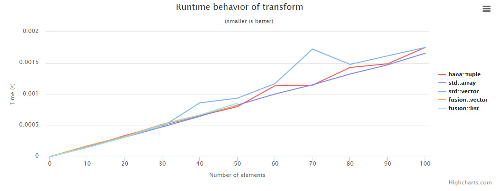

**注意**

* 请记住，`fusion::transform`通常是惰性的，我们正在强制它的评估为基准的目的。

正如你所看到的，`Hana`和`Fusion`几乎是一样的。 对于较大的集合数据集，`std::array`稍慢，对于较大的集合，`std::vector`明显更慢。 因为我们也想要寻找代码膨胀，让我们来看看为完全相同的场景生成的可执行文件的大小：

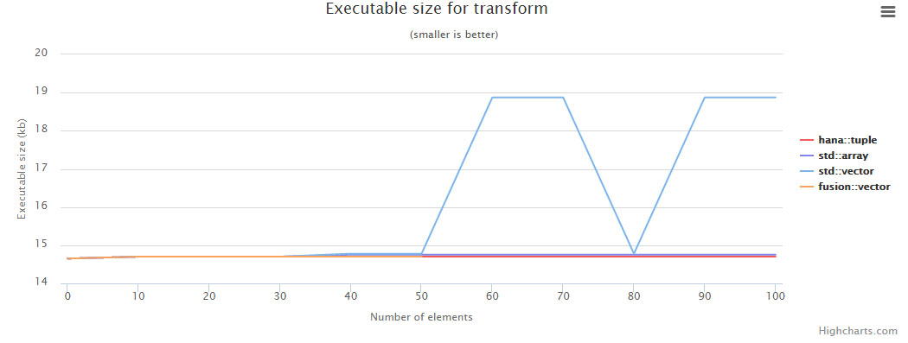

正如你可以看到，代码膨胀似乎不是一个问题，至少没有一个可以在微基准测试，如这一个。 让我们来看看折叠算法，它经常使用：

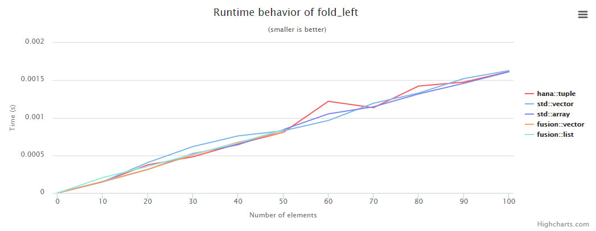

在这里，你可以看到，每个人的表现都差不多，这是一个好的迹象，哈娜至少不是拧紧的东西。 再次，让我们看看可执行文件的大小：

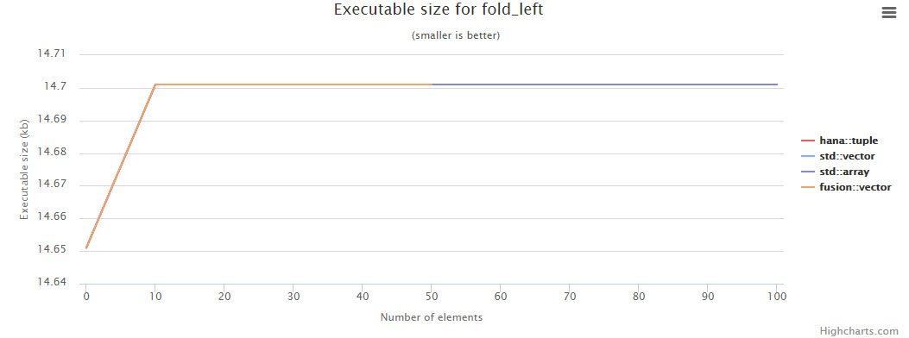

这里再次，代码大小没有爆炸。 因此，至少对于Hana的适度使用（和`Fusion`就此事，因为他们有同样的问题），代码膨胀不应该是一个主要关注。 在我们刚刚介绍的图表中的容器包含随机生成的`int`，这是便宜的复制和适合微基准。 但是，当我们在一个容器中链接多个算法时会发生什么情况，这些容器的元素复制很昂贵？ 更一般地，问题是：当一个算法被传递一个临时对象，它抓住机会，以避免不必要的副本？ 考虑：

```C++
auto xs = hana::make_tuple("some"s, "huge"s, "string"s);
// No copy of xs's elements should be made: they should only be moved around.
auto ys = hana::reverse(std::move(xs));
```

为了回答这个问题，我们将看看基准化上述代码时生成的图表的字符串大约为`1k`个字符。 但是，请注意，对标准库算法进行基准测试并不合理，因为它们不返回容器。

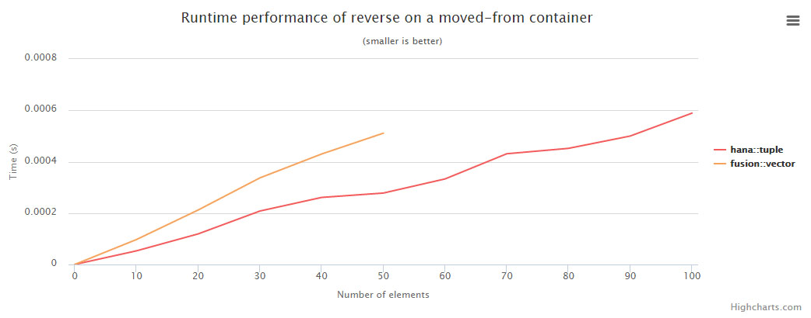

**注意**

* 请记住，`fusion::reverse`通常是惰性的，我们强制其评估为基准的目的。

如你所见，`Hana`比`Fusion`快，可能是因为在实现中更一致地使用`move`语义。 如果我们没有提供一个临时容器来撤销，哈纳不能执行任何动作，两个图书馆也会执行类似的操作：

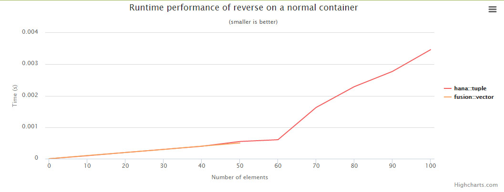

这就是关于运行时性能的部分。 希望你现在确信哈娜是为速度而建的。 性能对我们很重要：如果你遇到一个场景，其中`Hana`导致坏代码生成（并且故障不在编译器上），请打开一个问题，以便解决问题。

# 与外部库集成

`Hana`提供了与一些现有库的开箱即用集成。 具体来说，这意味着您可以使用`Hana`算法中的这些库中的一些容器，只需包含适当的标头，使之成为`Hana`和外部组件之间的桥梁。 这可以非常有用的移植现有代码从例如。 `Fusion / MPL`到`Hana`：

```C++
// In the old code, this used to receive a Fusion sequence.
// Now, it can be either a Hana sequence or a Fusion sequence.
template <typename Sequence>
void f(Sequence const& seq) {
    hana::for_each(seq, [](auto const& element) {
        std::cout << element << std::endl;
    });
}
```

**注意**

* 此时，仅提供使用`Hana`中其他库的数据类型的适配器; 不提供适配器（使用其他库中的`Hana`容器）。

但是，使用外部适配器有几个陷阱。 例如，过一段时间使用`Hana`，您可能习惯于使用正常的比较运算符比较`Hana`元组，或者使用`Hana`的`integral_constants`进行算术。 当然，没有什么能保证这些操作符也被定义为外部适配器（并且通常它们不会）。 因此，你必须坚持`Hana`提供的实现这些运算符的函数。 例如：

```C++
auto r = std::ratio<3, 4>{} + std::ratio<4, 5>{}; // error, the operator is not defined!
```

相反，您应该使用以下：

```C++
#include <boost/hana/ext/std/ratio.hpp>
#include <boost/hana/plus.hpp>
#include <ratio>
namespace hana = boost::hana;
auto r = hana::plus(std::ratio<3, 4>{}, std::ratio<4, 5>{});
```

但有时候，情况会更糟。 一些外部组件定义运算符，但它们不一定具有与来自`Hana`的语义相同的语义。 例如，比较两个不同长度的`std::tuple`会在使用`operator ==`时产生错误：

```C++
std::make_tuple(1, 2, 3) == std::make_tuple(1, 2); // compiler error
```

另一方面，比较不同长度的`Hana`元组将只返回一个错误的`IntegralConstant`：

```C++
hana::make_tuple(1, 2, 3) == hana::make_tuple(1, 2); // hana::false_c
```

这是因为`std::tuple`定义了自己的操作符，它们的语义与`Hana`的操作符不同。 解决方案是坚持使用`Hana`的命名函数，而不是使用运算符，当你知道你将需要使用其他库：

```C++
hana::equal(std::make_tuple(1, 2, 3), std::make_tuple(1, 2)); // hana::false_c
```

当使用外部适配器时，还应小心不要忘记包括正确的头文件。 例如，假设我想使用一个`Boost.MPL`向量与`Hana`。 我包括适当的头文件：

```C++
#include <boost/hana/ext/boost/mpl/vector.hpp> // bridge header
using Vector = mpl::vector<int, char, float>;
static_assert(hana::front(Vector{}) == hana::type_c<int>, "");
```

**注意**

* 这些头文件的确切布局在关于头文件组织的部分中有说明。

然而，现在，假设我使用`mpl::size`查询向量的大小，然后将其与某个值进行比较。 我也可以使用`hana::length`，一切都会很好，但为了例子的缘故与我一起：

```C++
using Size = mpl::size<Vector>::type;
static_assert(hana::equal(Size{}, hana::int_c<3>), ""); // breaks!
```

这个断点的原因是`mpl::size`返回一个`MPL IntegralConstant`，`Hana`无法知道这些，除非你包括正确的头文件。 因此，您应该执行以下操作：

```C++
#include <boost/hana/ext/boost/mpl/integral_c.hpp>
using Size = mpl::size<Vector>::type;
static_assert(hana::equal(Size{}, hana::int_c<3>), "");
```

士气是在使用外部库时，你必须对你所操作的对象有点小心。 最后的陷阱是关于外部库中的实现限制。 许多较旧的库对于可以使用它们创建的异构容器的最大大小有限制。 例如，不能创建包含`FUSION_MAX_LIST_SIZE`个以上元素的`Fusion`列表。 显然，这些限制是由`Hana`继承的，例如，试图计算包含`5`个元素的`fusion::list`的排列（结果列表将包含`120`个元素）将以可怕的方式失败：

```C++
auto list = fusion::make_list(1, 2, 3, 4, 5);
auto oh_jeez = hana::permutations(list); // probably won't make it
```

除了在本节中解释的陷阱，使用外部适配器应该像使用正常的哈纳容器一样简单。 当然，只要有可能，你应该试着坚持`Hana`的容器，因为他们通常更友好的工作，并经常更优化。

# Hana 核心

本节的目标是对`Hana`的核心进行一个高层次的概述。 这个核心是基于标签的概念，它是从`Boost.Fusion`和`Boost.MPL`库借用的，但`Hana`进一步采取了。 这些标签然后用于多个目的，如算法定制，文档分组，改进错误消息和将容器转换为其他容器。 由于其模块化设计，Hana可以非常容易地以特别的方式扩展。 事实上，库的所有功能通过特定的定制机制提供，这在这里解释。

## Tag

异构编程基本上是使用具有不同类型的对象进行编程。然而，很清楚，一些对象的家族，虽然具有不同的表示（`C++类型`），是强烈相关的。例如，`std::integral_constant<int，n>`类型对于每个不同的`n`是不同的，但在概念上它们都代表相同的东西;编译时编号。事实上，`std::integral_constant <int，1>{}`和`std::integral_constant<int，2>{}`有不同的类型只是一个事实的副作用，我们使用他们的类型来编码这些对象。事实上，当操作`std :: integr_constant<int，...> s`的序列时，你可能会认为它是一个虚拟的`integral_constant`类型的同构序列，忽略对象的实际类型，假装它们都是只是使用了不同值的`integral_constants`。

为了反映这一现实，`Hana`提供了代表异构容器和其他编译时实体的标签。例如，所有的`Hana`的`integral_constant<int，...>`都有不同的类型，但是它们都有相同的标签，即`integral_constant_tag<int>`。这允许程序员根据单个类型来思考，而不是试图考虑对象的实际类型。具体来说，标签被实现为空结构体。为了使它们脱颖而出，`Hana`采用通过添加`_tag`后缀命名这些标签的约定。

**注意**

* 可以通过使用`tag_of<T>::type`或等效的`tag_of_t<T>`来获得类型T的对象的标签。

标签是正常`C++`类型的扩展。 事实上，默认情况下，类型T的标签是T本身，并且库的核心被设计为在这些情况下工作。 例如，`hana::make`期望标签或实际类型; 如果你发送一个类型`T`，它会做逻辑的事情，并构造一个类型T的对象与你传递的参数。 但是，如果您向其传递标记，则应该专门针对该标记进行处理，并提供自己的实现，如下所述。 因为标签是对通常类型的扩展，所以我们最终通常是标签而不是通常的类型的推理，文档有时使用单词类型，数据类型和标签可互换。

## Tag 分发

标签调度是一种通用的编程技术，用于根据传递给函数的参数的类型来选择函数的正确实现。 重写函数行为的通常机制是重载。 不幸的是，当处理具有不同基本模板的相关类型的族时，或者当模板参数的种类不是已知的（是类型还是非类型模板参数？）时，这种机制并不总是方便的。 例如，考虑尝试为所有`Boost.Fusion`向量重载一个函数：

```C++
template <typename ...T>
void function(boost::fusion::vector<T...> v) {
    // whatever
}
```

如果你知道`Boost.Fusion`，那么你可能知道它不会工作。 这是因为`Boost.Fusion`向量不一定是`boost::fusion::vector`模板的特化。 `Fusion`载体也以编号形式存在，它们都是不同类型：

```C++
boost::fusion::vector1<T>
boost::fusion::vector2<T, U>
boost::fusion::vector3<T, U, V>
...
```

这是一个实现细节，需要通过缺少可变参数模板在`C++03`泄漏到接口。这是不幸的，但我们需要一种方法来解决它。为此，我们使用具有三个不同组件的基础结构：

1. 一个元函数将单个标签关联到相关类型系列中的每个类型。在`Hana`中，可以使用`tag_of`元函数访问此标记。具体来说，对于任何类型`T`，`tag_of<T>::type`是用于分派它的标签。

2. 属于库的公共接口的函数，我们希望能够提供自定义实现。在`Hana`中，这些函数是与概念相关的算法，如变换或解包。

3. 函数的实现，用传递给函数的参数的标签参数化。在`Hana`中，这通常通过具有一个名为`xxx_impl`（用于接口函数`xxx`）的单独模板与嵌套应用静态函数来完成，如下所示。

当调用`public`接口函数`xxx`时，它将获得它希望分派调用的参数的标签，然后将调用转发到与这些标签相关联的`xxx_impl`实现。例如，让我们实现一个基本设置，用于将其参数打印到流的函数的标签分派。首先，我们定义公共接口函数和可以专门的实现：

``` C++
template <typename Tag>
struct print_impl {
  template <typename X>
  static void apply(std::ostream&, X const&) {
    // possibly some default implementation
  }
};
template <typename X>
void print(std::ostream& os, X x) {
  using Tag = typename hana::tag_of<X>::type;
  print_impl<Tag>::apply(os, x);
}
```

现在，让我们定义一个类型，需要标签分派来自定义打印的行为。 虽然一些`C++14`的例子存在，它们太复杂，不能在本教程中显示，因此我们将使用一个`C++03`元组实现为几种不同的类型来说明该技术：

```C++
struct vector_tag;
struct vector0 {
  using hana_tag = vector_tag;
  static constexpr std::size_t size = 0;
};
template <typename T1>
struct vector1 {
  T1 t1;
  using hana_tag = vector_tag;
  static constexpr std::size_t size = 1;
  template <typename Index>
  auto const& operator[](Index i) const {
    static_assert(i == 0u, "index out of bounds");
    return t1;
  }
};
template <typename T1, typename T2>
struct vector2 {
  T1 t1; T2 t2;
  using hana_tag = vector_tag;
  static constexpr std::size_t size = 2;
  // Using Hana as a backend to simplify the example.
  template <typename Index>
  auto const& operator[](Index i) const {
    return *hana::make_tuple(&t1, &t2)[i];
  }
};
// and so on...
```

嵌套使用`hana_tag = vector_tag;` 部分是控制`tag_of`元函数的结果的简单方式，因此是`vectorN`类型的标签。 这在`tag_of`的参考中解释。 最后，如果你想为所有的`vectorN`类型定制打印函数的行为，你通常需要：

```C++
void print(std::ostream& os, vector0)
{ os << "[]"; }
template <typename T1>
void print(std::ostream& os, vector1<T1> v)
{ os << "[" << v.t1 << "]"; }
template <typename T1, typename T2>
void print(std::ostream& os, vector2<T1, T2> v)
{ os << "[" << v.t1 << ", " << v.t2 << "]"; }
// and so on...
```

现在，使用标签分派，您可以依赖于所有共享相同标签的`vectorNs`，而只专门修改`print_impl`结构：

```C++
template <>
struct print_impl<vector_tag> {
  template <typename vectorN>
  static void apply(std::ostream& os, vectorN xs) {
    constexpr auto N = hana::size_c<vectorN::size>;
    os << "[";
    N.times.with_index([&](auto i) {
      os << xs[i];
      if (i != N - hana::size_c<1>) os << ", ";
    });
    os << "]";
  }
};
```

一个优点是，所有的`vectorNs`现在可以由打印函数均匀地处理，在创建数据结构（以指定每个向量`N`的标签）和创建初始打印函数（设置标签调度系统）时，以一些样板为代价 `with print_impl`）。 这种技术还有其他优点，如在接口函数中检查前提条件的能力，而不必在每个自定义实现中执行，这将是乏味的：

```C++
template <typename X>
void print(std::ostream& os, X x) {
  // **** check some precondition ****
  // The precondition only has to be checked here; implementations
  // can assume their arguments to always be sane.
  using Tag = typename hana::tag_of<X>::type;
  print_impl<Tag>::apply(os, x);
}
```

**注意**

* 检查前提条件对于打印函数没有多大意义，但是例如考虑获得序列的第n个元素的函数; 您可能需要确保索引不超出界限。

这种技术还使得更容易提供接口函数作为函数对象而不是普通的重载函数，因为只有接口函数本身必须经历定义函数对象的麻烦。 函数对象具有超过重载函数的几个优点，例如用于更高阶算法或变量的能力：

```C++
// Defining a function object is only needed once and implementations do not
// have to worry about static initialization and other painful tricks.
struct print_t {
  template <typename X>
  void operator()(std::ostream& os, X x) const {
    using Tag = typename hana::tag_of<X>::type;
    print_impl<Tag>::apply(os, x);
  }
};
constexpr print_t print{};
```

你可能知道，能够同时为许多类型实现一个算法是非常有用的（这正是`C++模板`的目标！）。然而，甚至更有用的是为满足一些条件的许多类型实现算法的能力。 `C++模板`目前缺少这种限制模板参数的能力，但是一个称为`Concept`的语言特性正在推出，目的是解决这个问题。

有了类似的想法，`Hana`的算法支持一个额外的标签调度层，如上所述。这个层允许我们为所有类型满足一些谓词的算法“专门化”。例如，假设我们想对所有表示某种序列的类型实现上面的print函数。现在，我们不会有一个简单的方法来做到这一点。然而，Hana算法的标签调度设置与上面显示的略有不同，因此我们可以写下:

```C++
template <typename Tag>
struct print_impl<Tag, hana::when<Tag represents some kind of sequence>> {
  template <typename Seq>
  static void apply(std::ostream& os, Seq xs) {
    // Some implementation for any sequence
  }
};
```

其中`Tag`表示某种类型的序列将仅需要是表示Tag是否是序列的布尔表达式。我们将看到如何在下一节中创建这样的谓词，但现在让我们假设它只是工作。在不详细说明如何设置该标签分配的情况下，上述专门化仅在满足该谓词时被选取，并且如果没有找到更好的匹配。因此，例如，如果我们的`vector_tag`要满足谓词，我们对`vector_tag`的初始实现仍然优先于基于`hana::when`的特化，因为它表示更好的匹配。一般来说，任何不使用hana :: when的特殊化（无论是显式还是部分）将优先于使用`hana::when`的特殊化，这从用户的角度来看尽可能不令人惊讶。这涵盖了几乎所有关于在哈娜的标签调度。下一节将解释如何为元编程创建`C++`概念，然后可以与`hana::when`结合使用来实现大量的表达。

## 模拟C++约束

`Hana`中的概念的实现非常简单。 在它的核心，一个概念只是一个模板`struct`继承自一个布尔的`integral_constant`表示给定的类型是一个概念的模型：

```C++
template <typename T>
struct Concept
  : hana::integral_constant<bool, whether T models Concept>
{ };
```

然后，可以通过查看`Concept<T>::value`来测试类型T是否是`Concept`的模型。很简单，对吧？现在，虽然可能实现检查的方式不一定是任何具体的`HANA`，本节的其余部分将解释如何通常在`Hana`，以及它如何与标签调度交互。然后，您应该能够定义自己的概念，如果你愿意，或至少更好地了解`Hana`内部工作。

通常，Hana定义的概念将要求任何模型实现一些标签分派的函数。例如，`Foldable`概念要求任何模型定义至少一个`hana::unpack`和`hana::fold_left`。当然，概念通常也定义语义要求（称为法律），它们必须由他们的模型满足，但是这些规律不是（也不能）被概念检查。但是我们如何检查一些功能是否正确实现？为此，我们必须稍微修改我们定义的标签调度方法，如上一节所示。让我们回到我们的打印示例，并尝试为可打印的对象定义一个`Printable`概念。我们的最终目标是拥有一个模板结构如

```C++
template <typename T>
struct Printable
  : hana::integral_constant<bool, whether print_impl<tag of T> is defined>
{ };
```

要知道是否定义了`print_impl<...>`，我们将修改`print_impl`，使得它在不被覆盖的情况下从一个特殊的基类继承，我们只需检查`print_impl<T>`是否继承了该基类：

```C++
struct special_base_class { };
template <typename T>
struct print_impl : special_base_class {
  template <typename ...Args>
  static constexpr auto apply(Args&& ...) = delete;
};
template <typename T>
struct Printable
    : hana::integral_constant<bool,
        !std::is_base_of<special_base_class, print_impl<hana::tag_of_t<T>>>::value
    >
{ };
```

当然，当我们使用自定义类型专门化`print_impl`时，我们不会继承该`special_base_class`类型：

```C++
struct Person { std::string name; };
template <>
struct print_impl<Person> /* don't inherit from special_base_class */ {
  // ... implementation ...
};
static_assert(Printable<Person>::value, "");
static_assert(!Printable<void>::value, "");
```

正如你所看到的，`Printable<T>`只是检查`print_impl <T> struct`是否是一个自定义类型。 特别地，它甚至不检查是否定义嵌套的`::apply`函数或者它是否在语法上有效。 假设如果一个专门用于自定义类型的`print_impl`，则嵌套的`::apply`函数存在并且是正确的。 如果不是，则当尝试在该类型的对象上调用`print`时将触发编译错误。 `Hana`中的概念做出相同的假设。

由于这种从特殊基类继承的模式在Hana中是相当丰富的，所以库提供了一个称为`hana::default_`的虚拟类型，可以用于替换`special_base_class`。 然后，不使用`std::is_base_of`，可以使用`hana::is_default`，看起来更好。 有了这个语法糖，代码现在变成：

```C++
template <typename T>
struct print_impl : hana::default_ {
  template <typename ...Args>
  static constexpr auto apply(Args&& ...) = delete;
};
template <typename T>
struct Printable
    : hana::integral_constant<bool,
        !hana::is_default<print_impl<hana::tag_of_t<T>>>::value
    >
{ };
```

这就是要知道标签调度函数和概念之间的交互。然而，`Hana`中的一些概念不仅仅依赖于特定标签调度函数的定义来确定类型是否是概念的模型。当概念仅通过法律和精化概念引入语义保证，但没有额外的句法要求时，这可能发生。定义这样的概念由于几个原因是有用的。首先，如果我们可以假设一些语义保证`X`或`Y`，有时候会发生一个算法可以更有效地实现，所以我们可能创建一个概念来强制这些保证。其次，当我们有额外的语义保证时，有时可以自动定义几个概念的模型，这样可以节省用户手动定义这些模型的麻烦。例如，这是`Sequence`概念的情况，它基本上为`Iterable`和`Foldable`添加了语义保证，从而允许我们为从`Comparable`到`Monad`的大量概念定义模型。

对于这些概念，通常需要在`boost::hana`命名空间中专门化相应的模板结构以提供自定义类型的模型。这样做就像提供一个密封，说这个概念所要求的语义保证是由定制类型遵守的。需要明确专门化的概念将记录这一事实。这就是它！这是所有有必要了解的`Hana`的概念，到这里就结束了关于`Hana`的核心一节。

# 头文件的组织结构

库被设计为模块化的，同时保持必须包括的头文件的数量以获得相当低的基本功能。 库的结构也故意保持简单，因为我们都喜欢简单。 以下是头文件组织的一般概述。 该库提供的所有标题的列表也可在左侧面板（标题标签下）看到，以备您需要更多详细信息。

* boost/hana.hpp
  这是库的主标题，其中包括库的整个公共接口。请注意，外部适配器，实验功能和实现细节不包括在这个头文件中，但是，因为其中一些需要额外的依赖。

* boost/hana/
  这是包含库提供的一切的定义的库的主目录。库提供的每个算法和容器都有自己的头文件。对于一个名为XXX的容器或算法，相应的头文件是boost/hana/XXX.hpp。

  * boost/hana/concept/
  这个子目录包含Hana的概念的定义。这些头文件提供了一种检查对象是否是相应概念的模型的方法，并且它们有时还为其他相关概念提供默认实现，这些概念在每个概念的基础上被记录。它们还包括与该概念相关联的所有算法。
  * boost/hana/core/
  这个子目录包含标签调度和其他相关实用程序（如make和to）的机制。
  * boost/hana/fwd/
  这个子目录包含库中所有内容的前向声明。它本质上是boost/hana/目录的镜像，除了所有的头文件只包含前向声明和文档。例如，要包含hana::tuple容器，可以使用boost/hana/tuple.hpp头文件。但是，如果只想要该容器的前向声明，可以使用boost/hana/fwd/tuple.hpp头文件。请注意，不提供在boost/ hana/ext/和boost/hana/functional/中的头文件的转发声明。
  * boost/hana/functional/
  这个子目录包含通常有用的各种函数对象，但不一定属于一个概念。
  * boost/hana/ext/
  此目录包含外部库的适配器。对于命名空间ns中名为xxx的组件，外部适配器位于boost/hana/ext/ns/xxx.hpp标头中。例如，`std::tuple`的外部适配器位于boost/hana/ext/std/tuple.hpp头文件中，而`boost::mpl::vector`的外部适配器位于boost/hana/ext/boost/mpl/vector.hpp。

  注意，只有适应外部组件所需的严格最小值才包括在这些头文件中（例如向前声明）。这意味着当想要使用外部组件时，应该包括外部组件的定义。例如：

   ```C++
  #include <boost/hana/ext/std/tuple.hpp>
  #include <boost/hana/front.hpp>
  #include <tuple> //仍然需要创建元组
  namespace hana = boost::hana;
  int main() {
    constexpr std :: tuple <int，char，float> xs {P1，'2'，3.0f};
    static_assert(hana :: front(xs)== 1，“”);
  }
  ```

  * boost/hana/experimental/
  此目录包含实验性功能，可能会或可能不会在某一时刻进入库，但这被认为是有用的足够提供给公众。此子目录中的功能驻留在`hana::experimental`命名空间中。此外，不要指望这些功能是稳定的;它们可以在库的发行之间被移动，重命名，改变或移除。这些功能还可能需要额外的外部依赖关系;每个功能记录其需要的附加依赖性（如果有）。

  由于潜在的附加依赖性，这些头文件也不包括在库的主标题中。

  * boost/hana/detail/
  此目录包含内部需要的实用程序没有细节/保证是稳定的，所以你不应该使用它。

# 结束语

您现在拥有开始使用库所需的一切。 从这一点开始，掌握库只是理解如何使用通用概念和随其提供的容器的问题，最好通过查看参考文档来完成。 在某些时候，您可能还想创建自己的概念和数据类型，以更好地满足您的需求; 继续，库被设计为使用那种方式。

## Fair warning: functional programming ahead

使用异构对象的编程本质上是功能性的 - 因为不可能修改对象的类型，所以必须引入新的对象，其排除了突变。 不像以前的元编程库设计是在STL建模，Hana使用编程的功能风格，这是其表达性的很大一部分的来源。 然而，作为结果，在参考中呈现的许多概念对于没有功能编程知识的C++程序员来说将是不熟悉的。 参考试图通过使用直觉尽可能使这些概念平易近人，但要记住，最高的奖励通常是一些努力的结果。

这完成了教程部分的文档。 我希望你喜欢使用`Hana`，并请考虑贡献，使它更好！

\- Louis

# 使用此参考

对于大多数通用库，Hana中的算法通过它们所属的概念（`Foldable`，`Iterable`，`Searchable`，`Sequence`等等）来记录。 不同的容器然后被记录在他们自己的页面上，并且他们建模的概念被记录在那里。 由某个容器建模的概念定义了可以与这样的容器一起使用的算法。

更具体地，参考的结构（在左边的菜单中可用）如下：

* 核心
  核心模块的文档，其中包含创建概念，数据类型和相关实用程序所需的一切。这是相关的，如果你需要扩展库，否则你可以忽略这一点。
* 概念
  与库一起提供的所有概念的文档。每个概念：
  * 必须绝对实施函数的文档，以便对该概念建模。必须提供的函数集称为最小完整定义。
  * 该概念的任何模型必须满足的文档语义约束。这些约束通常称为定律，它们以半正式数学语言表示。当然，这些法律不能自动检查，但你应该确保你满意他们。
  * 记录其精炼的概念（如果有的话）。有时，一个概念是足够强大的，以提供一个概念的模型，它精炼，或至少一些相关的功能的实现。在这种情况下，该概念将记录其提供的精化概念的哪些功能，以及如何实现。此外，有时可能的是，用于精化概念的模型是唯一的，在这种情况下，其可以被自动提供。当这种情况发生时，它将被记录，但你不必做任何特殊的，以获得该模型。
* 数据类型
  与库一起提供的所有数据结构的文档。每个数据结构都记录了它模型的概念，以及它是如何实现的。它还记录了绑定到它的方法，但不是任何概念，例如也许是可选的。
* 功能
  通常在纯功能设置中有用的通用函数对象。这些目前没有绑定到任何概念或容器。
* 外部适配器
  外部库的所有适配器的文档。这些适配器被记录为Hana提供的本机类型，但显然`Hana`只提供它们和库之间的兼容层。
* 配置选项
  可用于调整库的全局行为的宏。
* 断言
  宏执行各种类型的断言。
* 按字母顺序排列
  库中提供的所有内容的字母索引。
* 标题
  库提供的所有标题的列表。
* 细节
  实施细节;不要去那里。任何未记录或记录在此组中的内容不能保证是稳定的。

在你知道Hana更好一点之后，它可能会发生，你只是想找到一个精确的函数，概念或容器的参考。如果您知道要查找的内容的名称，可以使用文档任何页面右上角的搜索框。我个人的经验是，这是迄今为止，当你已经知道它的名字，找到你想要的最快的方式。

## 函数签名

正如你将在参考中看到的，几个函数提供以半正式数学语言记录的签名。 我们正在以这种方式记录所有功能，但这可能需要一段时间。 使用的符号是用于定义函数的通常的数学符号。 具体地，函数`Return f(Arg1，...，ArgN)`; 可以使用数学符号`as`等价地定义:

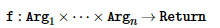

然而，这些签名不是记录实际的参数和返回类型的函数，而是根据参数和返回标签来写。 这是因为异构设置，其中对象的实际类型通常是毫无意义的，并且不帮助推断什么是由函数返回或采取。 例如，不是将`integral_constants`的等函数记录为

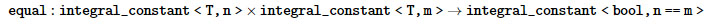

这是没有真正有用的（因为它真的不提供任何东西，但实现），而是记录使用`integr_constant_tag`，它充当所有的`integral_constants`的“类型”。 注意，因为`equal`是`Comparable`概念的一部分，所以实际上没有为`hana::integral_constant`记录，但是想法是：


这清楚地表达了比较两个整数常数给出另一个整数常数持有一个布尔的意图。 一般来说，对象的实际表示的这种抽象使我们能够以高级方式推理函数，即使它们的实际返回和参数类型是异质的并且没有帮助也是可能的。 最后，大多数函数期望容器元素具有一些属性。 例如，这是排序算法的情况，这显然需要容器元素是可订购的。 通常，我们将为`sort`的非预测版本写入签名

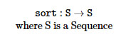

然而，这并不表示S的内容是可订购的要求。 为了表达这一点，我们使用以下符号：

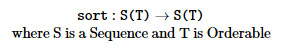

看到这一点的一种方法是假装S，序列标签，实际上是由序列的元素T的标签参数化。我们还假装这些元素都有相同的标签T，这不是一般的情况 。 现在，通过说明T必须是`Orderable`，我们表达的事实，序列的元素必须是`Orderable`。 这种符号用于不同的口味来表达不同种类的需求。 例如，`cartesian_product`算法采用一系列序列，并将那些序列的笛卡尔积作为序列序列返回。 使用我们的标记，这可以很容易地传达：

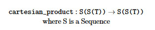


# 致谢

我要感谢以下人员和组织以这样或那样的方式贡献哈娜：

* Zach Laine和Matt Calabrese提出了使用函数调用语法做类型计算的原始想法，如BoostCon演示文稿（幻灯片1）（幻灯片2）中所示。
* Joel Falcou在我作为Google夏季代码计划的一部分工作期间连续两年指导我，Niall Douglas作为Boost的GSoC管理员，帮助我加入计划，最终让Google获得了令人敬佩的GSoC计划。
* `Boost`指导委员会为我在2015年冬天在`Hana`工作授予资金，作为对上一年GSoC的延伸。
* 几个`C++`现在的参与者和`Boost`邮件列表的成员，有关该项目的深入的对话，评论和问题。

# 词汇表

参考文档使用特定于此库的几个术语。 此外，功能的简化实现有时在伪代码中提供，实际实现有时稍微难以理解。 本节定义在引用和用于描述一些函数的伪代码中使用的术语。

## forwarded(x)

意味着对象被最佳地转发。 这意味着如果x是一个参数，它是`std::forward`，如果它是一个捕获的变量，它从每当包围`lambda`是一个右值时移动。

还要注意，当x可以移出时，语句`return forwarded(x);` 在带有`decltype(auto)`的函数中，并不意味着将返回对`x`的右值引用，这将创建一个悬挂引用。 相反，它意味着`x`由值返回，值由`std::forwarded x`构造。

## perfect-capture

这在`lambdas`中用于表示捕获的变量使用完美转发进行初始化，就好像使用了`[x(forwarded(x))...](){}`。

## tag-dispatched

这意味着记录的函数使用标签分派，因此确切的实现取决于与函数相关联的概念的模型。

## implementation-defined

这表示实体（通常是类型）的确切实现不应被用户依赖。 特别是，这意味着，不能假设任何超出文档中明确书面的内容。 通常，由实现定义的实体满足的概念将被记录，因为否则可能对它不起作用。 具体来说，假设太多的实现定义的实体可能不会杀了你，但是当你更新到较新版本的`Hana`时，它很可能会破坏你的代码。

# 快速问答

本节记录了一些设计选择的理由。 它也作为一些（不是这样）常见问题的解答。 如果你认为某个问题应该添加到这个列表，开一个GitHub `issue`，我们将考虑改进文档或在这里添加问题。

## 为什么要限制外部依赖的使用？

这样做有几个原因。首先，哈纳是一个非常基础的图书馆;我们基本上重新实现了核心语言和支持异构类型的标准库。当经历代码时，人们很快意识到，其他库很少需要，几乎一切都必须从头开始实现。此外，由于`Hana`是非常基本的，因此更有动机保持依赖最小，因为那些依赖将传递给用户。关于对`Boost`最小的依赖，使用它的一个大论据是可移植性。然而，作为一个前沿库，`Hana`只定位最近的编译器。因此，我们可以依赖于现代构造，并且通过使用`Boost`提供给我们的可移植性将主要代表自重。

## 为什么没有迭代器？

基于迭代器的设计具有它们自己的优点，但是也已知它们降低算法的可组合性。此外，异构编程的上下文带来了很多点，使迭代器不那么有趣。例如，递增迭代器将必须返回具有不同类型的新迭代器，因为它在序列中指向的新对象的类型可能不同。它也证明，在迭代器方面实现大多数算法导致更差的编译时性能，只是因为元编程的执行模型（使用编译器作为解释器）与C ++的运行时执行模型（处理器访问连续存储器）。

## 为什么要留下一些容器的表示实现定义？

首先，它为实现提供了更多的摆动空间，通过使用特定容器的聪明表示来执行编译时和运行时优化。 例如，包含类型T的同类对象的元组可以实现为类型T的数组，这在编译时更有效。 其次，最重要的是，知道一个异构容器的类型不如你想象的有用。 实际上，在异构编程的上下文中，由计算返回的对象的类型通常也是计算的一部分。 换句话说，没有办法知道由算法返回的对象的类型，而不实际执行算法。 例如，考虑`find_if`算法：

```C++
auto tuple = hana::make_tuple(1, 'x', 3.4f);
auto result = hana::find_if(tuple, [](auto const& x) {
  return hana::traits::is_integral(hana::typeid_(x));
});
```

如果对元组的某些元素满足谓词，结果将等于`just(x)`。 否则，结果将等于无。 然而，结果的空白在编译时是已知的，这需要只有（x），没有什么可以有不同的类型。 现在，假设你想明确地写出结果的类型：

```C++
some_type result = hana::find_if(tuple, [](auto const& x) {
  return hana::traits::is_integral(hana::typeid_(x));
});
```

为了拥有`some_type`的知识，您需要实际执行算法，因为`some_type`取决于容器中某些元素的谓词是否得到满足。 换句话说，如果你能够写上面的话，那么你就已经知道了算法的结果，你不需要首先执行算法。 在`Boost.Fusion`中，通过具有单独的`result_of`命名空间来解决这个问题，该命名空间包含计算给定传递给它的参数的类型的任何算法的结果类型的元函数。 例如，上面的例子可以用`Fusion`重写为：

```C++
using Container = fusion::result_of::make_vector<int, char, float>::type;
Container tuple = fusion::make_vector(1, 'x', 3.4f);
using Predicate = mpl::quote1<std::is_integral>;
using Result = fusion::result_of::find_if<Container, Predicate>::type;
Result result = fusion::find_if<Predicate>(tuple);
```

注意，我们基本上是做计算两次; 一次在`result_of`命名空间中，一次在正常的融合命名空间中，这是高度冗余的。 在`auto`和`decltype`之前，这样的技术对于执行异构计算是必要的。 然而，由于现代`C++`的出现，在异构编程的上下文中对显式返回类型的需要在很大程度上已经过时，并且知道容器的实际类型通常不是有用的。

## 为什么命名为Hana？

不，这不是我女朋友的名字！我只需要一个短而好看的名字，人们会很容易记得，而且`Hana`来了。这也使我注意到，`Hana`是指日本花，在韩语`Hana`表达了优美的概念，它统一了单一范式下的类型级和异构编程，这个名称回顾起来是相当不错的选择:-)。

## 为什么要定义我们自己的元组？

由于`Hana`在元组上定义了很多算法，一个可能的方法是简单地使用`std::tuple`并提供算法，而不是提供我们自己的元组。提供我们自己的元组的原因主要是性能。事实上，迄今为止测试的所有`std::tuple`实现都有非常糟糕的编译时性能。此外，为了获得真正惊人的编译时性能，我们需要利用元组的内部表示在一些算法，这需要定义我们自己的。最后，如果我们使用一个`std::tuple`，就不能提供一些像运算符`[]`的糖，因为该运算符必须定义为成员函数。

## 如何选择名称？

当决定一个名字X时，我尝试平衡以下事情（没有特定的顺序）：

* `C++`中的`X`是如何惯用的？
* 在编程世界的其余部分，`X`是如何惯用的？
* 一个名字`X`实际上是多好，不管历史原因
* 我如何作为库作者，感觉到`X`
* 库的用户如何感受`X`
* 是否有技术原因不使用`X`，如名称冲突或标准保留的名称

当然，好的命名永远是困难的。名称是并将永远受到作者自己的偏见的污染。不过，我尝试以合理的方式选择名字。

## 如何决定参数顺序？

不像命名，这是相当主观的，函数的参数的顺序通常是相当简单的确定。基本上，经验法则是“容器先行”。在`Fusion`和`MPL`中一直是这种方式，对于大多数`C++`程序员来说这是直观的。此外，在高阶算法中，我尝试将函数参数放在最后，以便多行`lambdas`看起来不错：

```C++
algorithm(container, [](auto x) {
  return ...;
});
// is nicer than
algorithm([](auto x) {
  return ...;
}, container);
```

## 为什么使用标签调度？

我们可以使用几种不同的技术在库中提供自定义点，并且选择了标签分发。为什么？首先，我想要一个双层调度系统，因为这允许第一层（用户调用的那些）的函数实际上是函数对象，这允许将它们传递给更高阶的算法。使用具有两个层的调度系统还允许向第一层添加一些编译时健全性检查，这改进了错误消息。

现在，由于几个原因，选择标签调度而不是其他具有两层的技术。首先，必须明确地声明一些标签是一个概念的模型是否有责任确保概念的语义要求被尊重给用户。其次，当检查类型是否是某个概念的模型时，我们基本上检查一些关键函数是否被实现。特别地，我们检查从该概念的最小完整定义的功能被实现。例如，`Iterable <T>`检查是否为`T`实现了`is_empty`，`at`和`drop_front`函数。但是，没有标签分派的情况下检测这个函数的唯一方法是基本检查以下表达式是否在`SFINAE-able`上下文中有效：

```C++
implementation_of_at(std::declval<T>(), std::declval<N>())
implementation_of_is_empty(std::declval<T>())
implementation_of_drop_front(std::declval<T>())
```

不幸的是，这需要实际做算法，这可能触发硬编译时错误或损害编译时性能。 此外，这需要选择一个任意索引`N`调用`at`：如果`Iterable`是空的怎么办？ 使用标签分派，我们可以询问是否定义了`at_impl<T>`，`is_empty_impl<T>`和`drop_front_impl<T>`，并且没有发生任何事情，直到我们实际调用它们的嵌套`::apply`函数。

## 为什么不提供zip_longest？

它需要（1）用任意对象填充最短序列，或（2）在调用`zip_longest`时用用户提供的对象填充最短序列。由于不需要所有压缩序列具有类似类型的元素，因此在所有情况下都没有办法提供单个一致的填充对象。应该提供一个填充对象的元组，但我发现它可能太复杂，值得现在。如果您需要此功能，请开一个GitHub `issue`。

## 为什么concept不是constexpr函数？

由于`C++ concept`提议将概念映射到布尔`constexpr`函数，因此`Hana`定义其`concept`也是有意义的，而不是具有嵌套`::value`的结构体。事实上，这是第一个选择，但它必须修改，因为模板函数有一个限制，使它们更不灵活

```C++
template <??? Concept>
struct some_metafunction {
  // ...
};
```

这种代码在某些上下文中非常有用，例如检查两种类型是否具有常见的嵌入建模概念：

```C++
template <??? Concept, typename T, typename U>
struct have_common_embedding {
  // whether T and U both model Concept, and share a common type that also models Concept
};
```

使用`concept`作为布尔`constexpr`函数，这不能一般写。 当概念只是模板结构时，我们可以使用模板模板参数：

```C++
template <template <typename ...> class Concept, typename T, typename U>
struct have_common_embedding {
  // whether T and U both model Concept, and share a common type that also models Concept
};
```

# 附录一：高级constexpr

在`C++`中，编译时和运行时之间的边界是模糊的，这在`C++14`中引入泛化常量表达式时更是如此。 然而，能够操纵异质对象是所有关于理解的边界，然后穿过它的意志。 这个部分的目标是用`constexpr`设置事情的直线; 以了解哪些问题可以解决，哪些不能。 这部分涵盖了关于常量表达式的高级概念; 只有对`constexpr`有很好理解的读者应该尝试读这个。

## Constexpr剥离

让我们开始一个具有挑战性的问题。 下面的代码可编译吗？

```C++
template <typename T>
void f(T t) {
  static_assert(t == 1, "");
}
constexpr int one = 1;
f(one);
```

答案是否定的，由`Clang`给出的错误就像:

```C++
error: static_assert expression is not an integral constant expression
  static_assert(t == 1, "");
                ^~~~~~
```

解释是在`f`的体内部，`t`不是常数表达式，因此它不能用作`static_assert`的操作数。 原因是这样的函数根本不能由编译器生成。 要理解这个问题，考虑当我们使用具体类型实例化`f`模板时应该发生什么：

```C++
// Here, the compiler should generate the code for f<int> and store the
// address of that code into fptr.
void (*fptr)(int) = f<int>;
```

显然，编译器不能生成`f<int>`的代码，如果`t!= 1`，它应该触发一个`static_assert`，因为我们还没有指定。 更糟的是，生成的函数应该在常量和非常量表达式上工作：

```C++
void (*fptr)(int) = f<int>; // assume this was possible
int i = ...; // user input
fptr(i);
```

显然，不能生成`fptr`的代码，因为它需要能够对运行时值进行`static_assert`，这是没有意义的。 此外，注意，无论你是否使用`constexpr`函数都没关系; 使`f constexpr`只声明f的结果是一个常量表达式，只要它的参数是一个常量表达式，但它仍然不能让你知道你是否使用`f`的`body`中的常量表达式调用。 换句话说，我们想要的是：

```C++
template <typename T>
void f(constexpr T t) {
  static_assert(t == 1, "");
}
constexpr int one = 1;
f(one);
```

在这个假设情况下，编译器将知道`t`是来自`f`的主体的常量表达式，并且可以使`static_asser`t起作用。 然而，`constexpr`参数在当前语言中不存在，并且添加它们将带来非常具有挑战性的设计和实现问题。 这个小实验的结论是**参数传递剥离了constexpr-ness**。 现在可能不清楚的是这种剥离的后果，接下来解释。

## Constexpr保存

参数不是常量表达式意味着我们不能将其用作非类型模板参数，数组绑定，`static_assert`或需要常量表达式的任何其他值。 此外，这意味着函数的返回类型不能取决于参数的值，如果你考虑它是一个新的东西：

```C++
template <int i>
struct foo { };
auto f(int i) -> foo<i>; // obviously won't work
```

事实上，函数的返回类型只能取决于它的参数的类型，而`constexpr`不能改变这个事实。 这对我们至关重要，因为我们对操作异构对象感兴趣，这最终意味着根据函数的参数返回具有不同类型的对象。 例如，一个函数可能希望在一种情况下返回类型T的对象，在另一种情况下返回类型U的对象; 从我们的分析，我们现在知道这些“情况”将必须依赖于参数类型编码的信息，而不是它们的值。

为了通过参数传递来保留`constexpr`，我们必须将`constexpr`值编码为一个类型，然后将一个不一定是该类型的`constexpr`对象传递给函数。 该函数必须是模板，然后可以访问在该类型内编码的`constexpr`值。

**TODO**

* 改进这个解释，并谈论包装成类型的非整数常量表达式。

## 副作用

让我提一个棘手的问题。 以下代码是否有效？

```C++
template <typename T>
constexpr int f(T& n) { return 1; }
int n = 0;
constexpr int i = f(n);
```

答案是肯定的，但原因可能不明显。 这里发生的是，我们有一个非`constexpr int n`和一个`constexpr`函数f引用它的参数。 大多数人认为它不应该工作的原因是`n`不是`constexpr`。 但是，我们不在`f`内部做任何事情，所以没有实际的理由，为什么这不应该工作！ 这有点像在内部的一个`constexpr`函数：

```C++
constexpr int sqrt(int i) {
  if (i < 0) throw "i should be non-negative";
  return ...;
}
constexpr int two = sqrt(4); // ok: did not attempt to throw
constexpr int error = sqrt(-4); // error: can't throw in a constant expression
```

只要`throw`出现的代码路径不被执行，调用的结果可以是常量表达式。 同样，我们可以在`f`中做任何我们想要的事，只要我们不执行一个代码路径需要访问它的参数`n`，这不是一个常量表达式：

```C++
template <typename T>
constexpr int f(T& n, bool touch_n) {
  if (touch_n) n + 1;
  return 1;
}
int n = 0;
constexpr int i = f(n, false); // ok
constexpr int j = f(n, true); // error
```

`Clang`给出的第二次调用的错误是:

```C++
error: constexpr variable 'j' must be initialized by a constant expression
constexpr int j = f(n, true); // error
              ^   ~~~~~~~~~~
note: read of non-const variable 'n' is not allowed in a constant expression
  if (touch_n) n + 1;
               ^
```

让我们现在介绍一下游戏，并考虑一个更微妙的例子。 以下代码是否有效？

```C++
template <typename T>
constexpr int f(T n) { return 1; }
int n = 0;
constexpr int i = f(n);
```

与我们的初始场景唯一的区别是，f现在的参数按值而不是引用。 然而，这使一个世界有所不同。 事实上，我们现在要求编译器创建一个`n`的副本，并将此副本传递给`f`。 然而，`n`不是`constexpr`，所以它的值只在运行时知道。 编译器如何编译一个变量的副本（在编译时），该变量的值只在运行时才知道？ 当然，它不能。 事实上，`Clang`给出的错误信息对于发生了什么很清楚：

```C++
error: constexpr variable 'i' must be initialized by a constant expression
constexpr int i = f(n);
              ^   ~~~~
note: read of non-const variable 'n' is not allowed in a constant expression
constexpr int i = f(n);
                    ^
```

**TODO**

* 解释在常量表达式中不会出现副作用，即使它们产生的表达式不被访问。

# 附录二：一个Mini MPL库

本节介绍了`MPL`库的一个小型重构。 目标是尽可能向后兼容`MPL`，同时仍然使用`Hana`引擎。 只有`MPL`的“算法”部分被实现为一个案例研究，但是应该可以实现`MPL`的许多（但不是全部）元函数。

向下滚动到主函数以查看测试。 测试正是`MPL`文档中的示例，它们被复制/粘贴过来了，然后尽可能少地修改以使用此重构版本。

```C++
// Copyright Louis Dionne 2013-2016
// Distributed under the Boost Software License, Version 1.0.
// (See accompanying file LICENSE.md or copy at http://boost.org/LICENSE_1_0.txt)
#include <boost/hana.hpp>
#include <boost/hana/ext/boost/mpl.hpp>
#include <boost/hana/ext/std.hpp>
#include <boost/mpl/lambda.hpp>
#include <boost/mpl/placeholders.hpp>
#include <boost/mpl/quote.hpp>
#include <iostream>
#include <type_traits>
namespace hana = boost::hana;
namespace mpl = boost::mpl;
namespace hpl {
//////////////////////////////////////////////////////////////////////////////
// Utilities
//////////////////////////////////////////////////////////////////////////////
namespace detail {
    template <typename Pred>
    constexpr auto mpl_predicate = hana::integral(hana::metafunction_class<
        typename mpl::lambda<Pred>::type
    >);
    template <typename F>
    constexpr auto mpl_metafunction = hana::metafunction_class<
        typename mpl::lambda<F>::type
    >;
}
//////////////////////////////////////////////////////////////////////////////
// integral_c
//////////////////////////////////////////////////////////////////////////////
template <typename T, T v>
using integral_c = std::integral_constant<T, v>;
template <int i>
using int_ = integral_c<int, i>;
template <long i>
using long_ = integral_c<long, i>;
template <bool b>
using bool_ = integral_c<bool, b>;
using true_ = bool_<true>;
using false_ = bool_<false>;
//////////////////////////////////////////////////////////////////////////////
// Sequences, compile-time integers & al
//
// Differences with the MPL:
// 1. `pair<...>::first` and `pair<...>::second` won't work;
//    use `first<pair<...>>` instead
//////////////////////////////////////////////////////////////////////////////
template <typename ...T>
using vector = hana::tuple<hana::type<T>...>;
template <typename T, T ...v>
using vector_c = hana::tuple<hana::integral_constant<T, v>...>;
template <typename T, T from, T to>
using range_c = decltype(hana::range_c<T, from, to>);
template <typename T, typename U>
using pair = hana::pair<hana::type<T>, hana::type<U>>;
template <typename P>
struct first : decltype(+hana::first(P{})) { };
template <typename P>
struct second : decltype(+hana::second(P{})) { };
//////////////////////////////////////////////////////////////////////////////
// Miscellaneous metafunctions
//////////////////////////////////////////////////////////////////////////////
template <typename C1, typename C2>
struct equal_to
    : bool_<C1::value == C2::value>
{ };
template <typename C1, typename C2>
struct less
    : bool_<(C1::value < C2::value)>
{ };
template <typename C1, typename C2>
struct greater
    : bool_<(C1::value > C2::value)>
{ };
template <typename N>
struct next
    : integral_c<typename N::value_type, N::value + 1>
{ };
//////////////////////////////////////////////////////////////////////////////
// Intrinsics
//
// Differences with the MPL:
// 1. `at` does not work for associative sequences; use `find` instead.
// 2. `begin`, `end`, `clear`, `erase`, `erase_key`, `insert`, `insert_range`,
//    `is_sequence`, `key_type`, `order`, `sequence_tag`, `value_type`: not implemented
//////////////////////////////////////////////////////////////////////////////
template <typename Sequence, typename N>
struct at
    : decltype(hana::at(Sequence{}, N{}))
{ };
template <typename Sequence, long n>
using at_c = at<Sequence, long_<n>>;
template <typename Sequence>
struct back
    : decltype(+hana::back(Sequence{}))
{ };
template <typename Sequence>
struct empty
    : decltype(hana::is_empty(Sequence{}))
{ };
template <typename Sequence>
struct front
    : decltype(+hana::front(Sequence{}))
{ };
template <typename Sequence>
struct pop_back {
    using type = decltype(hana::drop_back(
        hana::to_tuple(Sequence{}), hana::size_c<1>
    ));
};
template <typename Sequence>
struct pop_front {
    using type = decltype(hana::drop_front(Sequence{}));
};
template <typename Sequence, typename T>
struct push_back {
    using type = decltype(hana::append(Sequence{}, hana::type_c<T>));
};
template <typename Sequence, typename T>
struct push_front {
    using type = decltype(hana::prepend(Sequence{}, hana::type_c<T>));
};
template <typename Sequence>
struct size
    : decltype(hana::length(Sequence{}))
{ };
//////////////////////////////////////////////////////////////////////////////
// Iteration algorithms
//
// Differences with the MPL:
// 1. reverse_fold:
//    Does not take an optional additional ForwardOp argument.
//
// 2. iter_fold, reverse_iter_fold:
//    Not implemented because we don't use iterators
//////////////////////////////////////////////////////////////////////////////
template <typename Sequence, typename State, typename F>
struct fold
    : decltype(hana::fold(
        Sequence{}, hana::type_c<State>, detail::mpl_metafunction<F>
    ))
{ };
template <typename Sequence, typename State, typename F>
struct reverse_fold
    : decltype(hana::reverse_fold(
        Sequence{}, hana::type_c<State>, detail::mpl_metafunction<F>
    ))
{ };
template <typename Sequence, typename State, typename F>
using accumulate = fold<Sequence, State, F>;
//////////////////////////////////////////////////////////////////////////////
// Query algorithms
//
// Differences with the MPL:
// 1. find_if and find:
//    Instead of returning an iterator, they either have a nested `::type`
//    alias to the answer, or they have no nested `::type` at all, which
//    makes them SFINAE-friendly.
//
// 2. lower_bound, upper_bound:
//    Not implemented.
//
// 3. {min,max}_element:
//    Not returning an iterator, and also won't work on empty sequences.
//////////////////////////////////////////////////////////////////////////////
template <typename Sequence, typename Pred>
struct find_if
    : decltype(hana::find_if(Sequence{}, detail::mpl_predicate<Pred>))
{ };
template <typename Sequence, typename T>
struct find
    : decltype(hana::find(Sequence{}, hana::type_c<T>))
{ };
template <typename Sequence, typename T>
struct contains
    : decltype(hana::contains(Sequence{}, hana::type_c<T>))
{ };
template <typename Sequence, typename T>
struct count
    : decltype(hana::count(Sequence{}, hana::type_c<T>))
{ };
template <typename Sequence, typename Pred>
struct count_if
    : decltype(hana::count_if(Sequence{}, detail::mpl_predicate<Pred>))
{ };
template <typename Sequence, typename Pred = mpl::quote2<less>>
struct min_element
    : decltype(hana::minimum(Sequence{}, detail::mpl_predicate<Pred>))
{ };
template <typename Sequence, typename Pred = mpl::quote2<less>>
struct max_element
    : decltype(hana::maximum(Sequence{}, detail::mpl_predicate<Pred>))
{ };
template <typename S1, typename S2, typename Pred = mpl::quote2<std::is_same>>
struct equal
    : decltype( // inefficient but whatever
        hana::length(S1{}) == hana::length(S2{}) &&
        hana::all(hana::zip_shortest_with(detail::mpl_predicate<Pred>,
                hana::to_tuple(S1{}),
                hana::to_tuple(S2{})))
    )
{ };
//////////////////////////////////////////////////////////////////////////////
// Transformation algorithms
//
// Differences from the MPL:
// 1. The algorithms do not accept an optional inserter, and they always
//    return a `vector`.
// 2. stable_partition: not implemented
// 3. All the reverse_* algorithms are not implemented.
//////////////////////////////////////////////////////////////////////////////
template <typename Sequence>
struct copy {
    using type = decltype(hana::to_tuple(Sequence{}));
};
template <typename Sequence, typename Pred>
struct copy_if {
    using type = decltype(hana::filter(
        hana::to_tuple(Sequence{}),
        detail::mpl_predicate<Pred>
    ));
};
template <typename Sequence, typename Sequence_or_Op, typename = void>
struct transform;
template <typename Sequence, typename Op>
struct transform<Sequence, Op> {
    using type = decltype(hana::transform(
        hana::to_tuple(Sequence{}), detail::mpl_metafunction<Op>
    ));
};
template <typename S1, typename S2, typename Op>
struct transform {
    using type = decltype(hana::zip_with(
        detail::mpl_metafunction<Op>,
        hana::to_tuple(S1{}),
        hana::to_tuple(S2{})
    ));
};
template <typename Sequence, typename OldType, typename NewType>
struct replace {
    using type = decltype(hana::replace(
        hana::to_tuple(Sequence{}),
        hana::type_c<OldType>,
        hana::type_c<NewType>
    ));
};
template <typename Sequence, typename Pred, typename NewType>
struct replace_if {
    using type = decltype(hana::replace_if(
        hana::to_tuple(Sequence{}),
        detail::mpl_predicate<Pred>,
        hana::type_c<NewType>
    ));
};
template <typename Sequence, typename T>
struct remove {
    using type = decltype(hana::filter(
        hana::to_tuple(Sequence{}),
        hana::not_equal.to(hana::type_c<T>)
    ));
};
template <typename Sequence, typename Pred>
struct remove_if {
    using type = decltype(hana::filter(
        hana::to_tuple(Sequence{}),
        hana::compose(hana::not_, detail::mpl_predicate<Pred>)
    ));
};
template <typename Sequence, typename Pred>
struct unique {
    using type = decltype(hana::unique(
        hana::to_tuple(Sequence{}),
        detail::mpl_predicate<Pred>
    ));
};
template <typename Sequence, typename Pred>
struct partition {
    using hana_pair = decltype(hana::partition(
        hana::to_tuple(Sequence{}),
        detail::mpl_predicate<Pred>
    ));
    using type = pair<
        decltype(hana::first(hana_pair{})),
        decltype(hana::second(hana_pair{}))
    >;
};
template <typename Sequence, typename Pred = mpl::quote2<less>>
struct sort {
    using type = decltype(hana::sort(
        hana::to_tuple(Sequence{}), detail::mpl_predicate<Pred>
    ));
};
template <typename Sequence>
struct reverse {
    using type = decltype(hana::reverse(hana::to_tuple(Sequence{})));
};
//////////////////////////////////////////////////////////////////////////////
// Runtime algorithms
//////////////////////////////////////////////////////////////////////////////
template <typename Sequence, typename F>
void for_each(F f) {
    hana::for_each(Sequence{}, [&f](auto t) {
        f(typename decltype(t)::type{});
    });
}
template <typename Sequence, typename TransformOp, typename F>
void for_each(F f) {
    for_each<typename transform<Sequence, TransformOp>::type>(f);
}
} // end namespace hpl
template <typename N>
struct is_odd
    : hpl::bool_<(N::value % 2)>
{ };
int main() {
using namespace hpl;
//////////////////////////////////////////////////////////////////////////////
// Misc
//////////////////////////////////////////////////////////////////////////////
// pair
{
    static_assert(std::is_same<first<pair<int, float>>::type, int>{}, "");
    static_assert(std::is_same<second<pair<int, float>>::type, float>{}, "");
}
//////////////////////////////////////////////////////////////////////////////
// Intrinsics
//////////////////////////////////////////////////////////////////////////////
// at
{
    using range = range_c<long,10,50>;
    static_assert(at<range, int_<0>>::value == 10, "");
    static_assert(at<range, int_<10>>::value == 20, "");
    static_assert(at<range, int_<40>>::value == 50, "");
}
// at_c
{
    using range = range_c<long, 10, 50>;
    static_assert(at_c<range, 0>::value == 10, "");
    static_assert(at_c<range, 10>::value == 20, "");
    static_assert(at_c<range, 40>::value == 50, "");
}
// back
{
    using range1 = range_c<int,0,1>;
    using range2 = range_c<int,0,10>;
    using range3 = range_c<int,-10,0>;
    using types = vector<int, char, float>;
    static_assert(back<range1>::value == 0, "");
    static_assert(back<range2>::value == 9, "");
    static_assert(back<range3>::value == -1, "");
    static_assert(std::is_same<back<types>::type, float>{}, "");
}
// empty
{
    using empty_range = range_c<int,0,0>;
    using types = vector<long,float,double>;
    static_assert(empty<empty_range>{}, "");
    static_assert(!empty<types>{}, "");
}
// front
{
    using types1 = vector<long>;
    using types2 = vector<int,long>;
    using types3 = vector<char,int,long>;
    static_assert(std::is_same<front<types1>::type, long>{}, "");
    static_assert(std::is_same<front<types2>::type, int>{}, "");
    static_assert(std::is_same<front<types3>::type, char>{}, "");
}
// pop_back
{
    using types1 = vector<long>;
    using types2 = vector<long,int>;
    using types3 = vector<long,int,char>;
    using result1 = pop_back<types1>::type;
    using result2 = pop_back<types2>::type;
    using result3 = pop_back<types3>::type;
    static_assert(size<result1>::value == 0, "");
    static_assert(size<result2>::value == 1, "");
    static_assert(size<result3>::value == 2, "");
    static_assert(std::is_same< back<result2>::type, long>{}, "");
    static_assert(std::is_same< back<result3>::type, int>{}, "");
}
// pop_front
{
    using types1 = vector<long>;
    using types2 = vector<int,long>;
    using types3 = vector<char,int,long>;
    using result1 = pop_front<types1>::type;
    using result2 = pop_front<types2>::type;
    using result3 = pop_front<types3>::type;
    static_assert(size<result1>::value == 0, "");
    static_assert(size<result2>::value == 1, "");
    static_assert(size<result3>::value == 2, "");
    static_assert(std::is_same<front<result2>::type, long>{}, "");
    static_assert(std::is_same<front<result3>::type, int>{}, "");
}
// push_back
{
    using bools = vector_c<bool,false,false,false,true,true,true,false,false>;
    using message = push_back<bools, false_>::type;
    static_assert(back<message>::type::value == false, "");
    static_assert(count_if<message, equal_to<mpl::_1, false_>>{} == 6u, "");
}
// push_front
{
    using v = vector_c<int,1,2,3,5,8,13,21>;
    static_assert(size<v>{} == 7u, "");
    using fibonacci = push_front<v, int_<1>>::type;
    static_assert(size<fibonacci>{} == 8u, "");
    static_assert(equal<
        fibonacci,
        vector_c<int,1,1,2,3,5,8,13,21>,
        equal_to<mpl::_, mpl::_>
    >{}, "");
}
// size
{
    using empty_list = vector<>;
    using numbers = vector_c<int,0,1,2,3,4,5>;
    using more_numbers = range_c<int,0,100>;
    static_assert(size<empty_list>{} == 0u, "");
    static_assert(size<numbers>{} == 6u, "");
    static_assert(size<more_numbers>{} == 100u, "");
}
//////////////////////////////////////////////////////////////////////////////
// Iteration algorithms
//////////////////////////////////////////////////////////////////////////////
// fold
{
    using types = vector<long,float,short,double,float,long,long double>;
    using number_of_floats = fold<types, int_<0>,
        mpl::if_<std::is_floating_point<mpl::_2>,
            next<mpl::_1>,
            mpl::_1
        >
    >::type;
    static_assert(number_of_floats{} == 4, "");
}
// reverse_fold
{
    using numbers = vector_c<int,5,-1,0,-7,-2,0,-5,4>;
    using negatives = vector_c<int,-1,-7,-2,-5>;
    using result = reverse_fold<numbers, vector_c<int>,
        mpl::if_<less<mpl::_2, int_<0>>,
            push_front<mpl::_1, mpl::_2>,
            mpl::_1
        >
    >::type;
    static_assert(equal<negatives, result>{}, "");
}
//////////////////////////////////////////////////////////////////////////////
// Query algorithms
//////////////////////////////////////////////////////////////////////////////
// find_if
{
    using types = vector<char,int,unsigned,long,unsigned long>;
    using found = find_if<types, std::is_same<mpl::_1, unsigned>>::type;
    static_assert(std::is_same<found, unsigned>{}, "");
}
// find
{
    using types = vector<char,int,unsigned,long,unsigned long>;
    static_assert(std::is_same<find<types, unsigned>::type, unsigned>{}, "");
}
// contains
{
    using types = vector<char,int,unsigned,long,unsigned long>;
    static_assert(!contains<types, bool>{}, "");
}
// count
{
    using types = vector<int,char,long,short,char,short,double,long>;
    static_assert(count<types, short>{} == 2u, "");
}
// count_if
{
    using types = vector<int,char,long,short,char,long,double,long>;
    static_assert(count_if<types, std::is_floating_point<mpl::_>>{} == 1u, "");
    static_assert(count_if<types, std::is_same<mpl::_, char>>{} == 2u, "");
    static_assert(count_if<types, std::is_same<mpl::_, void>>{} == 0u, "");
}
// min_element (MPL's example is completely broken)
{
}
// max_element (MPL's example is completely broken)
{
}
// equal
{
    using s1 = vector<char,int,unsigned,long,unsigned long>;
    using s2 = vector<char,int,unsigned,long>;
    static_assert(!equal<s1,s2>{}, "");
}
//////////////////////////////////////////////////////////////////////////////
// Transformaton algorithms
//////////////////////////////////////////////////////////////////////////////
// copy
{
    using numbers = vector_c<int,10, 11, 12, 13, 14, 15, 16, 17, 18, 19>;
    using result = copy<range_c<int, 10, 20>>::type;
    static_assert(size<result>{} == 10u, "");
    static_assert(equal<result, numbers, mpl::quote2<equal_to>>{}, "");
}
// copy_if
{
    using result = copy_if<range_c<int, 0, 10>, less<mpl::_1, int_<5>>>::type;
    static_assert(size<result>{} == 5u, "");
    static_assert(equal<result, range_c<int, 0, 5>>{}, "");
}
// transform
{
    using types = vector<char,short,int,long,float,double>;
    using pointers = vector<char*,short*,int*,long*,float*,double*>;
    using result = transform<types,std::add_pointer<mpl::_1>>::type;
    static_assert(equal<result, pointers>{}, "");
}
// replace
{
    using types = vector<int,float,char,float,float,double>;
    using expected = vector<int,double,char,double,double,double>;
    using result = replace< types,float,double >::type;
    static_assert(equal<result, expected>{}, "");
}
// replace_if
{
    using numbers = vector_c<int,1,4,5,2,7,5,3,5>;
    using expected = vector_c<int,1,4,0,2,0,0,3,0>;
    using result = replace_if<numbers, greater<mpl::_, int_<4>>, int_<0>>::type;
    static_assert(equal<result, expected, mpl::quote2<equal_to>>{}, "");
}
// remove
{
    using types = vector<int,float,char,float,float,double>;
    using result = hpl::remove<types, float>::type;
    static_assert(equal<result, vector<int, char, double>>{}, "");
}
// remove_if
{
    using numbers = vector_c<int,1,4,5,2,7,5,3,5>;
    using result = remove_if<numbers, greater<mpl::_, int_<4> > >::type;
    static_assert(equal<result, vector_c<int,1,4,2,3>, mpl::quote2<equal_to>>{}, "");
}
// unique
{
    using types = vector<int,float,float,char,int,int,int,double>;
    using expected = vector<int,float,char,int,double>;
    using result = unique<types, std::is_same<mpl::_1, mpl::_2>>::type;
    static_assert(equal<result, expected>{}, "");
}
// partition
{
    using r = partition<range_c<int,0,10>, is_odd<mpl::_1>>::type;
    static_assert(equal<first<r>::type, vector_c<int,1,3,5,7,9>>{}, "");
    static_assert(equal<second<r>::type, vector_c<int,0,2,4,6,8>>{}, "");
}
// sort
{
    using numbers = vector_c<int,3,4,0,-5,8,-1,7>;
    using expected = vector_c<int,-5,-1,0,3,4,7,8>;
    using result = sort<numbers>::type;
    static_assert(equal<result, expected, equal_to<mpl::_, mpl::_>>{}, "");
}
// reverse
{
    using numbers = vector_c<int,9,8,7,6,5,4,3,2,1,0>;
    using result = reverse<numbers>::type;
    static_assert(equal<result, range_c<int,0,10>>{}, "");
}
//////////////////////////////////////////////////////////////////////////////
// Runtime algorithms
//////////////////////////////////////////////////////////////////////////////
// for_each
{
    auto value_printer = [](auto x) {
        std::cout << x << '\n';
    };
    for_each<range_c<int, 0, 10> >(value_printer);
}
}
```

# 参考文档

[参考文档](./hana-reference-zh.md)

# 按字母顺序索引

# 头文件

[头文件](./hana-header-zh.md)

# TODO 列表

# Deprecated 列表

# Bug 列表


